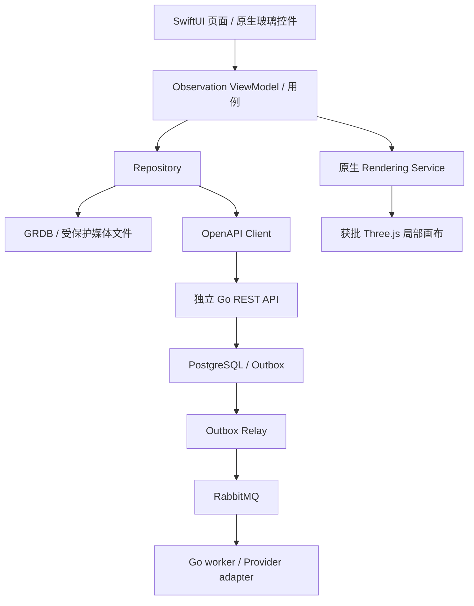
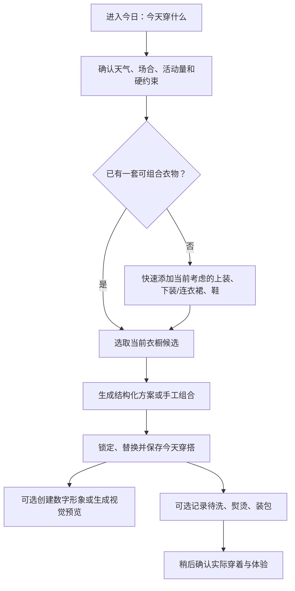
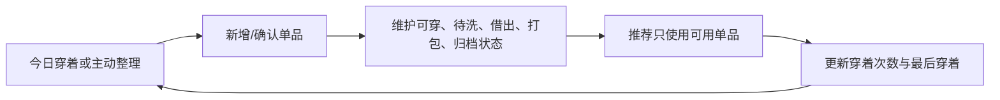

# OOTD 产品总体设计

## 2026-09-08 方向确认与研究边界

首版范围已确定为本地可调 3D 角色与直接换装，连同衣橱、推荐、记录和删除形成离线闭环；云 AI 和同步分期。具体功能约束归 PRD 11/12、Design 04/05，研究依据见 [`13-三维虚拟形象与服装系统研究.md`](13-三维虚拟形象与服装系统研究.md)。旧照片优先流程属于后续能力，静态云试穿不是本地 3D 前提。具体资产参数、renderer 与玻璃合成仍需 POC；本次不修改照片/历史数据切片。

## SwiftUI 液态玻璃组件设计

2026-09-08：用户已确认 SwiftUI、前后端分离及最低 iOS 26；具体组件组合与交互规格为 draft，完成切片契约后实施。精确平台/API 基线见 [技术选型](01-技术选型.md#客户端最终决策与原生液态玻璃)。

### 页面分层与组件清单

角色和衣物是主要内容，液态玻璃用于浮在内容之上的导航与操作层。采用语义颜色、系统字体与 SF Symbols，集中管理品牌强调色、间距和圆角；不在每个 Feature 各自定义一套材质。系统组件已具有玻璃外观时不再叠一层自定义玻璃。

| 区域 / 组件 | SwiftUI 实现 | 产品行为与边界 |
| --- | --- | --- |
| 应用入口 | `TabView` + 每 Tab 的 `NavigationStack` | 今日、衣橱、穿搭簿；保留系统导航、返回与状态恢复 |
| 顶部导航操作 | `toolbar`、`ToolbarItem`、系统 `Button` | 编辑角色、筛选、更多；使用系统排列与材质 |
| 角色画布 `AvatarViewport` | SwiftUI 容器 + renderer 协议 | 渲染背景和人物，加载/失败状态属于原生；Three.js 仅承载获批三维画面 |
| 角色操作条 `AvatarControlBar` | `GlassEffectContainer` + 原生玻璃按钮 | 正/侧/背视角、重置等离散操作；图标有标签，选中状态不只靠颜色 |
| 换装入口 `OutfitSlotBar` | 悬浮操作表面或玻璃按钮组 | 上装、下装、鞋等已定义槽位；避免整条背景与每个按钮重复玻璃化 |
| 衣物选择 `GarmentPickerSheet` | 系统 `sheet`、`presentationDetents`、网格和筛选控件 | 选择后更新本地草稿；支持关闭/撤销；详细选择内容维持可读背景 |
| 身形调节 `BodyParameterControl` | `Form`、`Slider`、数值标签 | 展示经资产适配验证的有限参数；提供可访问增减操作；不把模型参数冒充真实身体测量 |
| 保存操作 | `.buttonStyle(.glassProminent)` | 单个主要动作“保存搭配”；保存计划、记录实际穿着仍是分别确认的动作 |
| 衣物卡片 `WardrobeItemCard` | `LazyVGrid`、图片、语义文字 | 使用稳定中性背景保持衣物颜色与细节可辨，玻璃不覆盖整张图片 |
| 近似效果说明 | 原生文本及详情入口 | 模板与真实衣物的差别持续可见，不靠短暂动画或颜色表达 |

自定义非按钮悬浮表面可以使用 `.glassEffect(.regular, in: .capsule)`；按钮优先系统样式以保留交互语义。`GlassEffectContainer` 用于需要共同组合的相邻表面，不包裹整个页面制造全屏模糊。跨元素形变只在操作语义明确且无障碍允许时采用，首版无需为展示效果引入复杂 morph 动画。[Apple 自定义视图 API](https://developer.apple.com/documentation/SwiftUI/Applying-Liquid-Glass-to-custom-views)

### 应用与后端职责

新 OOTD 业务 ID 与后端统一使用 UUID v4；离线创建无需服务端分配 ID。Swift 领域模型使用类型化 ID，API 使用规范字符串；旧生活管理主键保持原样，迁移按 PRD 19 决策，不批量改号。完整数据规则见 [后端架构](02-后端架构.md#postgresql-约束)。



玻璃组件只接收显示状态和事件闭包。ViewModel 管理选择、草稿和保存状态；Repository 管理持久化与同步。API 负责云端权限、任务、配额及共享事实。UI 材质变化不改变媒体同意、所有权或删除链；本次不新增无实际用例支撑的 API。

### 三维叠加、无障碍与性能

- 原生操作区通过布局避开角色关键部位，sheet 展开时调整画布可用区域；旋转手势不得抢走按钮、系统返回或 sheet 拖动。
- `WKWebView` 的 GPU 表面与原生玻璃叠加必须实测背景合成、滚动、命中与资源成本，不预先保证折射视觉完全等同于纯 SwiftUI 内容。
- 开启减少透明度时，保证控件具有可读的实色背景；减少动态效果时取消自定义形变和持续旋转；高对比度、浅/深色模式、系统玻璃外观偏好均纳入验证。
- 支持 Dynamic Type、VoiceOver、至少 44pt 点击区域与清晰焦点顺序。体型滑块、视角切换和保存必须能通过无障碍操作完成。
- 避免全屏玻璃、多层模糊和随三维每帧重建 SwiftUI 层级；在同一场景分别测量关闭/开启自定义玻璃后的帧时间、hitch、内存和热状态，按三维 POC 总预算判定。

### 实施与证据

先定义主题和系统导航，再完成角色控制条/换装面板的隔离样例，最后接入真实 renderer。以最弱目标 iOS 26 真机验证明暗衣物、繁杂背景、动态字体和辅助功能；模拟器截图只用于布局检查。本节不为被冻结的旧生活管理页面增加装饰，不新增空组件目录。系统验收中的新增检查保持 pending，不能用文档或成功编译代替视觉验收。

## 文档状态与范围声明

状态：已批准，2026-08-30。

关联需求与设计：

- [`../prd/10-OOTD产品需求.md`](../prd/10-OOTD产品需求.md) 是产品总纲；11–19 号单功能 PRD 是各功能行为与发布门禁的直接需求依据。
- [`01-技术选型.md`](01-技术选型.md) 固定 SwiftUI iOS、Gin/GORM、Atlas、RabbitMQ、Redis 与私有对象存储技术边界。
- [`02-后端架构.md`](02-后端架构.md) 固定模块化单体、同一二进制和 API/worker 角色边界。
- [`11-OOTD权限隐私与安全设计.md`](11-OOTD权限隐私与安全设计.md) 是 OOTD 敏感数据、同意、保留和删除基线。

本文是 OOTD 产品总体设计并已获批准。实现按 `docs/plan/` 分阶段推进，发布必须满足 `docs/acceptance/` 的证据要求；14、15 号生成能力还受 POC、供应商、合规与 feature flag 门禁。技术验证只能使用合成或已授权数据，不能以验证名义接入未经批准的生产数据流。

功能设计集：

- 本文：产品定位、信息架构、核心闭环和跨功能边界。
- [`04-数字形象与照片采集设计.md`](04-数字形象与照片采集设计.md)：形象模式、人体照片输入、质量门禁和删除链。
- [`05-数字衣橱与衣物录入设计.md`](05-数字衣橱与衣物录入设计.md)：渐进建库、衣物状态和图像处理。
- [`06-穿搭推荐设计.md`](06-穿搭推荐设计.md)：场景约束、候选生成、解释和排序。
- [`07-AI虚拟试穿设计.md`](07-AI虚拟试穿设计.md)：可选静态 AI 试穿及其真实性边界。
- [`08-动态预览设计.md`](08-动态预览设计.md)：动效、视频或可旋转预览的条件启用边界。
- [`09-穿搭记录与反馈设计.md`](09-穿搭记录与反馈设计.md)：穿搭簿、实际穿着和反馈学习。
- [`10-OOTD服务端与异步任务设计.md`](10-OOTD服务端与异步任务设计.md)：可选云任务、幂等、取消和清理。
- [`11-OOTD权限隐私与安全设计.md`](11-OOTD权限隐私与安全设计.md)：独立权限、敏感数据、同意、保留和删除。

## 产品定义

OOTD 的核心任务不是让用户浏览虚拟服装，而是在出门前快速回答三个问题：

1. 今天真实可穿的衣物有哪些？
2. 哪一套适合今天的天气、场合和活动量？
3. 我是否愿意实际穿它，并在需要时提前准备？

产品定位为“个人出门准备助手”。衣橱是可用资产库，推荐是决策支持，数字形象是可选的视觉确认，穿搭簿负责把选择转化为可学习的真实反馈。三者不能被一个生成模型替代。

### 目标用户

- 每天在衣柜前花时间做选择，但不希望先整理完整衣柜的用户。
- 日程包含通勤、会面、聚餐、运动或旅行，希望穿搭与当天安排协调的用户。
- 重视隐私，希望拒绝上传人体照片后仍能获得基础建议的用户。
- 愿意逐步记录常穿衣物和实际体验，而不是一次完成复杂风格测试的用户。

### 产品承诺

- 有完整可行衣物时，用户从进入“今日穿什么”到保存决定的目标时长不超过 90 秒。
- 基础推荐只引用用户已确认且当前可用的衣物，不生成不存在的单品。
- 拒绝数字形象照片、日历、位置或云处理，不阻止手动场景和本地衣橱完成主任务。
- 视觉预览用于判断整体风格，不承诺尺码、合身、垂坠、透明度、面料触感或颜色准确性。

## 目标与非目标

### 目标

1. 以 OOTD-first 冷启动让用户在首次使用中先完成一次真实穿搭决定，再渐进形成衣橱。
2. 建立“今日决策闭环”和“衣橱成长闭环”，使推荐根据真实穿着反馈而非只根据生成图点击优化。
3. 把日程、天气、活动量和用户硬约束转换为最小场景摘要，不直接耦合 EventKit、MapKit 或账务表。
4. 同时支持即时结构化搭配、可选静态试穿和条件启用的动态预览，各层失败互不阻塞。
5. 明确照片、身体信息、推荐记录和生成结果的独立生命周期。

### 非目标

- 不在首版提供购买、导购、联盟链接、品牌广告、社交社区或达人内容流。
- 不进行真实量体、尺码预测、医学或体型诊断、吸引力评分。
- 不声称 AI 图能反映真实合身、布料物理、Logo、文字、花纹或遮挡细节。
- 不自动读取完整日历正文、参会人、精确地址、账务明细或第三方购物历史用于推荐。
- 不要求建立照片级数字分身后才能使用。
- 不在 90 秒主路径内等待云端高质量试穿或动态视频完成。
- 不在独立商业化 PRD 批准前设计积分、额度、订阅、付费或权益分层。

## 信息架构

OOTD 产品使用三个一级 Tab：

| Tab | 用户问题 | 核心内容 |
| --- | --- | --- |
| 今日 | 我现在穿什么，出门前还要准备什么？ | 当日场景、天气摘要、快速推荐、已定穿搭和准备事项。 |
| 衣橱 | 我有哪些真实可穿的衣物？ | 单品、可用状态、渐进录入、整理、缺口和归档。 |
| 穿搭簿 | 我以前怎么穿、实际效果如何？ | 已保存方案、实际穿着、日历视图、反馈和可解释复用。 |

这三个 Tab 是已批准的 OOTD 信息架构，并替代旧生活管理产品的五 Tab 作为目标导航。现有代码按实施计划分批迁移，不增加第六个 Tab，也不长期并存两套产品导航。若未来需要调整一级导航，必须先更新产品需求、信息架构、迁移计划与验收。

## OOTD-first 冷启动

### 原则

首次价值必须来自一次当日决定，而不是“请先拍完整个衣柜”。所有风格、形象和权限步骤都可跳过，系统只在需要相应能力时解释并请求。

冷启动有两条等价入口：不提供照片的用户可以直接手工添加当前考虑的衣物；愿意提供 OOTD 照片的用户可以用一张照片产生 3–5 个待确认衣物草稿和组合草稿，并进入可选数字形象流程。照片导入不自动创建 `OutfitPlan` 或 `WearEvent`，保存计划与确认实际穿着由用户分别主动完成。照片路径采用两个价值时刻：

- **2 分钟内获得首个成果**：完成端侧照片检查，看到人物/通用形象预览、组合草稿和待确认衣物草稿；云端生成不能成为该目标的前置条件。
- **5 分钟内获得第一套新搭配**：再补充约 3 件可替换单品后，生成一套不同于原 OOTD 的结构化方案。实际门槛按缺少的穿搭角色提示，不把固定件数变成权限或付费门槛。

这些时间是已批准的可用性目标，需在最低支持设备和授权测试中验证；不得通过默认上传、跳过确认或伪造完成状态达成。

### 首次流程



首次快速添加只要求单品照片或名称、类别和“今天可穿”。自动标签均为建议，用户确认后才成为衣橱事实。若用户拒绝照片，可使用颜色、类别和自由名称完成一套手工组合。

### 功能可用门槛

- **手工搭配门槛**：零衣物即可进入；用户可以边选边新增。
- **基础推荐门槛**：至少存在一条完整可穿路径，即“上装 + 下装 + 鞋”或“连体/连衣单品 + 鞋”。不满足时说明缺少的类别，不生成虚假方案。
- **个性化激活事件**：用户确认至少 8 件当前可用衣物，覆盖至少 3 个穿搭类别，保存一套推荐，并在之后标记为实际穿着。该事件用于评估产品价值，不是权限或付费门槛。
- **照片级预览门槛**：独立同意并通过人物、衣物照片质量检查；不影响基础推荐。

## 90 秒决策路径

在基础推荐门槛满足、上下文可得的情况下，体验目标如下：

| 阶段 | 累计目标 | 用户动作 | 系统责任 |
| --- | --- | --- | --- |
| 打开与确认上下文 | 0–15 秒 | 查看或修改天气、场合、活动量 | 使用缓存和最小摘要，不阻塞于网络刷新。 |
| 查看三个候选 | 15–30 秒 | 比较“稳妥、天气优先、更有风格” | 本地硬过滤后生成结构化候选，首屏不等待云图。 |
| 微调 | 30–75 秒 | 锁定单品、换鞋、更暖/更轻便 | 只重算受影响部分，保留用户已锁定选择。 |
| 保存 | 75–90 秒 | 选定方案并确认准备项 | 原子保存方案和上下文快照，视觉任务可异步继续。 |

目标时间是可用性指标，不允许用隐藏信息、默认同意上传或省略不确定性说明来换取。

## 两条产品闭环

### 今日决策闭环


成功事实是“实际穿了且基本合适”，不是生成次数、停留时长或分享次数。跳过、换件和未穿都属于有价值反馈，但不能被解释为对身体或审美的负面评价。

### 衣橱成长闭环



衣橱完整度由真实使用渐进提高。系统可以提示“补录这件外套会让冬季推荐更准确”，但不得用百分比焦虑、连续签到或虚假缺口推动用户上传更多照片。

## 跨领域上下文

OOTD 只消费用户已确认或主动选择的稳定摘要：

```text
OutfitContext
├─ localDate / timeWindow / timeZone
├─ occasionKind / formality / dressCode
├─ indoorOutdoor / expectedWalking / activityLevel
├─ weatherBand / precipitation / wind / UV
├─ temperaturePreference
├─ userHardConstraints
└─ sourceKind / sourceUpdatedAt
```

- 日历事件只在用户选择“为此事件准备穿搭”后派生摘要；不传递标题、备注、参会人或原始标识。
- 目的地天气只需要城市级或事件明确城市；普通穿搭不请求精确位置。
- 交通方式可以派生“预计步行量”或“需防雨”等约束，不向推荐层暴露路线坐标。
- 账务数据不进入推荐。未来若用户主动将服饰消费关联单品，必须通过独立确认，不以商户或金额静默推断。
- 来源变化不会自动覆盖已确认穿搭。界面显示旧摘要、新摘要和当前计划，用户选择保留或重新生成。

## 功能边界与依赖

| 能力 | 主事实源 | 是否进入 90 秒关键路径 | 失败时 |
| --- | --- | --- | --- |
| 衣物与状态 | 本地数字衣橱 | 是 | 手工新增或手工组合。 |
| 场景摘要 | 本地手工输入或已授权系统摘要 | 是 | 使用手工场合和缓存天气。 |
| 结构化推荐 | 本地规则、排序与反馈 | 是 | 展示可组合单品并允许手工搭配。 |
| 风格化数字形象 | 本地配置 | 否 | 使用单品拼图或无人物模式。 |
| 静态 AI 试穿 | 可选异步任务 | 否 | 保留结构化方案，允许重试或删除任务。 |
| 动态预览 | 条件启用异步任务 | 否 | 回退静态结果或关闭动效。 |
| 穿搭簿与反馈 | 本地记录 | 否，但决定个性化质量 | 保存方案但允许跳过反馈。 |

## 页面与状态

### 今日

- 今日上下文卡：有日程摘要、仅天气、完全手工、来源变化、天气过期。
- 推荐区：衣橱未激活、正在本地生成、三个候选、无可行组合、部分上下文未知。
- 方案详情：单品拼图、可选数字形象、理由、不确定性、锁定/替换、保存。
- 已决定卡：已保存、准备事项待完成、场景已变化、已实际穿着。

### 衣橱

- 分类和搜索：有数据、空、筛选无结果、照片处理中。
- 快速添加：相机、系统照片选择器、手工无图、低质量重拍、疑似重复。
- 单品详情：可穿、待洗、借出、已打包、归档、来源图片已删除。

### 穿搭簿

- 时间线/日历：只有计划、已实际穿着、有反馈、未穿、来源事件已删除。
- 详情：当时上下文、单品快照、后续状态变化、反馈和再次使用。
- 空态：从今日保存第一套，不用导入示例伪装用户历史。

## 领域数据与一致性

以下是已批准的逻辑领域对象。物理 GRDB Record、PostgreSQL 表和 OpenAPI schema 仍须通过对应迁移与契约评审落地，不能从本表机械生成：

| 对象 | 责任 | 关键不变量 |
| --- | --- | --- |
| `WardrobeItem` | 用户确认的单品及可用状态 | 推荐只能引用当前 owner 的稳定 ID；AI 建议不能绕过确认成为事实。 |
| `OutfitContext` | 一次决策的最小场景快照 | 保存后不可被来源更新静默改写。 |
| `RecommendationSession` | 候选、锁定项、替换与理由 | 每个候选引用真实可用单品；相同输入可审计模型/规则版本。 |
| `OutfitPlan` | 用户选定的组合和准备状态 | 保存时记录单品 ID 与展示快照；单品后来归档不删除历史。 |
| `WearEvent` | 实际穿着事实 | 与计划分离；没有计划也可记录实际穿着。 |
| `OutfitFeedback` | 舒适、温度和场合反馈 | 允许跳过；不得包含吸引力或身体价值评分。 |
| `AvatarProfile` | 可选数字形象配置 | 缺失或删除不影响衣橱、推荐、穿搭记录。 |
| `TryOnJob` | 可选异步视觉任务元数据 | 不成为推荐事实，不保存第三方密钥或长期公开 URL。 |

衣物当前状态与历史穿搭快照分离。删除衣物照片不应删除用户的历史穿搭事实；历史页改为显示安全占位和当时确认的非图片描述。删除整个衣物实体、穿搭记录或形象的具体语义按 [`../prd/10-OOTD产品需求.md`](../prd/10-OOTD产品需求.md) 和 [`11-OOTD权限隐私与安全设计.md`](11-OOTD权限隐私与安全设计.md) 执行。

## API 与本地存储边界

- 衣橱、场景摘要、结构化推荐、方案、穿着与反馈默认本地优先，并应在离线时可读写。
- OOTD 领域对象与旧账务、日历和行程表分开，不通过外键直接依赖 EventKit identity 或账务记录。
- 新 migration、服务端表和 OpenAPI operation 只能随进入当前实施阶段的功能增加，并须遵循 Atlas、GRDB 与单一 OpenAPI 事实源规则。
- 基础推荐通过本地 Repository 和纯领域对象完成，不因未来试穿供应商而持有供应商 DTO。
- 静态试穿或动态任务达到各自启用门禁后，使用 [`10-OOTD服务端与异步任务设计.md`](10-OOTD服务端与异步任务设计.md) 的异步边界；API key 永不进入客户端。
- 人物原图、衣物原图、抠图和生成结果的本地目录、文件保护、TTL 和导出边界按 [`11-OOTD权限隐私与安全设计.md`](11-OOTD权限隐私与安全设计.md) 统一执行。

## 权限、隐私与安全

1. 首次进入不批量请求照片、相机、日历、位置或通知权限。
2. 用户可用手工输入和风格化形象完成核心流程，照片与云处理不是使用门槛。
3. 人物、面部、衣物照片和可关联日程的穿搭记录按高敏感数据处理；原始照片和派生物有可见删除路径。
4. 照片优先通过系统 picker 获取用户明确选择的单项；不要求完整照片库访问。
5. 端侧先做裁剪、去 EXIF/GPS、质量检查和必要分割；上传前另行展示数据接收方、目的、保留期和删除方式。
6. 原始事件标题、地址、参会人、金额、商户、精确轨迹、照片 URL 和人体特征不得进入日志、推送或分析事件。
7. 用户素材默认不得用于模型训练、广告、画像或向第三方提供；用途变化需要重新同意。
8. 不接受未经授权的他人照片；未成年人和家庭照片场景不在当前范围，只有独立儿童安全/多人授权 PRD 与法律评审通过后才能另行启用。

完整要求见 [`04-数字形象与照片采集设计.md`](04-数字形象与照片采集设计.md) 与 [`11-OOTD权限隐私与安全设计.md`](11-OOTD权限隐私与安全设计.md)。

## 失败与降级

| 失败 | 用户可见说明 | 降级 |
| --- | --- | --- |
| 衣橱没有完整组合 | 明确缺少上装、下装/连衣单品或鞋 | 快速新增或手工记录今天穿搭。 |
| 所有匹配单品不可用 | 列出冲突，例如“唯一防雨鞋待洗” | 用户明确放宽一个约束，不编造单品。 |
| 日历拒绝或事件无语义 | 不循环请求权限 | 手工选择场合、时间和正式度。 |
| 位置拒绝 | 说明穿搭只需城市级天气 | 手工选城市或输入温度区间。 |
| 天气网络失败 | 显示缓存时间和不确定性 | 使用缓存或手工天气；不阻塞衣橱。 |
| 推荐计算失败 | 保留上下文和用户锁定项 | 展示分类衣橱并手工组合。 |
| 数字形象缺失/删除 | 不提示功能残缺 | 使用单品拼图。 |
| AI 试穿失败或超时 | 明确结构化方案已保存 | 异步重试、取消或继续无图方案。 |
| 场景来源变化 | 展示旧、新摘要和影响 | 保留当前或由用户重新生成。 |
| 离线 | 标记云图不可用 | 本地衣橱、推荐、保存和反馈继续可用。 |

## 指标与评审证据

北极星指标：**保存推荐后实际穿着且用户认为基本合适的比例**。

支持指标：

- 从进入“今天穿什么”到保存决定的中位数和 P95 时长。
- 首次完成一条完整组合和个性化激活事件的时间。
- 首个推荐直接接受率、平均换件次数和锁定项使用率。
- 实际穿着率，以及温度、舒适和场合适配反馈。
- 无可行组合率、库存状态导致的冲突率、推荐失败率。
- 选择无照片路径的完成率、云上传同意撤回率、删除完整率。
- 静态试穿细节失真、身份变化和不合理裸露报告率。

这些指标不自动启用分析 SDK。离机收集仍是条件能力，必须先批准字段白名单、同意、地域、保留期和供应商；研究阶段优先使用明确招募、已授权的可用性测试和匿名人工记录。

## 关键决策、备选方案与重评条件

### 决策一：OOTD-first，而不是衣橱-first

选择原因：完整建库成本高，用户尚未获得价值时最容易流失；从当天一套真实选择开始能同步积累衣橱和反馈。

备选方案：首次批量拍完整衣柜。只有研究证明目标用户愿意投入且显著提升后续留存时重评。

### 决策二：三 Tab 围绕时间、资产和历史

选择原因：“今日—衣橱—穿搭簿”分别回答现在、拥有和过去，避免把推荐、试穿、形象、灵感做成九宫格功能入口。

备选方案：在旧“于是”五 Tab 上增加第六 Tab。该方案会长期暴露两套产品心智，因此不采用；目标导航直接迁移为“今日、衣橱、穿搭簿”，只有新的整体 IA PRD 才能重评。

### 决策三：结构化推荐优先于生成图

选择原因：真实衣物 ID、约束和理由可验证，可离线工作；生成图有延迟、成本和失真，不能承担事实层。

备选方案：先生成整张造型图，再识别使用了哪些衣物。该方案会编造或改变单品，不采用。

### 决策四：数字形象和照片均为可选

选择原因：身体照片敏感，且数字形象不是完成日常决策的必要条件。

备选方案：强制创建照片级分身。只有经用户研究和隐私评审证明不可替代价值时重评。

### 决策五：本地闭环先于云端能力

选择原因：与现有本地优先方向一致，离线时仍能完成决定，并缩小人体照片与日程组合泄露面。

备选方案：所有推荐和衣橱标签都放在服务端。只有本地性能或模型许可经测量无法满足目标，且云方案完成合规审批后重评。

## 可执行测试与验收

以下是设计级验收示例；正式发布还须满足 `docs/acceptance/` 中的可执行门槛并留存证据：

### 场景一：首次无照片闭环与后续 90 秒决策

- 前置条件：全新本地资料，使用合成衣物素材，不授权日历、位置或人物照片。
- 操作：手工选择天气和场合，快速新增一条完整组合，查看候选并保存；随后用同一完整衣橱再次发起决策。
- 期望：首次不出现权限墙且可完整结束；保存方案只引用新增单品；可跳过数字形象。90 秒指标从存在完整可穿路径的第二次决策开始计算，不用空衣橱录入时间掩盖日常决策性能。

### 场景二：个性化激活

- 前置条件：8 件已确认、可用、跨 3 类的衣物。
- 操作：生成候选，替换鞋，保存并稍后标记实际穿着和反馈。
- 期望：激活事件仅在“衣物覆盖 + 保存 + 实际穿着”全部满足后成立；未授权分析时不离机上报。

### 场景三：库存冲突

- 前置条件：唯一防雨鞋为待洗，天气为雨天且用户要求防雨。
- 操作：请求推荐。
- 期望：不推荐待洗鞋、不编造鞋；显示冲突并允许用户显式放宽约束或新增鞋。

### 场景四：来源变化

- 前置条件：已为晚间室内事件保存穿搭，事件后来改为白天户外。
- 操作：再次打开今日卡。
- 期望：显示旧、新摘要和影响；穿搭保持不变，只有用户确认后重新推荐。

### 场景五：云能力失败

- 前置条件：结构化方案已生成，静态试穿任务超时。
- 操作：保存方案并离线重启 App。
- 期望：方案、理由和单品拼图可用；任务状态可取消或重试；不重复计费或创建重复任务。

### 场景六：删除与隔离

- 前置条件：存在人物原图、风格化形象、静态生成图和历史穿搭。
- 操作：删除数字形象但保留穿搭历史。
- 期望：所有人物原图和派生形象按批准范围删除；衣橱和历史事实保留，页面使用安全占位；推荐不再引用形象资产。

### 场景七：可访问性

- 操作：在最大辅助字号、VoiceOver、深色模式和减少动态效果下完成三 Tab 的核心流程。
- 期望：主按钮可达，状态不只靠颜色，服装缩略图有类别和颜色文本，动态预览可暂停并有静态等价内容。

### 场景八：基线与门禁检查

- 操作：检查 migration、OpenAPI、依赖、生产配置、导航入口和 feature flag。
- 期望：产品入口只呈现已进入当前实施阶段的 OOTD 能力；静态试穿和动态预览在各自 POC、供应商、合规及 feature flag 门禁通过前不可被真实用户调用，且不存在旧五 Tab 与新三 Tab 长期并存。
