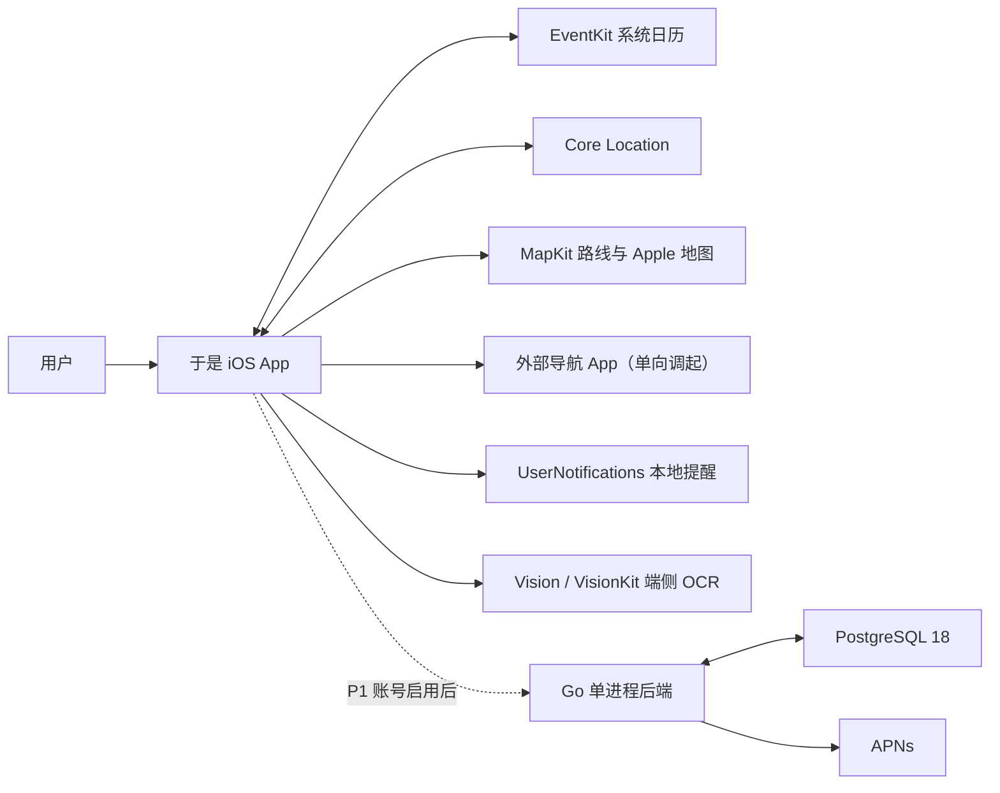
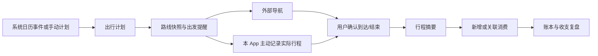
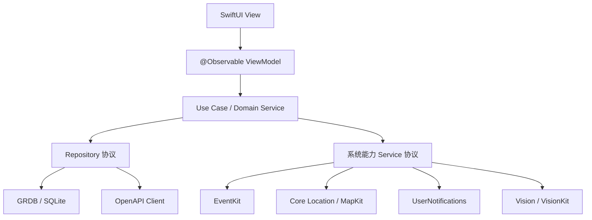
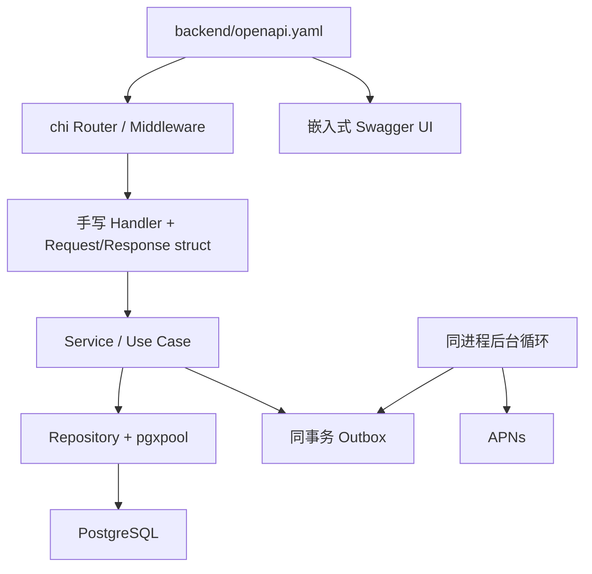

# 系统总体设计

> **历史文档。** 本设计描述产品转向前的生活管理系统。当前架构以 [`01-技术选型.md`](01-技术选型.md)、[`02-后端架构.md`](02-后端架构.md) 与 [`10-OOTD产品总体设计.md`](10-OOTD产品总体设计.md) 为准。

## 状态

草案，2026-08-09。关联产品需求：[`../prd/03-最小可行产品需求.md`](../prd/03-最小可行产品需求.md)。技术版本与排除项以 [`01-技术选型.md`](01-技术选型.md) 和 [`02-后端架构.md`](02-后端架构.md) 为准。

## 设计目标

- 将记账、日历事件、出行计划、实际行程和消费关联为一条可理解的生活闭环。
- 保持每个领域可独立使用，避免用户必须授权日历、定位或登录才能记账。
- 采用本地优先架构，明确本地、系统框架和服务端各自拥有的数据。
- 在单 Swift module、单 Go module、单后端进程和单 PostgreSQL schema 文件约束下保留清晰边界。
- 对 Apple 地图交接、日历、OCR 和云端能力提供真实、可降级的产品语义。

## 系统上下文

外部导航只接收目的地、起点和交通方式，不向“于是”返回稳定的实际导航数据。实际行程必须由本 App 在用户明确开始后记录，或由用户手动完成。

## 核心闭环

日历事件、出行计划、实际行程和交易是四种独立实体。它们通过显式关系连接，不共享状态字段，也不因删除其中一个而默认级联删除其他用户数据。

## 领域边界

| 领域 | 责任 | 不负责 |
| --- | --- | --- |
| 今天 | 聚合今日时间线、待处理事项和摘要；提供跨领域入口。 | 不直接修改账务、日历或轨迹。 |
| 记账 | 账户、分类、交易、分录、基础报表和待确认草稿。 | 不实现预算，不把预计出行费用当作正式交易。 |
| 日历 | 权限、日历来源、事件快照、变化检测和字段来源。 | 不成为用户系统日历的替代编辑器。 |
| 出行 | 地点、路线快照、计划、提醒、外部导航、实际行程和轨迹。 | 不模拟第三方导航过程或读取其历史。 |
| 生活关联 | 维护事件、计划、行程和交易之间的关系与聚合。 | 不改变被关联实体的领域语义。 |
| 同步 | mutation、游标、版本、冲突和 tombstone。 | 不传输票据原图或原始轨迹，不决定业务冲突应如何合并。 |
| 设置与隐私 | 权限、来源选择、保留策略、导出、删除和诊断。 | 不在未获授权时后台采集数据。 |
| 穿搭扩展 | 未来的衣物、穿搭和场景推荐边界。 | 不进入 P0 数据库和发布关键路径。 |

## iOS 总体架构

P0 保持单一 `ThenApp` Swift module，通过目录、协议和依赖方向隔离：

建议目录职责：

| 目录 | 内容 |
| --- | --- |
| `App` | App 入口、依赖容器、路由、生命周期和 feature flag。 |
| `Features/Today` | 今日聚合和全局待处理入口。 |
| `Features/Accounting` | 账本、交易编辑和基础报表。 |
| `Features/Calendar` | 日历授权、来源选择和事件展示。 |
| `Features/Trips` | 出行计划、路线、提醒、导航和实际行程。 |
| `Features/Settings` | 权限、隐私、导出、删除和诊断。 |
| `Core/Domain` | 纯 Swift 领域实体、值对象、错误和用例协议。 |
| `Core/DesignSystem` | 后续视觉方向确定后的语义 token 和复用组件；本轮不定义视觉风格。 |
| `Services` | EventKit、定位、路线、通知、导航、OCR、认证和同步适配器。 |
| `Data` | GRDB records、migrations、Repository 实现、生成 API client 的边界映射。 |

View 与 ViewModel 不持有 `EKEvent`、`CLLocationManager`、GRDB Record 或 OpenAPI 生成 DTO。长生命周期任务由专用 actor 或 App 级服务拥有，例如 `TripRecordingService`、`CalendarImportService` 和 `SyncService`，不依赖页面是否存在。

## Go 后端总体架构

Go 后端只在账号或云同步启用时参与核心数据流：

启动顺序为：加载并校验配置、建立连接池、构造 Repository 与 Service、注册路由、启动受根 context 管理的必要后台循环、报告 readiness。退出时先停止接收请求，再停止后台任务并关闭数据库连接。应用启动绝不自动修改生产 schema。

## 数据所有权

| 数据 | P0 事实源 | 账号同步启用后 | 默认上云策略 |
| --- | --- | --- | --- |
| 账户、分类、交易 | 本地 GRDB | 客户端本地副本 + 服务端版本 | 用户启用账号后同步。 |
| 系统日历原始事件 | EventKit；App 保存窗口快照 | 仍以设备 EventKit 为来源 | 默认不上传标题、备注、参会人和原始正文。 |
| 出行计划 | 本地 GRDB | 可同步用户确认后的计划字段 | 不上传未确认地点候选。 |
| 路线快照 | 本地 GRDB | 通常不跨设备同步 | 过期后重新计算，不作为长期事实。 |
| 原始轨迹点 | 活跃行程恢复所需的临时本地数据 | 不同步 | 摘要确认或行程丢弃后立即删除。 |
| 行程摘要 | 本地 GRDB | 可同步 | 只包含用户确认的时间、距离等摘要。 |
| OCR 中间结果与票据图片 | 识别会话内本地临时数据 | 不同步 | 确认、取消或会话结束后删除，不提供保存原图。 |
| mutation、cursor、tombstone | 本地与服务端同步机制 | 双方共同维护 | 只包含同步所需最小字段。 |
| 认证、设备和服务端 Outbox | 不适用 | 服务端 PostgreSQL | 服务端事实源。 |

## 本地优先数据流

1. ViewModel 调用领域用例，完成输入验证。
2. Repository 在一个 SQLite 事务中写入业务实体、关系和可选 mutation。
3. 本地查询立即刷新 UI；联网状态不影响本地成功结果。
4. 同步启用时，SyncService 批量推送 mutation，按 mutation ID 幂等处理。
5. 服务端提交业务写入、变更游标与 Outbox 后返回实体版本。
6. 客户端拉取游标后的变化和 tombstone，在事务中应用；冲突进入待处理箱。
7. 外部来源变化先更新来源快照，再由业务规则决定是否更新用户实体。

## 功能开关与发布模式

| 开关 | 默认 | 说明 |
| --- | --- | --- |
| 账号与云同步 | 关闭 | 产品负责人确认运营与合规条件后开启。 |
| 导航入口 | 仅 Apple 地图 | 国内路线供应商与其他导航 App 不在当前 P0/P1 范围，不创建 adapter 或伪入口。 |
| 原始轨迹保留/云备份 | 不提供 | 摘要确认后删除原始点，不提供长期保留、导出或同步。 |
| 云 OCR | 不提供 | 当前只允许 Vision/VisionKit 端侧识别；未来新增必须另建 PRD。 |
| Time Sensitive / Critical Alerts | 不提供 | 当前只使用普通本地通知，不保留隐藏开关。 |
| 预算与商业化 | 不提供 | 不创建预算、订阅、付费、容量或权益分层入口。 |
| 穿搭 | 关闭 | 独立 PRD、视觉设计和模型方案批准后进入开发。 |

开关只能控制已编译、已测试的能力，不得用远程开关绕过 App Store 审核、权限说明或契约兼容要求。

### P0 范围负向证据

`scripts/validate-p0-scope.sh` 是范围冻结的可重复静态门禁，每次候选构建前必须通过。它只扫描生产源码、Xcode 工程、本地 migration、`backend/openapi.yaml`、`backend/schema.sql` 和 `Package.resolved`，不把记录“不实施”决策的文档词项误当成产品入口。

- 生产文案与符号不得出现预算/结转/共享预算、票据保存/附件、原始轨迹导出/云备份、国内地图选择、特殊级别通知或商业化的可执行入口词项。“不保存票据原图”和“订阅日历”等真实说明不得被粗糙子串扫描误报。
- iOS 本地 schema 固定为当前 19 张已批准表：`local_profiles`、三张账务主表、五张日历缓存表、六张计划/路线/提醒/交接/事件关系表、三张 Journey/临时轨迹表和一张交易—行程关系表。任何表集变化都必须先更新设计、PRD 和迁移计划，再同步门禁允许集。
- P1 未批准时 `backend/openapi.yaml` 必须保持 `paths: {}`，`backend/schema.sql` 不得有 `CREATE TABLE` 或 `CREATE TYPE`；这两项不阻止保留已批准的契约和声明式工具基线。
- SwiftPM 依赖集必须等于当前锁定的 GRDB、Apple Swift OpenAPI 生成/运行时及其传递依赖；不得引入国内地图、付费/订阅、云附件、分析或追踪 SDK。

静态门禁不能证明运行时清理、网络零上传或深层链接不可达；这些仍必须通过 OCR/Journey 文件系统检查、网络观测、Release 字符串扫描和真实 UI 走查取得独立证据。

## 非功能目标

| 维度 | 目标 |
| --- | --- |
| 可用性 | 无网络仍可记账、查看缓存日程、创建计划、开始/结束行程；外部服务失败有手动路径。 |
| 数据正确性 | 正式账务分录始终平衡；P1 同步启用时本地写入和 mutation 原子；重复请求不产生重复业务数据。 |
| 性能 | 基线设备上核心本地列表交互目标 P95 小于 300ms；常见本地保存目标小于 500ms，最终阈值由真机基准确认。 |
| 稳定性 | 活跃行程在锁屏、前后台切换和页面销毁后继续由 App 级服务拥有；异常退出后能识别未结束行程。 |
| 电量 | 不进行全天定位；轨迹采样按运动、精度和后台状态自适应，发布前记录真实行程耗电证据。 |
| 可访问性 | 支持 Dynamic Type、VoiceOver、减少动态效果、足够点击区域和非颜色唯一状态表达。 |
| 可观测性 | 使用脱敏 request ID、稳定错误码、延迟和队列指标；不记录金额、标题、地址或轨迹正文。 |
| 恢复 | 本地数据库迁移、同步重试、冲突和后台任务都有可中断、可恢复状态；生产数据变更需备份和回滚计划。 |

## 关键决策

- 使用“今天、账本、日程、行程、我的”五个一级入口；全局新增不占用独立 Tab。
- 日程提供未来议程和来源管理，但不是独立重型日历编辑器；来源事件主要服务今天和出行流程。
- 交易与分录是账务事实，OCR 草稿和预计费用不是事实。
- 出行计划与实际行程分离；计划可取消，实际行程可以没有计划。
- 原始系统日历身份仅留在本地；票据图片和原始轨迹都是临时数据，完成对应确认后删除，服务端不接收。
- 当前版本不实现预算、国内地图适配、特殊级别通知、订阅或付费能力。
- P0 固定为单设备本地模式；账号、Go 后端和多设备同步进入 P1，接口与同步模型先完成设计但不制造 P0 运行依赖。

## 失败与降级总则

- 权限拒绝：解释影响、提供系统设置入口和手动替代，不循环弹窗。
- 网络失败：保留本地操作并显示同步状态，不阻止记账或结束行程。
- 路线失败：允许手动出发时间、复制地址和直接打开地图搜索。
- Apple 地图调起失败：允许复制地址且不标记行程已开始；不尝试切换未实现的第三方地图。
- 定位中断：保存已有轨迹片段，允许继续、手动完成或丢弃本次记录。
- OCR 失败：保留图片选择上下文并切换手动输入，不生成空的正式交易。
- 同步冲突：保留双方版本和字段差异；账务及用户编辑过的出行不静默覆盖。

## 穿搭扩展边界

未来穿搭领域可读取用户明确选择的日程场景、目的地天气和衣橱信息，但只能通过稳定的领域摘要交互，例如“场景类型、时间、天气、正式程度”，不得直接依赖 EventKit 或账务数据库表。衣物照片、身体信息和推荐记录使用独立权限、存储、保留与删除策略。P0 不创建空的穿搭表或接口。

## 重新评估条件

- P1 账号与同步被批准，或出现家庭/共享账本需求。
- 新 PRD 明确批准预算、国内路线、长期轨迹、票据附件、特殊通知或商业化中的任一能力。
- 同进程后台任务影响 HTTP 可用性或需要独立扩缩容。
- 数据规模使 SQLite 查询、同步批次或 PostgreSQL 单库出现经测量的瓶颈。
- 穿搭进入批准范围，需要新的图片、模型和内容安全边界。
