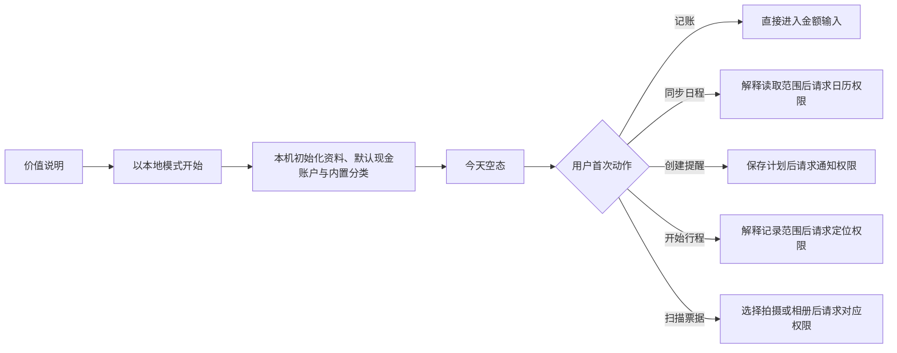

# 信息架构与用户流程

> **历史文档。** 五 Tab 生活管理信息架构已停止扩展；当前 OOTD 信息架构见 [`10-OOTD产品总体设计.md`](10-OOTD产品总体设计.md)。

## 状态

P0 已批准并实施中，2026-08-10。账本月度概览、月份切换、canonical root 流水、本地搜索、信用卡还款专用入口、日程、出行、“今天”只读组合、五 Tab 导航、行程—交易显式关联、“我的”权限可见性、结构化导出与分层删除均已落地并通过自动化验证；系统分享、破坏性操作和后台遮罩的完整端到端 UI 与真机证据仍待完成。关联 [`../prd/03-最小可行产品需求.md`](../prd/03-最小可行产品需求.md) 与 [`03-系统总体设计.md`](03-系统总体设计.md)。本文只定义结构、流程和状态，不定义颜色、字体、插画或最终视觉风格。

## 一级导航

P0 使用五个底部 Tab：

| Tab | 用户问题 | 核心内容 |
| --- | --- | --- |
| 今天 | 我今天要做什么、什么时候出发、还有什么待处理？ | 今日时间线、下一次出发、进行中行程、本月收支摘要、待确认事项。 |
| 账本 | 我的钱去了哪里、这个月收支如何？ | 月度概览、交易、账户、分类和报表。 |
| 日程 | 未来有哪些事件，哪些需要安排出行？ | 议程、系统日历来源、事件详情和待规划事件。 |
| 行程 | 我要怎么去、正在去哪、去过哪里？ | 待出发计划、进行中记录、历史行程和费用汇总。 |
| 我的 | App 拥有哪些权限和数据，我如何控制？ | 权限、本地保留规则、导出、删除、只读诊断状态和关于。P1 获批后才增加账号与同步。 |

全局“＋”不作为 Tab，统一提供：

1. 记一笔。
2. 扫描票据。
3. 创建出行计划。
4. 开始记录行程。

系统根据当前上下文排序，不隐藏其他入口。例如在行程详情中优先展示“记录本次消费”，但仍可展开完整操作面板。

### P0 五 Tab 落地规则

- Tab 顺序固定为“今天—账本—日程—行程—我的”，不根据权限或空数据动态隐藏。
- P0 “行程”同时展示待出发 TripPlan、唯一未收口 Journey 与已完成 Journey；被丢弃的 Journey 不进入日常历史列表。
- P0 “我的”只展示真实可用的本地权限、数据位置、保留规则、导出/删除、App 版本与诊断收集状态；不展示账号、同步、云备份或订阅占位。
- 全局新增使用系统 `Menu` 或 sheet 承载稳定操作，所有入口使用 SF Symbols、语义颜色和 Dynamic Type；不自建与系统不一致的底部导航。

## 信息结构

```mermaid
flowchart TD
    ROOT["于是"] --> TODAY["今天"]
    ROOT --> LEDGER["账本"]
    ROOT --> CAL["日程"]
    ROOT --> TRIP["行程"]
    ROOT --> ME["我的"]
    ROOT --> ADD["全局新增"]

    TODAY --> TL["今日时间线"]
    TODAY --> NEXT["下一次出发"]
    TODAY --> ACTIVE["进行中行程"]
    TODAY --> SUMMARY["本月收支摘要"]
    TODAY --> INBOX["待确认箱"]

    LEDGER --> MONTH["月度概览"]
    LEDGER --> TX["交易流水"]
    LEDGER --> ACCOUNT["账户与分类"]

    CAL --> AGENDA["议程"]
    CAL --> EVENT["事件详情"]
    CAL --> SOURCES["日历来源"]

    TRIP --> UPCOMING["待出发"]
    TRIP --> RECORDING["正在记录"]
    TRIP --> HISTORY["历史行程"]

    ME --> PERMISSION["权限与集成"]
    ME --> SYNC["账号与同步"]
    ME --> PRIVACY["隐私与数据"]

    ADD --> ADDTX["快速记账"]
    ADD --> SCAN["扫描票据"]
    ADD --> ADDPLAN["创建计划"]
    ADD --> START["开始行程"]
```

## 页面清单

### 全局与今天

| 页面 | 核心动作 | 必备状态 |
| --- | --- | --- |
| 首次启动 | 了解价值、选择本地开始 | 首次、已完成、数据恢复待决。 |
| 今天首页 | 查看今日聚合、进入下一步 | 有事件、无事件、离线、有进行中行程、有待确认事项。 |
| 全局新增面板 | 选择四类新增动作 | 正常、相机不可用、已有进行中行程。 |
| 待确认箱 | 处理 OCR、导入、关联、日历变化与同步冲突 | 空、分组列表、处理中、批量来源失败。 |

### 账本

| 页面 | 核心动作 | 必备状态 |
| --- | --- | --- |
| 月度概览 | 切换自然月，查看本币收入、支出、净变化和分类净额 | 首次无账、本位币未确认、正常、上月/下月。 |
| 交易流水 | 查看 canonical root 折叠结果、本地搜索并进入详情 | 空、加载中、正常、搜索无结果、查询局部失败。 |
| 快速记账 | 保存支出/收入/转账/信用卡还款 | 新建、无可用信用卡、校验失败、离线保存、重复点击保护。 |
| 扫描票据 | 拍摄或选择图片 | 设备不支持、相机拒绝、相册拒绝、识别中、失败。 |
| OCR 确认 | 校对字段并确认入账 | 低置信度、高置信度、重复候选、字段缺失。 |
| 交易详情 | 查看、编辑、退款、冲销、关联 | 正常、已冲销、来源删除、同步冲突。 |
| 账户与分类 | 管理可选项和停用状态 | 初始默认、空、被引用不可硬删除。 |

### 日程

| 页面 | 核心动作 | 必备状态 |
| --- | --- | --- |
| 日程启用说明 | 了解读取范围、开启或跳过 | 未请求、拒绝后再次进入。 |
| 日历来源选择 | 选择需要缓存的系统日历 | 正常、无可用日历、权限撤回。 |
| 议程 | 浏览过去 30 天至未来 90 天事件 | 今日空、未来空、缓存过期、正在刷新。 |
| 事件详情 | 查看来源、创建或打开出行计划 | 有地点、无地点、全天、已取消、来源已删除。 |
| 地点确认 | 从自由文本确认地点候选 | 单候选、多候选、无结果、离线手动输入。 |

### 行程

| 页面 | 核心动作 | 必备状态 |
| --- | --- | --- |
| 行程列表 | 查看待出发、进行中和历史 | 空、正常、未结束行程恢复提示。 |
| 计划编辑 | 设置起终点、时间、方式和缓冲 | 手动、来自日历、字段冲突、离线。 |
| 路线确认 | 选择路线、确认出发时间和提醒 | 正常、过期、MapKit 无路线或失败。 |
| 提醒设置 | 请求通知权限、安排提醒 | 未请求、允许、拒绝、系统关闭。 |
| 出发卡片 | 开始记录、只打开地图或稍后提醒 | 准备中、路线过期、地图不可用。 |
| 正在记录 | 查看状态、暂停/继续、结束 | 正常、后台受限、定位中断、低精度、离线。 |
| 行程总结 | 确认时间距离、关联消费 | 完整轨迹、部分轨迹、无轨迹、待保存。 |
| 行程详情 | 查看计划、实际、事件与消费 | 正常、来源删除、原始轨迹已清理。 |
| 关联交易选择 | 选择已有交易或新建 | 无候选、搜索、已关联、候选重复。 |

### 我的

| 页面 | 核心动作 | 必备状态 |
| --- | --- | --- |
| 权限与集成 | 查看日历、通知、定位、相机、相册和地图状态 | 各权限所有系统状态。 |
| 通知设置 | 设置默认缓冲和提醒 | 权限关闭、部分计划未安排。 |
| 账号与同步 | 登录、设备与冲突；未启用时不展示伪入口 | 功能关闭、本地模式、已登录、离线、冲突。 |
| 隐私与数据 | 查看数据分类、保留和本地/云位置 | 正常、同步关闭。 |
| 导出 | 导出结构化可读数据；不包含临时票据图片和原始轨迹 | 生成中、完成、存储不足、分享取消。 |
| 删除 | 删除本地数据或账号；临时票据和轨迹由生命周期自动清理 | 二次确认、进行中、部分失败、完成。 |
| 诊断与关于 | 查看 App 名称、版本、构建号、数据模式与诊断收集状态 | 完整版本信息、缺失版本字段时的安全降级。P0 无诊断包、日志、崩溃报告或同步摘要。 |

## 首次使用流程

首次启动只完成产品理解和本地初始化，不连续请求系统权限：

P0 不展示账号入口。P1 账号能力通过专项批准并真实可用后，入口只在用户触发备份/同步时出现；不得用登录墙阻塞本地记账。

## 核心流程

### 快速记账

1. 用户点击“记一笔”，金额输入立即获得焦点。
2. 非首次使用时默认采用最近一次同类交易的账户、常用分类、当前时间和已确认本币；首次使用采用默认现金账户与内置分类，并要求用户确认系统地区建议的本币。所有默认值可见且可修改。
3. 用户选择支出、收入、转账或信用卡还款。转账明确显示“从账户”和“到账户”；还款只允许从可用资产账户到可用信用卡负债账户，没有信用卡时明确引导先创建账户。
4. 可选输入商户、备注和关联事件/行程；不提供票据附件保存。
5. 保存前执行金额、币种、账户和分录平衡校验。
6. SQLite 事务成功后立即返回成功状态；P1 同步开启时才显示非阻塞的“待同步”。
7. 重复点击由按钮状态和 transaction ID/mutation ID 双层去重。

### 账本月报、流水与搜索

1. 用户进入“账本”后，先看到所选自然月的本币收入、支出、净变化和支出分类净额，再看到近期 canonical root 流水；“今天”的本月摘要只是入口，不替代账本页。
2. 上月、下月按钮只改变只读查询月份，不写交易；未来月份仍可查看真实空态，不伪造零账目。
3. 流水每个 canonical root 只显示当前有效版本及全链净影响，退款、更正和冲销不得额外制造重复业务行；点击进入同一稳定 root 的详情。
4. 搜索只在本机匹配当前有效商户、备注或完整金额，结果继续按 canonical root 折叠；搜索为空时返回普通账本视图，查询失败只降级对应区域。
5. 月报始终从全部正式分录重建：退款抵减支出、更正的相反冲销与替代分录自然抵消、转账不计收入或支出。

### 日历事件到出行计划

1. 用户从议程或今天卡片打开事件。
2. 有地点时进入地点确认；无地点时允许补充仅用于“于是”的目的地，不修改系统事件。
3. 用户选择起点、交通方式、准备缓冲和是否提醒。
4. 系统生成路线快照，显示 MapKit 来源、计算时间、耗时、距离和可能失效的提示。
5. 用户确认后保存计划，并在需要时请求通知权限。
6. 事件时间、地点或取消状态变化时，将受影响字段标为“来源已变化”，保留用户覆盖值并要求确认。

### 出发、导航和行程记录

1. 出发卡片展示建议出发时间、剩余时间、路线新鲜度和提醒状态。
2. 用户选择“开始记录并导航”“只打开地图”或“稍后提醒”。
3. “开始记录并导航”先确认本 App 已成功进入记录状态，再交接到 Apple 地图；交接本身不等于实际出发。
4. 从 Apple 地图返回后，App 展示进行中行程和“已到达/结束”入口，不读取导航状态。
5. 定位中断时保留已记录片段，提示继续、手动结束或丢弃。
6. 结束后先生成草稿摘要，用户确认时间与距离，再进入消费关联。

### 行程到消费

1. 行程总结提供“记录本次消费”“关联已有交易”和“本次无消费”。
2. 新建交易只预填关联关系、时间和可解释的分类建议，不预填路线估价为实际金额。
3. 关联是独立关系；解除关联不删除交易或行程。
4. 行程详情汇总已确认交易；待确认草稿单独展示，不计入总额。

### OCR 草稿

1. 用户拍摄或选择图片，端侧识别并提取金额、日期、商户和币种候选。
2. 低置信度字段以语义状态提示，并把焦点引导到必须确认的字段。
3. 系统按来源、时间、金额、商户/订单号生成重复候选，但不自动删除。
4. 用户确认后才创建正式交易；确认、取消或离开识别会话时都删除票据图片和 OCR 临时图。

## 待确认箱

待确认箱使用统一容器，不把不同领域混成同一对象。每项必须显示：

- 类型：OCR 草稿、导入草稿、关联建议、日历变化或同步冲突。
- 来源和创建时间。
- 为什么需要用户处理。
- 主要操作：确认、编辑、忽略或查看差异。
- 忽略后的去向和是否可恢复。

账务冲突和日历变化不得使用“一键全部接受”绕过逐项风险确认；低风险候选可在后续版本支持批量处理。

P0 不为不存在的持久化候选伪造统一收件箱：OCR 候选仅在当前记账表单会话处理；文件导入和同步冲突未实现时不出现空分组。首版“今天”待处理只统计本地实际存在的 CalendarOccurrence pending revision 和 `reviewing`/`finalizing` Journey，点击必须进入可完成的处理页面。

## 今天读模型

“今天”是只读组合，不创建 `today_items` 或可与领域事实漂移的汇总表。`TodaySnapshotService` 从 CalendarRepository、TripPlanRepository、JourneyRepository 和 LedgerRepository 并发获取快照，在内存中组合：

1. 设备当前时区自然日与今日交叉的 `active | missing` 日历事件；全天事件按本地日期判断，不强制转 UTC 零点。
2. 最早的未取消 `planned` 计划，优先使用已确认出发时间，只展示路线来源和提醒状态，不从当前网络情况重写计划。
3. 当前设备唯一未收口 Journey，与其稳定恢复操作。
4. 已确认本位币时的当月收入、支出和净变化；未确认时显示设置入口，不伪造零报表。
5. 待处理数量与类型，只计实际存在的本地状态。

各块使用独立的成功/失败状态：账本查询失败不得清空今日事件，日历未授权不得隐藏手动计划或记账入口。刷新保留上次成功块并为失败块显示局部降级，不用一个全局 error 把整页变成空态。

## 导航与深层链接

| 入口 | 目标 | 失败处理 |
| --- | --- | --- |
| 出发提醒 | 对应出行计划或进行中行程 | 实体已删除时进入行程列表并说明原因。 |
| 远程同步提示 | 同步状态或冲突项 | 未登录或已退出时只显示本地状态。 |
| Widget / App Intent（P1） | 快速记账或下一次出发 | App 未初始化时先完成最小本地初始化。 |
| Apple 地图返回 | 进行中行程 | 没有进行中记录时回到出发卡片，不推断状态。 |

所有深层链接都通过 App Router 解析稳定领域 ID，View 不自行拼接导航路径。

## 通用状态语言

| 状态 | 展示原则 |
| --- | --- |
| 加载 | 已有缓存继续显示，并用局部刷新表示；避免整页空白骨架覆盖可用数据。 |
| 空 | 解释为什么为空，并提供一个与当前目标直接相关的动作。 |
| 离线 | 明确哪些操作仍可用；本地保存成功与同步失败分开表达。 |
| 权限拒绝 | 说明影响、提供手动方案和系统设置入口，不反复弹窗。 |
| 来源变化 | 显示旧值、新来源值和用户覆盖值，不静默替换。 |
| 路线过期 | 显示计算时间并提供重算或手动出发时间。 |
| 同步冲突 | 保留双方内容、版本和差异；用户选择后生成新 mutation。 |
| 部分数据 | 例如轨迹中断，展示已保存范围和缺失影响，允许完成任务。 |
| 不可恢复错误 | 提供脱敏、可操作的恢复说明；可在不暴露业务正文时让用户手动说明 App 版本。P0 不伪造没有持久化对应记录的诊断 ID，禁止展示内部堆栈。 |

## 语言与本地化

1. P0 的开发语言和首发语言统一为简体中文，字符串目录的 `sourceLanguage` 固定为 `zh-Hans`。P0 不承诺英文或其他语言，也不为未审核翻译预建语言切换入口。
2. 生产界面的用户可见文案统一由 `ios/ThenApp/Localizable.xcstrings` 管理；App 名称和系统权限用途说明统一由 `ios/ThenApp/InfoPlist.xcstrings` 管理。不得再创建 `.strings`、第二份字符串目录或在 iOS 目录复制同一文案事实源。
3. SwiftUI 静态文案优先使用可由编译器提取的 `Text`、`Label`、`Button` 等本地化接口；需要生成普通 `String` 时使用 `String(localized:)`。插值参数必须保留 Xcode 生成的类型和位置占位符，不手工拼接会改变语序的句子。
4. 金额、日期、时间、距离与持续时间继续通过地区感知的 Formatter 或 FormatStyle 生成。字符串目录只负责完整句式与参数位置，不把货币符号、日期顺序或复数规则写死在业务逻辑中。
5. 当前语言缺少条目时必须回退到已审核的简体中文源文案；界面不得显示空字符串、内部标识符、数据库枚举或未经解释的系统错误。测试夹具和无障碍测试中的合成文案不进入生产目录。
6. 文案修改与对应字符串目录必须在同一改动中完成。发布校验使用 Xcode 编译器导出的生产字符串与已提交目录进行逐键比对，并编译目录验证格式；缺失目录、空键、重复事实源、未同步键或编译失败都阻断发布。
7. 若未来新增语言，必须先批准独立范围，完成全量翻译、格式参数检查、Dynamic Type、VoiceOver、截断、权限弹窗与核心任务真机走查，再声明该语言受支持。

## 可访问性与内容规范

- 所有金额同时提供符号、币种和 VoiceOver 可读文本，不只依赖正负颜色。视觉层继续使用地区化货币符号；金额 `Text`、`LabeledContent`、列表行和 Picker 选项必须另用 `NumberFormatter.currencyPlural` 提供货币全称，不能把 `¥0.00` 等符号串直接作为无障碍名称。
- 行程状态同时使用文本和图形，不用颜色单独表达“记录中”或“中断”。
- 支持 Dynamic Type；关键操作在最大字号下仍可完成，不将主按钮挤出屏幕。
- “我的”中的保留规则等说明行使用简短完整句，并显式允许随 Dynamic Type 垂直增长换行；禁止为维持单行而截断隐私或删除范围。
- “退款抵减支出、转账不计入收支”等会改变统计解释的口径文字属于正文，不放在会被系统自动弱化的 `Section` footer；使用可换行的 footnote 字号与主文字色。年月标题禁止对公历年份使用千位分组。
- 地图不是唯一的信息载体，路线时间、距离、起终点和状态需要文字列表。
- P0 只使用 SwiftUI 系统导航、sheet、列表和状态转场，不定义自定义显式或隐式动画；因此系统“减少动态效果”可直接控制所有现有转场。发布验证器必须扫描 `ThenApp` 生产 Swift 源码，阻断 `withAnimation`、`.animation`、自定义 transition、matched geometry、phase/keyframe animator、symbol/content/scroll transition，以及 UIKit/Core Animation 动画入口；独立临时副本注入合成 `withAnimation` 后必须稳定非零退出。测试或构建工具代码不进入生产扫描范围。未来新增自定义动效必须先更新设计，读取 `accessibilityReduceMotion` 并提供无位移等价状态，再调整验证器白名单；不得用动画时长很短或系统默认曲线替代 Reduce Motion 适配。倒计时和地图更新不能持续抢占 VoiceOver 焦点。静态门槛只证明生产代码没有绕过系统设置，最低 iOS 18 真机仍需开启“减少动态效果”完成核心旅程并留存录屏。
- iOS 26 的系统 Tab Bar 会以 Liquid Glass 浮在滚动内容上方；P0 使用 Apple 官方 `tabBarMinimizeBehavior(.onScrollDown)`，让长列表在用户向下阅读时收起导航玻璃。账本、表单等密集滚动容器统一使用 `scrollEdgeEffectStyle(.hard, for: .all)`，在正文与浮动 Navigation Bar / Tab Bar 之间建立近乎不透明的明确边界，避免系统 soft fade 降低正文对比度；iOS 18–25 保持系统默认边缘行为。[Apple SwiftUI 新设计说明](https://developer.apple.com/videos/play/wwdc2025/323/?time=797)、[ScrollEdgeEffectStyle 官方说明](https://developer.apple.com/documentation/swiftui/scrolledgeffectstyle)
- iOS 26 向下阅读长列表后允许系统把 Tab Bar 收成当前 Tab；用户可通过系统反向滚动行为或点击已折叠的当前 Tab 胶囊恢复完整五 Tab。自动化在“我的”底部固定验证点击当前胶囊的确定恢复路径后，才继续跨 Tab 操作。
- “今天”和“账本”的系统搜索统一放在导航栏抽屉并常驻展示；禁止让搜索栏悬浮在列表底部遮挡仍可滚动到的账目、账户或分类。搜索结果继续复用原页面的数据与导航，不创建第二套搜索页面。
- 发布前在真实 App 进程上使用 Xcode `performAccessibilityAudit` 检查“今天、账本、日程、行程、我的”五个一级页面与快速记账页，至少覆盖描述、特征、点击区域、对比度、文本裁切、Dynamic Type 和元素检测。描述、特征、点击区域、对比度和元素检测不得过滤；可定位的应用正文裁切必须先修复产品代码。Xcode 26 / iOS 26 已出现把 SwiftUI 系统控件和实际可缩放文本误报为 Dynamic Type 不支持或裁切的工具问题：只有同一页面已通过最大辅助字号可达性测试、源码未使用固定字号时，才允许记录并过滤 `.dynamicType`；`.textClipped` 只允许匹配系统 `XCUIElementType.searchField`、提示为当前产品的短搜索文案且最大字号下搜索入口仍可达。元素为空、未知类型和其他问题均不得过滤。过滤规则、计数与原始结果包都必须进入验收证据。Apple 官方说明 issue handler 用于过滤特定审计问题，且 Apple 工程师已要求对 iOS 26 持续 Dynamic Type / 裁切误报提交 Feedback：[WWDC23 审计过滤示例](https://developer.apple.com/videos/play/wwdc2023/10035/?time=574)、[Apple Developer Forums 工具问题确认](https://developer.apple.com/forums/thread/823968)。
- 自动化把系统容器与业务页面分开验收：常规 XCUITest 在默认启动模式验证真实五 Tab、导航和数据控制；无障碍审计在 Debug 进程用 `--then-accessibility-audit-destination=<today|ledger|calendar|travel|profile>` 直接承载同一个生产 Feature View、真实 AppEnvironment 和本地数据库，只移除外层 TabView / Liquid Glass，不替换业务组件、数据或权限。该入口使用条件编译，不进入 Release；测试必须断言审计模式不存在 Tab Bar。这样系统 Tab Bar 的可用性由常规测试负责，Feature View 的对比度由零过滤审计负责，两者证据不可互相替代。
- 每个 XCUITest 使用仅 Debug 编译的 `--then-ui-testing-storage-id=<UUID>` 选择独立 Application Support 子目录；该目录仍运行正式 `AppDatabase`、全部 migration、GRDB Repository 和 AppEnvironment，不使用内存库或 mock。测试 UUID 不能改变正式 `Application Support/ThenApp`，Release 不解析该参数；同一测试内重启沿用同一 UUID，不同测试不得共享业务数据。参数存在但不是合法 UUID 时必须 fail closed：启动进入“无法打开本地数据”恢复页，不得回退到正式数据库或自动新建其他资料。
- 像素型原生审计必须在页面完成加载后的稳定可视视口执行，不得先滚动页面再让 Xcode 对已经离开屏幕、被 Navigation Bar 裁掉的残留无障碍节点计算对比度。长页面的后续视口通过真实滚动到目标、`isHittable` 断言、最大辅助字号截图和对应业务操作覆盖；这条分工不允许过滤当前可见控件的对比度、点击区域或裁切问题。
- 删除、冲销、停止轨迹等高影响操作使用明确对象名称和结果，不用泛化“确定吗”。
- 权限文案说明用户收益、读取范围、不开启的替代方式和撤回位置。

## 视觉设计待办

本轮没有品牌资产、视觉参考或已选设计方向，因此不定义颜色、圆角、字体层级、图标风格和插画。系统流程评审通过后，应针对“今天、快速记账、事件到出行、正在记录”四个关键场景进行独立视觉探索，再建立 SwiftUI 设计 token 和组件规范。
