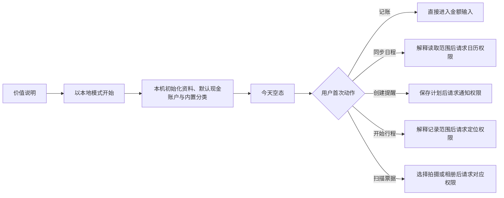

# 信息架构与用户流程

## 状态

草案，2026-08-09。关联 [`../prd/03-最小可行产品需求.md`](../prd/03-最小可行产品需求.md) 与 [`03-系统总体设计.md`](03-系统总体设计.md)。本文只定义结构、流程和状态，不定义颜色、字体、插画或最终视觉风格。

## 一级导航

P0 使用五个底部 Tab：

| Tab | 用户问题 | 核心内容 |
| --- | --- | --- |
| 今天 | 我今天要做什么、什么时候出发、还有什么待处理？ | 今日时间线、下一次出发、进行中行程、本月收支摘要、待确认事项。 |
| 账本 | 我的钱去了哪里、这个月收支如何？ | 月度概览、交易、账户、分类和报表。 |
| 日程 | 未来有哪些事件，哪些需要安排出行？ | 议程、系统日历来源、事件详情和待规划事件。 |
| 行程 | 我要怎么去、正在去哪、去过哪里？ | 待出发计划、进行中记录、历史行程和费用汇总。 |
| 我的 | App 拥有哪些权限和数据，我如何控制？ | 权限、通知、账号与同步、隐私、导出、删除、诊断和关于。 |

全局“＋”不作为 Tab，统一提供：

1. 记一笔。
2. 扫描票据。
3. 创建出行计划。
4. 开始记录行程。

系统根据当前上下文排序，不隐藏其他入口。例如在行程详情中优先展示“记录本次消费”，但仍可展开完整操作面板。

## 信息结构

```mermaid
flowchart TD
    ROOT["于是"] --> TODAY["今天"]
    ROOT --> LEDGER["账本"]
    ROOT --> CAL["日程"]
    ROOT --> TRIP["行程"]
    ROOT --> ME["我的"]
    ROOT --> ADD["全局新增"]

    TODAY --> TL["今日时间线"]
    TODAY --> NEXT["下一次出发"]
    TODAY --> ACTIVE["进行中行程"]
    TODAY --> SUMMARY["本月收支摘要"]
    TODAY --> INBOX["待确认箱"]

    LEDGER --> MONTH["月度概览"]
    LEDGER --> TX["交易流水"]
    LEDGER --> ACCOUNT["账户与分类"]

    CAL --> AGENDA["议程"]
    CAL --> EVENT["事件详情"]
    CAL --> SOURCES["日历来源"]

    TRIP --> UPCOMING["待出发"]
    TRIP --> RECORDING["正在记录"]
    TRIP --> HISTORY["历史行程"]

    ME --> PERMISSION["权限与集成"]
    ME --> SYNC["账号与同步"]
    ME --> PRIVACY["隐私与数据"]

    ADD --> ADDTX["快速记账"]
    ADD --> SCAN["扫描票据"]
    ADD --> ADDPLAN["创建计划"]
    ADD --> START["开始行程"]
```

## 页面清单

### 全局与今天

| 页面 | 核心动作 | 必备状态 |
| --- | --- | --- |
| 首次启动 | 了解价值、选择本地开始 | 首次、已完成、数据恢复待决。 |
| 今天首页 | 查看今日聚合、进入下一步 | 有事件、无事件、离线、有进行中行程、有待确认事项。 |
| 全局新增面板 | 选择四类新增动作 | 正常、相机不可用、已有进行中行程。 |
| 待确认箱 | 处理 OCR、导入、关联、日历变化与同步冲突 | 空、分组列表、处理中、批量来源失败。 |

### 账本

| 页面 | 核心动作 | 必备状态 |
| --- | --- | --- |
| 月度概览 | 查看收支、分类与趋势 | 首次无账、正常、筛选月份。 |
| 交易流水 | 搜索、筛选、进入详情 | 空、加载本地缓存、筛选无结果、同步失败。 |
| 快速记账 | 保存支出/收入/转账 | 新建、校验失败、离线保存、重复点击保护。 |
| 扫描票据 | 拍摄或选择图片 | 设备不支持、相机拒绝、相册拒绝、识别中、失败。 |
| OCR 确认 | 校对字段并确认入账 | 低置信度、高置信度、重复候选、字段缺失。 |
| 交易详情 | 查看、编辑、退款、冲销、关联 | 正常、已冲销、来源删除、同步冲突。 |
| 账户与分类 | 管理可选项和停用状态 | 初始默认、空、被引用不可硬删除。 |

### 日程

| 页面 | 核心动作 | 必备状态 |
| --- | --- | --- |
| 日程启用说明 | 了解读取范围、开启或跳过 | 未请求、拒绝后再次进入。 |
| 日历来源选择 | 选择需要缓存的系统日历 | 正常、无可用日历、权限撤回。 |
| 议程 | 浏览过去 30 天至未来 90 天事件 | 今日空、未来空、缓存过期、正在刷新。 |
| 事件详情 | 查看来源、创建或打开出行计划 | 有地点、无地点、全天、已取消、来源已删除。 |
| 地点确认 | 从自由文本确认地点候选 | 单候选、多候选、无结果、离线手动输入。 |

### 行程

| 页面 | 核心动作 | 必备状态 |
| --- | --- | --- |
| 行程列表 | 查看待出发、进行中和历史 | 空、正常、未结束行程恢复提示。 |
| 计划编辑 | 设置起终点、时间、方式和缓冲 | 手动、来自日历、字段冲突、离线。 |
| 路线确认 | 选择路线、确认出发时间和提醒 | 正常、过期、MapKit 无路线或失败。 |
| 提醒设置 | 请求通知权限、安排提醒 | 未请求、允许、拒绝、系统关闭。 |
| 出发卡片 | 开始记录、只打开地图或稍后提醒 | 准备中、路线过期、地图不可用。 |
| 正在记录 | 查看状态、暂停/继续、结束 | 正常、后台受限、定位中断、低精度、离线。 |
| 行程总结 | 确认时间距离、关联消费 | 完整轨迹、部分轨迹、无轨迹、待保存。 |
| 行程详情 | 查看计划、实际、事件与消费 | 正常、来源删除、原始轨迹已清理。 |
| 关联交易选择 | 选择已有交易或新建 | 无候选、搜索、已关联、候选重复。 |

### 我的

| 页面 | 核心动作 | 必备状态 |
| --- | --- | --- |
| 权限与集成 | 查看日历、通知、定位、相机、相册和地图状态 | 各权限所有系统状态。 |
| 通知设置 | 设置默认缓冲和提醒 | 权限关闭、部分计划未安排。 |
| 账号与同步 | 登录、设备与冲突；未启用时不展示伪入口 | 功能关闭、本地模式、已登录、离线、冲突。 |
| 隐私与数据 | 查看数据分类、保留和本地/云位置 | 正常、同步关闭。 |
| 导出 | 导出结构化可读数据；不包含临时票据图片和原始轨迹 | 生成中、完成、存储不足、分享取消。 |
| 删除 | 删除本地数据或账号；临时票据和轨迹由生命周期自动清理 | 二次确认、进行中、部分失败、完成。 |
| 诊断 | 查看版本、同步摘要和脱敏诊断包 | 正常、导出失败。 |

## 首次使用流程

首次启动只完成产品理解和本地初始化，不连续请求系统权限：

P0 不展示账号入口。P1 账号能力通过专项批准并真实可用后，入口只在用户触发备份/同步时出现；不得用登录墙阻塞本地记账。

## 核心流程

### 快速记账

1. 用户点击“记一笔”，金额输入立即获得焦点。
2. 非首次使用时默认采用最近一次同类交易的账户、常用分类、当前时间和已确认本币；首次使用采用默认现金账户与内置分类，并要求用户确认系统地区建议的本币。所有默认值可见且可修改。
3. 用户选择支出、收入或转账。转账时界面明确显示“从账户”和“到账户”。
4. 可选输入商户、备注和关联事件/行程；不提供票据附件保存。
5. 保存前执行金额、币种、账户和分录平衡校验。
6. SQLite 事务成功后立即返回成功状态；P1 同步开启时才显示非阻塞的“待同步”。
7. 重复点击由按钮状态和 transaction ID/mutation ID 双层去重。

### 日历事件到出行计划

1. 用户从议程或今天卡片打开事件。
2. 有地点时进入地点确认；无地点时允许补充仅用于“于是”的目的地，不修改系统事件。
3. 用户选择起点、交通方式、准备缓冲和是否提醒。
4. 系统生成路线快照，显示 MapKit 来源、计算时间、耗时、距离和可能失效的提示。
5. 用户确认后保存计划，并在需要时请求通知权限。
6. 事件时间、地点或取消状态变化时，将受影响字段标为“来源已变化”，保留用户覆盖值并要求确认。

### 出发、导航和行程记录

1. 出发卡片展示建议出发时间、剩余时间、路线新鲜度和提醒状态。
2. 用户选择“开始记录并导航”“只打开地图”或“稍后提醒”。
3. “开始记录并导航”先确认本 App 已成功进入记录状态，再交接到 Apple 地图；交接本身不等于实际出发。
4. 从 Apple 地图返回后，App 展示进行中行程和“已到达/结束”入口，不读取导航状态。
5. 定位中断时保留已记录片段，提示继续、手动结束或丢弃。
6. 结束后先生成草稿摘要，用户确认时间与距离，再进入消费关联。

### 行程到消费

1. 行程总结提供“记录本次消费”“关联已有交易”和“本次无消费”。
2. 新建交易只预填关联关系、时间和可解释的分类建议，不预填路线估价为实际金额。
3. 关联是独立关系；解除关联不删除交易或行程。
4. 行程详情汇总已确认交易；待确认草稿单独展示，不计入总额。

### OCR 草稿

1. 用户拍摄或选择图片，端侧识别并提取金额、日期、商户和币种候选。
2. 低置信度字段以语义状态提示，并把焦点引导到必须确认的字段。
3. 系统按来源、时间、金额、商户/订单号生成重复候选，但不自动删除。
4. 用户确认后才创建正式交易；确认、取消或离开识别会话时都删除票据图片和 OCR 临时图。

## 待确认箱

待确认箱使用统一容器，不把不同领域混成同一对象。每项必须显示：

- 类型：OCR 草稿、导入草稿、关联建议、日历变化或同步冲突。
- 来源和创建时间。
- 为什么需要用户处理。
- 主要操作：确认、编辑、忽略或查看差异。
- 忽略后的去向和是否可恢复。

账务冲突和日历变化不得使用“一键全部接受”绕过逐项风险确认；低风险候选可在后续版本支持批量处理。

## 导航与深层链接

| 入口 | 目标 | 失败处理 |
| --- | --- | --- |
| 出发提醒 | 对应出行计划或进行中行程 | 实体已删除时进入行程列表并说明原因。 |
| 远程同步提示 | 同步状态或冲突项 | 未登录或已退出时只显示本地状态。 |
| Widget / App Intent（P1） | 快速记账或下一次出发 | App 未初始化时先完成最小本地初始化。 |
| Apple 地图返回 | 进行中行程 | 没有进行中记录时回到出发卡片，不推断状态。 |

所有深层链接都通过 App Router 解析稳定领域 ID，View 不自行拼接导航路径。

## 通用状态语言

| 状态 | 展示原则 |
| --- | --- |
| 加载 | 已有缓存继续显示，并用局部刷新表示；避免整页空白骨架覆盖可用数据。 |
| 空 | 解释为什么为空，并提供一个与当前目标直接相关的动作。 |
| 离线 | 明确哪些操作仍可用；本地保存成功与同步失败分开表达。 |
| 权限拒绝 | 说明影响、提供手动方案和系统设置入口，不反复弹窗。 |
| 来源变化 | 显示旧值、新来源值和用户覆盖值，不静默替换。 |
| 路线过期 | 显示计算时间并提供重算或手动出发时间。 |
| 同步冲突 | 保留双方内容、版本和差异；用户选择后生成新 mutation。 |
| 部分数据 | 例如轨迹中断，展示已保存范围和缺失影响，允许完成任务。 |
| 不可恢复错误 | 提供脱敏诊断 ID、重试或导出数据，禁止展示内部堆栈。 |

## 可访问性与内容规范

- 所有金额同时提供符号、币种和 VoiceOver 可读文本，不只依赖正负颜色。
- 行程状态同时使用文本和图形，不用颜色单独表达“记录中”或“中断”。
- 支持 Dynamic Type；关键操作在最大字号下仍可完成，不将主按钮挤出屏幕。
- 地图不是唯一的信息载体，路线时间、距离、起终点和状态需要文字列表。
- 动画遵循“减少动态效果”，倒计时和地图更新不能持续抢占 VoiceOver 焦点。
- 删除、冲销、停止轨迹等高影响操作使用明确对象名称和结果，不用泛化“确定吗”。
- 权限文案说明用户收益、读取范围、不开启的替代方式和撤回位置。

## 视觉设计待办

本轮没有品牌资产、视觉参考或已选设计方向，因此不定义颜色、圆角、字体层级、图标风格和插画。系统流程评审通过后，应针对“今天、快速记账、事件到出行、正在记录”四个关键场景进行独立视觉探索，再建立 SwiftUI 设计 token 和组件规范。
