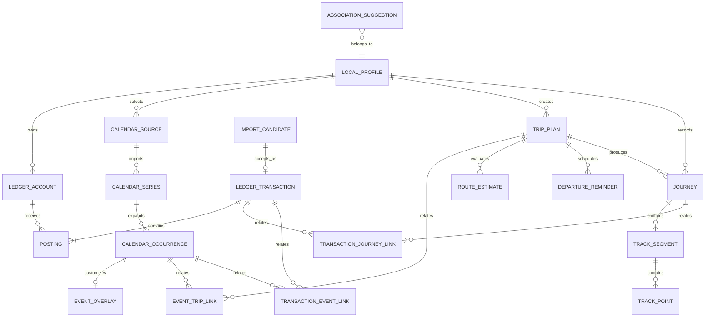
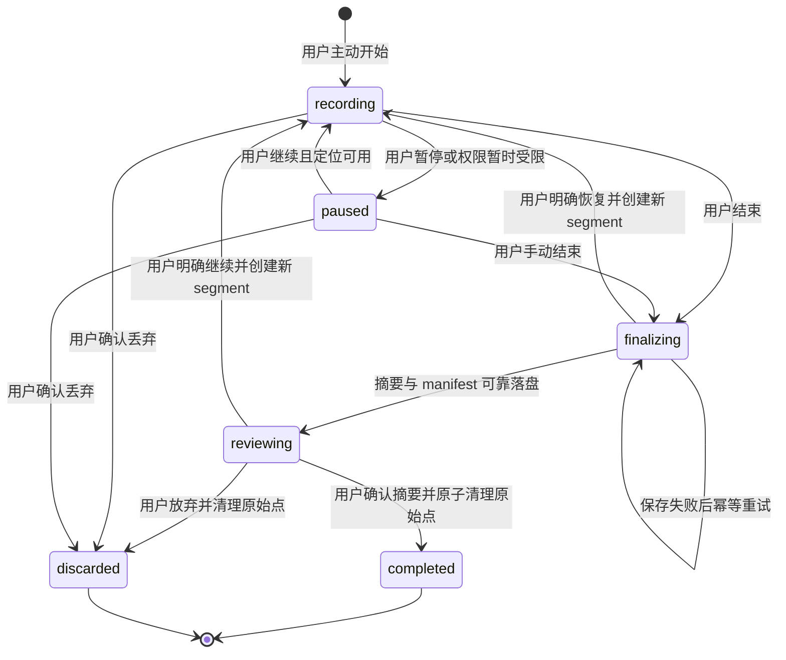
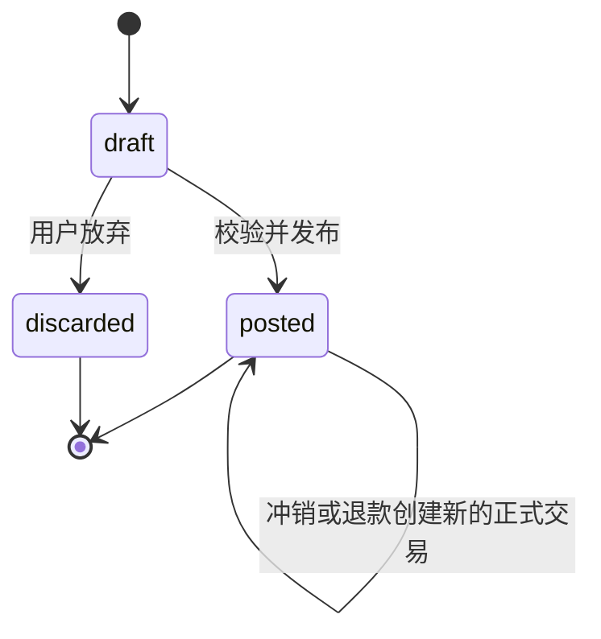
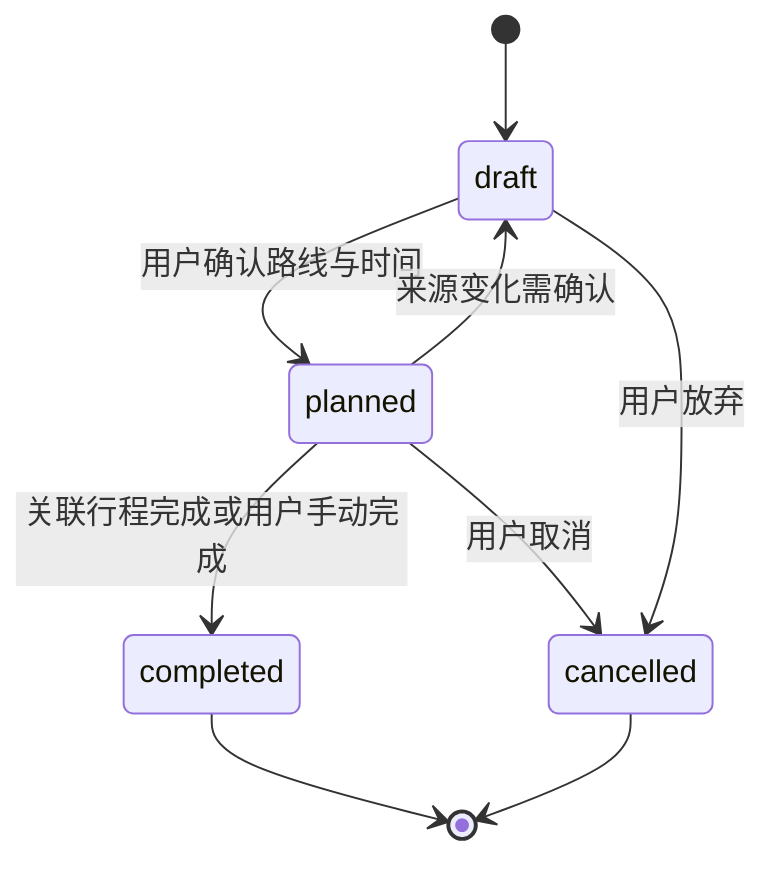

# 领域模型与数据设计

> **历史文档。** 本文只用于解释旧 GRDB 表与迁移。当前 OOTD 领域设计见 11–18 号设计，旧数据处置见 [`19-OOTD技术债清理与迁移设计.md`](19-OOTD技术债清理与迁移设计.md)。

## 状态

P0 已批准并实施中，2026-08-10。账务、日历缓存、出行计划、实际行程和交易—行程生活关联的本地物理模型已随七个有序 migration 落地，其中第六个是旧版地点快照兼容修正，第七个为 Journey 消费复盘三态。关联 [`../prd/03-最小可行产品需求.md`](../prd/03-最小可行产品需求.md)、[`03-系统总体设计.md`](03-系统总体设计.md) 与 [`01-技术选型.md`](01-技术选型.md)。本文定义 P0 逻辑模型；P1 评审通过前不向 `backend/schema.sql` 写入业务 DDL。

## 建模原则

- 财务账本、日历来源、出行计划和实际行程是四个独立聚合。
- 聚合之间只使用有外键语义的专用关联，不用无约束的通用 `entity_type + entity_id` 表承载业务关系。
- 外部来源数据与用户覆盖数据物理分离；日历重扫、OCR 或路线更新不能覆盖用户确认内容。
- 已确认账务以分录为事实；账户余额和基础报表都是可重建的派生结果，当前不建立预算领域。
- 计划和实际分离；路线估算、地点和轨迹片段使用不可变快照保存历史语义。
- 本地同步元数据只存在于 Data 层，不进入领域对象和 ViewModel。
- 时间使用 UTC instant 并保留 IANA 时区；全天事件另外保存当地日期。
- 金额使用 `Int64` 最小货币单位和 ISO 4217 币种；坐标始终携带坐标系。

## 聚合关系

## 公共标识和同步字段

### 领域公共字段

可同步实体使用：

| 字段 | 语义 |
| --- | --- |
| `id` | UUID/等价全局唯一 ID，由客户端或服务端生成，不承担排序。 |
| `owner_id` | 数据所有者；本地模式指向 LocalProfile，云端指向 User。 |
| `created_at` | 创建 instant。服务端接收同步后以服务端值为权威。 |
| `updated_at` | 最近领域变化时间；不用于冲突胜负。 |
| `version` | 服务端乐观锁版本。 |
| `deleted_at` | 可空 tombstone 时间；业务冲销不等于删除。 |
| `created_by_device_id` | 诊断与冲突定位，不用于授权。 |

服务端所有关联都必须验证两端属于同一用户，数据库可使用 `(id, owner_id)` 复合唯一约束和复合外键阻止跨用户链接。

### 本地 Data 层字段

GRDB Record 可包含但领域模型不暴露：

- `local_revision`
- `remote_version`
- `sync_state`
- `last_sync_error_code`
- `last_synced_at`
- `pending_mutation_count`

同步字段不得出现在 View 的业务判断中；UI 通过独立 `SyncSummary` 获取展示状态。

本地已经产生 mutation 的聚合称为 dirty aggregate。它拉取到更高远端版本时，不得用远端内容覆盖本地正式数据，而是把远端 canonical payload、remote version、原 base version 和发现时间写入独立 `ConflictStaging`。在用户解决前，本机余额、报表和列表继续使用本地 effective 版本，远端版本只用于差异展示；解决动作创建新的 mutation，原 mutation 的 ID、payload 和处理结果保持不变。`ConflictStaging` 属于 Data/同步基础设施，不是第二套领域事实源。

## 财务账本

### LedgerAccount

同一模型表示用户可见资产/负债账户和系统收入/支出/权益账户，避免分类与会计账户形成两份事实源。

| 字段 | 说明 |
| --- | --- |
| `id`、`owner_id` | 标识和所有者。 |
| `parent_id` | 可选父分类；资产/负债账户 P0 不做任意层级。 |
| `kind` | `asset`、`liability`、`income`、`expense`、`equity`。 |
| `subtype` | 现金、银行、信用卡、电子钱包、餐饮、交通等稳定业务值。 |
| `name` | 用户可见名称。 |
| `native_currency_code` | 资产/负债账户的本位币。 |
| `configuration_state` | `pending_currency_confirmation` 或 `ready`；仅用于首次空账户配置。 |
| `system_key` | 未分类、期初权益等不可重复的内置用途。 |
| `status` | `active` 或 `archived`；已被引用账户不能硬删除。 |
| `display_order` | 仅用于用户排序，不参与账务计算。 |

P0 的资产和负债账户限定单币种；外汇和跨币种转账进入后续独立设计。

P0 用户可创建的资金账户限定为现金、银行卡、电子钱包和信用卡；它们分别映射到 `asset` 或 `liability` 以及受控 subtype，用户不能创建 `equity` 账户。用户分类映射到 `expense` 或 `income`，自定义分类的 subtype 固定为 `custom`。分类最多一层父子关系：父节点必须与子节点属于同一 owner、同一 kind、处于 active 且自身没有 parent；资金账户不允许 parent。账户和分类名称去除首尾空白后必须为 1–40 个用户可见字符。

归档是 P0 唯一的日常停用操作。归档账户或分类继续参与历史分录和余额查询，但不会出现在新交易选择器；允许恢复为 active。期初权益等内部账户不进入管理界面且不能归档；存在 active 子分类时不得先归档父分类，父分类处于 archived 时也不得先恢复其子分类。P0 不硬删除已经创建的账户或分类，也不级联修改历史交易。

### P0 首次本地初始化

首次进入本地模式时，`InitializeLocalLedger` 必须在一个 SQLite 事务中创建且仅创建一个 `LocalProfile`、期初权益等系统账户、收入/支出未分类账户、一个默认现金账户和一组可归档但不可重复创建的内置分类。P0 内置支出分类至少包括餐饮、交通、购物、居住和其他，内置收入分类至少包括工资和其他；全部使用稳定 `system_key`，不能依赖展示名称识别用途。`LocalProfile` 保存 `base_currency_code` 与 `base_currency_state = suggested | confirmed`；默认现金账户在确认前使用 `configuration_state = pending_currency_confirmation`。初始化使用稳定 `system_key` 与唯一约束保证崩溃重试幂等，不能依赖 seed 文件或应用启动时散落建表。

本币可以根据系统地区给出建议，但建议值不是用户确认值。用户首次发布正式交易前必须明确确认本币；拒绝建议时允许重新选择。确认后变更本币属于独立设置和报表迁移，不得静默跟随系统地区变化。默认现金账户在确认本币前只能作为待配置账户，不能承载正式分录。

### LedgerTransaction

| 字段 | 说明 |
| --- | --- |
| `status` | 持久状态 `draft`、`posted`、`discarded`；是否已被替代或冲销由不可变关系推导。 |
| `kind` | `expense`、`income`、`transfer`、`refund`、`reversal`、`opening`、`adjustment`。 |
| `canonical_root_id` | 一条账务更正、退款与冲销链的稳定聚合 ID；首笔交易指向自身。 |
| `occurred_at` | 实际发生 instant。 |
| `original_timezone_id`、`local_date` | 用户当时看到的时区和自然日。 |
| `payee`、`note` | 可选敏感正文。 |
| `source_type` | `manual`、`ocr`、`file_import`、`system_suggestion`。 |
| `posted_at` | 正式发布时刻。 |
| `refund_of_id`、`reversal_of_id` | 指向原交易。 |
| `replacement_for_id`、`correction_group_id` | 替代交易与对应冲销归入同一次更正操作。 |

草稿可原地编辑。正式交易修改金额、币种、账户、分类或发生时间时，必须执行一次原子的 `CorrectTransaction`：为当前有效交易创建完全相反的已发布冲销交易，再创建替代交易。旧交易、冲销和替代交易的分录全部保留，用户界面把旧交易显示为 `superseded`，但账本绝不能仅靠排除旧交易来改变余额。

`CorrectTransaction`、`RefundTransaction` 和 `ReverseTransaction` 都以 `canonical_root_id` 为聚合边界。本地 Use Case 在一个 SQLite 写事务中校验 local/root revision、写入所有交易与分录并递增 root revision；P0 本地模式不创建 mutation，只有 P1 同步已启用时才在同一事务原子加入 mutation。服务端在一个 pgx 事务中以 `SELECT ... FOR UPDATE` 锁定 canonical root、校验 expected root version、完成同样的领域写入并原子写入 change/receipt/Outbox。每个被冲销的正式交易最多存在一条完整冲销，数据库使用唯一 `reversal_of_id` 约束辅助保证；部分退款不占用完整冲销唯一性，累计可退额在持有 root 锁时计算。更正后的金额不得低于该 root 已确认且尚未被冲销的累计退款影响。

canonical root 的首笔交易行是本地 `local_root_revision` 的权威 head；每个命令必须携带 `expected_root_revision`，并在同一写事务内以 compare-and-swap 将 head 递增一次。新生成的退款、冲销和替代交易记录本次提交后的 revision 作为审计快照，但并不成为第二个 head。初始交易为当前有效交易；每次更正后，沿同一 root 的 `replacement_for_id` 链找到没有后继 replacement 的末端，即新的当前有效交易。退款和普通完整冲销只能针对该 root 当前可操作状态，不能通过传入已被替代的旧交易绕过校验。

更正事务创建两笔交易：第一笔 `reversal_of_id = 当前有效交易` 并复制其发生时间、时区、自然日与全部相反分录，第二笔 `replacement_for_id = 当前有效交易` 并使用用户确认的新正文和分录；两笔共享非空 `correction_group_id`、同一 canonical root 与同一新 revision。退款只允许从当前有效支出发起，`refund_of_id` 指向发起时的当前有效支出，分录借记用户选择的同币种资产/负债到账账户、贷记原支出分类。累计有效退款只统计同一 root 下尚未存在 `reversal_of_id` 冲销的 refund；退款自身允许被完整冲销，冲销后不再占用可退额度。

若 root 存在大于零的有效退款，不允许直接对当前有效支出做整笔冲销，否则“原交易完全相反”会与已存在退款共同造成超额反向影响；用户必须先冲销有效退款，或继续退款到剩余可退额。更正仍可进行，但替代支出金额不得小于有效退款合计。已被完整冲销的当前有效交易不能再退款或更正；reversal 交易自身不能再次被冲销。

### Posting

| 字段 | 说明 |
| --- | --- |
| `transaction_id` | 所属交易。 |
| `ledger_account_id` | 借记或贷记账户。 |
| `side` | `debit` 或 `credit`。 |
| `amount_minor` | 严格大于零的最小货币单位。 |
| `currency_code` | ISO 4217。 |
| `memo` | 可选分录说明。 |
| `sequence` | 稳定展示和签名顺序。 |

关键不变量：

1. 每笔 `posted` 交易至少有两条分录。
2. 每个币种的借方合计等于贷方合计。
3. 交易、分录和账户属于同一 owner。
4. 正式分录不可原地修改或删除。
5. 余额从所有 `posted` 的不可变分录计算，包括旧交易及其冲销；更正后的净影响由“旧交易 + 相反冲销 + 替代交易”自然得到，不能按 `superseded` 过滤旧分录。
6. 汇总结果必须检查 `Int64` 可接受范围。

账户余额使用各账户类型的正常方向显示为正值：`asset` 与 `expense` 为借方合计减贷方合计，`liability`、`income` 与 `equity` 为贷方合计减借方合计。负余额必须保留并明确展示，不能取绝对值掩盖异常。余额查询只聚合 `posted` 分录，不保存不可验证的余额事实列。

典型分录：

| 用户动作 | 借方 | 贷方 |
| --- | --- | --- |
| 餐饮支出 | 餐饮支出 | 现金/银行卡资产 |
| 工资收入 | 银行资产 | 工资收入 |
| 信用卡消费 | 对应支出 | 信用卡负债 |
| 信用卡还款 | 信用卡负债 | 银行资产 |
| 同币种转账 | 目标资产 | 来源资产 |
| 期初余额 | 资产或期初权益 | 期初权益或负债 |
| 冲销 | 原贷方分录改为借方 | 原借方分录改为贷方 |

由于不使用数据库 trigger，跨行平衡由 Service 在一个 SQLite/pgx 事务内校验；Repository API 不暴露“绕过发布校验直接插入 posting”的路径，并使用真实 PostgreSQL 集成测试验证。退款、冲销、更正及其 root version 更新也只能通过上述聚合命令进入 Repository。

### ImportCandidate

候选字段包括来源类型、来源批次、外部 ID、稳定指纹、解析字段、字段置信度、重复候选、状态和过期时间。

状态：`detected -> reviewing -> accepted | rejected | expired`。接受时在一个事务中创建交易、分录和来源关系。没有外部 ID 时，指纹只用于提示重复，不能静默丢弃或合并。

## 日历来源

### CalendarSource

保存设备来源、来源类型、外部日历标识的本地 HMAC、用户是否选择、`access_state = selected | unselected | unavailable`、最后成功扫描时间和扫描窗口。P0 的 `CalendarSource`、`CalendarSeries`、`CalendarOccurrence`、`EventOverlay` 及原始 EventKit/HMAC 身份全部 local-only，不进入 mutation、服务端 change feed 或云端外键。

### CalendarSeries 与 CalendarOccurrence

- `CalendarSeries` 表示重复规则和来源系列身份。
- `CalendarOccurrence` 表示一次具体实例，保存外部实例 HMAC、全天标记、开始/结束 instant、当地日期、时区、加密标题/地点、来源指纹、最后出现的完整扫描和 `source_state`。
- occurrence 的 `source_state` 使用 `active`、`missing`、`cancelled`、`source_deleted`、`out_of_window`、`ambiguous`；权限和来源选择属于 CalendarSource 的 `access_state`，不通过批量改写 occurrence 表达。

全天事件使用当地日期与闭开区间保存，不能只转成 UTC；重复事件单次例外只影响对应 occurrence。

### EventOverlay

保存用户在“于是”中的忽略、地点确认、默认缓冲、提醒偏好和备注。来源字段和 overlay 分离，EventKit 重扫只修改来源快照。

`CalendarOccurrenceRevision` 或等价的来源变化候选保存 occurrence 的旧来源版本、新来源版本、检测时间和处理状态，直到用户采用、忽略或完成关联计划的重新确认。不能先覆盖当前快照再尝试从日志还原差异。

扫描规则：

1. `EKEventStoreChangedNotification` 只触发重扫，不包含具体变化。
2. 一次完整窗口扫描中未出现的实例先进入 `missing`，不能直接判定 `source_deleted`；系统应通过已知标识定向复核、系列/实例指纹和扩展窗口尝试识别事件移动。
3. 只有明确取消，或完整扫描加定向复核确认来源中不存在时，才能从 `missing` 进入 `source_deleted`；再次出现时允许回到 `active`。非唯一匹配进入 `ambiguous`，由用户确认后恢复 `active` 或建立新实例。
4. 滑出扫描窗口的 occurrence 使用 `out_of_window`；取消选择来源或权限撤回只更新 CalendarSource 的 `access_state`，不批量改写 occurrence，更不生成删除 tombstone。
5. 权限拒绝、查询失败、进程退出或部分扫描不能批量改变 occurrence 的来源状态。日历缓存清理只清除允许删除的敏感快照，不伪造 `source_deleted`；已有专用关系时保留最小 local-only 引用或将关系标为 orphaned。
6. 来源删除后，仅取消 `follows_source = true` 且尚未触发的未来提醒；用户已经独立确认的计划和提醒保留并显示来源已失效，实际行程和账务始终保留。

## 地点、计划和路线

### LocationSnapshot

不可变字段包括加密名称与地址、可空经纬度与坐标系、来源（`manual | mapkit`）、水平精度和创建时间。MapKit 确认结果必须带 WGS-84 坐标；搜索失败时允许保存仅含用户确认文字的 manual 快照，但该快照不能用于路线计算，Apple 地图交接只能按地址搜索。当前不保存第三方地点 ID。常用地点可指向最新快照，但历史计划和行程继续引用当时快照。

Core Location 与 MapKit 的内部规范坐标保持 WGS-84；当前不保存 GCJ-02/BD-09，也不实现供应商坐标转换。

### TripPlan

| 字段 | 说明 |
| --- | --- |
| `origin_snapshot_id`、`destination_snapshot_id` | 起终点不可变快照。 |
| `transport_mode` | 步行、驾车、公共交通等已验证方式。 |
| `target_arrival_at` | 目标到达时间。 |
| `planned_departure_at` | 用户确认的计划出发时间。 |
| `timezone_id` | 计划语义时区。 |
| `selected_route_estimate_id` | 当前选中的路线快照。 |
| `local_source_occurrence_id` | 可空、本地专用的 CalendarOccurrence 引用；不得上传原始身份。 |
| `source_occurrence_version` | 计划最近采用的本地来源版本。 |
| `status` | `draft`、`planned`、`completed`、`cancelled`。 |

“正在出行”从关联 Journey 推导，不写入计划状态。事件与计划通过 `EventTripLink` 连接；一个事件可以有多个候选计划，但 P0 默认只允许一个有效 `planned` 计划。

从日历带入的目的地、目标到达时间、交通方式和提醒规则分别保存 `value_source`、`source_occurrence_version` 与 `user_overridden_at`，不能只用一个计划级布尔值判断是否允许跟随来源。来源变化只为尚未被用户覆盖的字段生成采用建议；用户确认后的计划正文可以同步云端，但云端 payload 不包含 `local_source_occurrence_id`、EventKit/HMAC 身份或来源 revision。其他设备接收的是独立可编辑的用户计划，不得伪装成已同步系统日历事件。

### RouteEstimate

不可变字段包括固定来源 `mapkit`、交通方式、起终点、距离、预计耗时、`calculated_at`、`expires_at` 和 WGS-84 坐标系。过期后只允许重新计算或明确继续使用旧值；路线信息永不自动入账。

### DepartureReminder

保存计划、可选本地事件、策略、缓冲秒数、计算触发时间、路线快照、`follows_source`、schedule version、期望状态和最后调度错误。本地另外保存系统通知 request ID。

事件、路线或策略变化时递增 schedule version，取消旧请求并重新安排。App 只能承诺“已向系统调度”，不能声称通知必然展示或用户已经看到。

### NavigationHandoff

只记录计划、目标导航 App、请求时间和打开结果 `succeeded | not_installed | failed`。成功调起不改变 TripPlan/Journey 状态，也不证明已经出发或到达。

## 实际行程与轨迹

### Journey

| 字段 | 说明 |
| --- | --- |
| `trip_plan_id` | 可空；允许无计划直接记录。 |
| `recording_device_id` | 实际记录设备。 |
| `status` | `recording`、`paused`、`finalizing`、`reviewing`、`completed`、`discarded`。 |
| `started_at`、`ended_at` | 实际时间。 |
| `transport_mode` | 实际方式。 |
| `actual_origin_snapshot_id`、`actual_destination_snapshot_id` | 可空实际位置快照。 |
| `distance_meters`、`duration_seconds` | 确认后的摘要。 |
| `capture_completeness` | 本机采集结果 `complete`、`partial`、`none`；原始点删除后仍保留该摘要语义。 |
| `raw_track_state` | `collecting`、`awaiting_summary_confirmation` 或 `purged`。 |
| `expense_review_state` | 消费复盘状态 `pending`、`no_expense` 或 `has_expense`；不得从当前关系数量临时推断用户是否确认“无消费”。 |
| `final_sequence`、`point_count`、`manifest_hash` | 完成本机采集时冻结的临时轨迹清单，用于确认摘要前验证完整性；不上传。 |
| `termination_reason` | 用户结束、权限撤回、系统终止等。 |
| `tracking_consent_version` | 开始记录时的授权说明版本。 |

每台设备最多存在一个未收口 Journey，包括 `recording`、`paused`、`finalizing` 和 `reviewing`。异常退出后保留恢复标记，下次启动让用户继续、完成或丢弃，不自动推断到达。

### 轨迹

本地 `TrackSegment` 和 `TrackPoint` 保存单调序号、UTC 时间、WGS-84 坐标、精度、速度、方向、高度和 quality flag。除坐标格式本身非法外，原始采样先在 SQLite 事务中可靠落盘，再异步标记低精度、异常跳点或是否进入摘要计算；这些记录只是 active/reviewing Journey 的恢复数据，不是长期历史。

用户确认行程摘要时，同一 SQLite 事务必须先验证 manifest、保存最终时间/距离/完整性摘要，再删除该 Journey 的所有 TrackPoint/TrackSegment 并把 `raw_track_state` 设为 `purged`。用户丢弃行程时同样清理原始点。清理失败不能显示“已完成”；App 异常退出后恢复到 reviewing 并继续完成清理。原始轨迹不进入 mutation、OpenAPI、服务端 schema、导出或云备份。

## 显式关联

使用专用关系：

- `EventTripLink`
- `TransactionEventLink`
- `TransactionJourneyLink`
- `AssociationSuggestion`

正式关联至少保存两端 ID、role、created_by 和 confirmed_at。系统推断只写 `AssociationSuggestion`，用户确认后才写正式关系；被拒绝建议保存稳定指纹，避免反复提示。

P0 当前实施的行程—交易关系固定为 `TransactionJourneyLink`，交易端引用 `canonical_root_id` 而不是可被更正替代的 current transaction ID。每个 `owner_id + transaction_root_id + journey_id` 最多一条 confirmed 关系；role 使用 `transport | parking | toll | meal | other`，只用于展示与汇总分组，不改变会计分类。创建时在同一 SQLite 事务中验证 root 是同 owner 的 `posted` canonical root、Journey 是同 owner 且已进入 `reviewing | completed`；重复相同请求幂等回读，同一对关系不得因 role 不同重复计费。

行程消费汇总从已关联 canonical root 的全部 `posted` 分录净影响重建，必须自然吸收退款、冲销和更正；不得只取初始交易金额，也不得将退款作为第二笔正费用。解除关系只删除 link，不更改或删除 Journey、交易、分录或账务历史。关系创建/解除不能在账务表写入预计费用。

消费复盘状态遵循以下不变量：

- `pending` 表示用户尚未完成本次消费复盘；它与“当前恰好没有关系”不同，不能计入已闭环指标。
- `no_expense` 只能由用户在 `reviewing | completed` Journey 且关系数为零时显式确认；重复确认幂等，不创建占位交易或伪关系。
- 创建或幂等回读任一正式 TransactionJourneyLink 时，同一 SQLite 事务把 Journey 更新为 `has_expense`。
- 解除关系后，同一事务重新计算该 Journey 的关系数；仍有关系时保持 `has_expense`，最后一条解除时回到 `pending`，不得自动恢复历史 `no_expense`。
- 用户已经确认 `no_expense` 后仍可新建或关联真实交易；关系创建成功时状态原子转为 `has_expense`。已有关系时禁止标记 `no_expense`，界面应引导先解除关系。
- 删除 Journey 会随 Journey 一并删除该状态与所有关系；交易及分录保持不变。

该状态通过新增的前向 migration `v7_add_journey_expense_review_state` 加入 `journeys`。migration 只新增带常量默认值和枚举约束的 `expense_review_state` 列，不修改已执行的 `v4_create_journey_recording`；既有 Journey 中已经存在正式关系的回填为 `has_expense`，其余保持 `pending`，绝不能根据历史关系缺失回填为 `no_expense`。升级后必须验证既有 Journey、关系与账务不变，并通过 SQLite `foreign_key_check` 和 `integrity_check`。

P0 的 `EventTripLink` 和 `TransactionEventLink` 是 local-only，因为其 CalendarOccurrence 端不会上传服务端；它们不进入 mutation、云端 change feed 或服务端 schema。云端只同步用户确认后的 TripPlan 正文、Journey 摘要、TransactionJourneyLink 等两端都存在于云端的关系。未来若要跨设备保留事件语义，必须先批准一个不含原始 EventKit 身份的最小 `EventReference` 模型，不能上传悬空外键或把 CalendarOccurrence 暗中复制到服务端。

删除规则：

- 删除或失去日历事件不删除计划、Journey 或交易。
- 删除计划不删除已完成 Journey。
- 删除 Journey 清理轨迹和行程关系，但交易保留为未关联。
- 解除关系不删除任一端实体。
- 账务业务撤销使用退款、冲销或更正，不以同步删除代替。

## 状态机与不变量

### Transaction

`superseded` 与 `reversed` 是根据 `replacement_for_id`、`reversal_of_id` 推导的用户可见 effect state，不是允许余额查询排除旧分录的持久状态。完整冲销、更正和退款始终锁定 canonical root 并递增同一 root version。

### TripPlan

状态转换必须由领域用例执行；不得通过枚举大小、客户端时间或数据库直接更新跳过规则。

## 删除与生命周期语义

区分：

1. **业务撤销**：账务通过更正、退款或冲销保留历史。
2. **同步删除**：创建只含 ID、version 和 deleted_at 的 tombstone。
3. **隐私擦除**：清理数据库、派生数据、推送令牌和后续 Outbox。

默认方向：

- OCR 图片和中间图在识别确认、取消或会话结束后删除，不提供附件保存。
- 日历正文、参会人和邮件默认不采集。
- 原始轨迹只在 active/reviewing Journey 期间临时保留；摘要确认或行程丢弃后立即删除。
- 日历缓存随着扫描窗口滚动，权限撤回后按隐私设置清理，不误删已经创建的用户计划。
- tombstone 至少保留批准的最小期限并等待所有有效设备确认；超过最长离线期仍未确认的设备必须先标为 `reset_required`，提升 `min_valid_cursor/sync_epoch` 后才可清理，过旧设备只能全量恢复。

具体天数依赖最长离线时长、账号删除撤销期、备份策略和用户承诺，未确认前不得在实现中随意硬编码。

## 物理存储约束

- iOS 所有表由一个集中 `DatabaseMigrator` 创建和演进；Feature 不隐式建表。
- P1 服务端启用后，PostgreSQL 所有 enum、table、constraint、index 和 comment 最终集中写入 `backend/schema.sql`；P0 本地模式不为尚未启用的同步提前创建服务端业务表。
- P1 服务端 PostgreSQL 不依赖 extension、trigger、function、RLS 或 seed DML；相关 Atlas 声明式限制不作用于 P0 的 GRDB/SQLite 迁移。
- 高敏感字段按 [`09-权限隐私与安全设计.md`](09-权限隐私与安全设计.md) 使用强制信封加密；P0 搜索和报表只在本地执行。P1 未经独立安全与泄漏评审，不提供服务端敏感字段搜索或报表。
- P0 本地索引至少覆盖 status + time、交易本地日期、事件窗口、计划出发时间和 Journey active 状态；P1 同步启用后再增加 owner、mutation 队列和服务端 change cursor 索引。
- 未经 PRD 与本文批准，不提前创建空业务表。

### 当前 P0 物理落地

首个本地 migration 固定为 `v1_create_local_ledger`，只创建已经进入当前垂直切片的 `local_profiles`、`ledger_accounts`、`ledger_transactions` 和 `postings`。四张表集中定义在一个 `DatabaseMigrator` 文件中，并落实单一 LocalProfile、稳定 system key、账户/交易同 owner 复合外键、正式状态与发布时间一致、完整冲销引用唯一、正整数分录金额和核心查询索引。

本位币确认已经通过 `ConfirmBaseCurrencyUseCase` 原子更新 LocalProfile 与全部初始账户；同币种支出、收入和转账已由纯领域 `LedgerPostingPlan` 验证账户状态、账户类型、币种、分录数量、正整数金额、借贷平衡与 `Int64` 溢出。`CreateTransactionUseCase` 只通过 `GRDBLedgerRepository` 的单个 SQLite 写事务发布正式交易与分录，重复使用相同 transaction ID 和相同内容会返回首次结果，同 ID 不同内容会被拒绝。Data 层没有公开绕过上述验证的正式分录写入口。

退款、冲销和更正的 canonical root 原子命令已经随账务垂直切片落地。第二个本地 migration 固定为 `v2_create_calendar_cache`，加入 `calendar_sources`、`calendar_scans`、`calendar_series`、`calendar_occurrences` 和 `calendar_occurrence_revisions`。第三个本地 migration 固定为 `v3_create_trip_planning`，随计划垂直切片加入 `location_snapshots`、`trip_plans`、`route_estimates`、`departure_reminders`、`navigation_handoffs` 和本地 `event_trip_links`。第四个本地 migration 固定为 `v4_create_journey_recording`，只加入 `journeys`、`track_segments` 和 `track_points`，并用部分唯一索引限制每设备一个未收口 Journey。第五个本地 migration `v5_create_life_links` 已只创建 `transaction_journey_links`，以复合外键和唯一约束固定同 owner、稳定 canonical root 与单一 role；它没有为关联建议、同步队列或云端事件关系预建空表。第六个 `v6_relax_manual_location_coordinates` 是兼容 migration：检测旧版 `location_snapshots.latitude` 是否仍为 `NOT NULL`，仅在旧结构上原子重建地点表，使 `latitude`、`longitude`、`coordinate_system` 必须“三者都有或三者全无”，复制全部既有地点并保留 `trip_plans`/`route_estimates` 的外键指向与查询索引；当前结构上执行应为空操作。第七个 `v7_add_journey_expense_review_state` 为 `journeys` 增加受约束的 `expense_review_state`：存在正式生活关系的历史 Journey 回填为 `has_expense`，其余只回填 `pending`，绝不根据空关系推断用户确认过 `no_expense`。P0 OCR 候选固定为记账表单会话内纯值，不创建候选表、附件表或来源关系。

## 必须先确认的 schema 决策

1. P1 账号与多设备同步的准确实体范围、本地数据认领/合并和发布条件；P0 固定为单设备本地模式。
2. P0 之后是否需要最小 EventReference，以及用户确认的哪些事件语义允许上传服务端；原始 CalendarOccurrence 维持 local-only。
3. 用户所说“删除交易”的可见语义：更正、冲销、隐藏或隐私擦除。
4. 关联建议可使用哪些时间、地点和金额特征。
5. 最长离线期、账号删除撤销期和备份清理承诺。
6. P1 是否另行批准服务端敏感字段搜索或报表；默认不提供，强制信封加密不因该决策而放宽。

## 数据验收重点

- 支出、收入、转账、信用卡还款、退款、冲销和期初余额始终平衡。
- 并发发布同一草稿最多成功一次。
- 日历扫描中断或权限撤回不会把窗口事件批量判定删除。
- 重复事件单次修改不影响系列中其他实例；全天事件跨时区不改变日期。
- Apple 地图交接不会改变 Journey 状态或生成费用。
- 异常退出后能恢复 active/reviewing Journey；摘要确认与原始点清理必须原子，完成后不存在可导出或上传的 TrackPoint。
- 删除 Journey 会清理轨迹，但不删除交易；自动建议不能创建正式关系。
