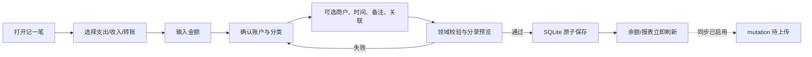

# 记账系统设计

> **历史文档。** 记账不属于当前 OOTD 产品范围；本文只用于解释旧代码、数据与测试，不再授权实现。

## 状态

P0 已批准并实施中，2026-08-09。关联 [`../prd/03-最小可行产品需求.md`](../prd/03-最小可行产品需求.md)、[`05-领域模型与数据设计.md`](05-领域模型与数据设计.md) 和 [`08-同步与接口设计.md`](08-同步与接口设计.md)。

## 目标与非目标

P0 目标是让个人用户快速、准确、离线地完成日常账务，并能把消费与事件或行程关联。系统内部遵循双重分录，但界面使用支出、收入、转账、退款和冲销等用户语言。

P0 不提供预算、企业会计、税务、投资持仓、发票合规、共享账本、自动抓取支付流水或自动外汇结算。专业会计细节不应增加普通支出的录入成本。

## 功能结构

| 子域 | 能力 |
| --- | --- |
| 账户 | 现金、银行卡、信用卡、电子钱包；期初余额；归档。 |
| 分类 | 收入和支出分类、有限层级、排序和归档。 |
| 交易 | 支出、收入、同币种转账、退款、冲销、更正和详情历史。 |
| 报表 | 月度收支、分类分布、趋势和行程消费入口。 |
| 待确认 | OCR、文件导入、重复候选和未来的同步冲突。 |
| 关联 | 事件和行程的显式关系；不保存票据附件。 |

## 首次本地初始化

P0 首次进入本地模式时，`InitializeLocalLedger` 在一个 SQLite 事务中创建单一 `LocalProfile`、期初权益等系统账户、收入/支出未分类账户、默认现金账户和内置收入/支出分类。每个内置对象使用稳定 `system_key` 和唯一约束，初始化被进程中断后可以安全重试，不会生成第二套账户或分类。

默认分类固定提供餐饮、交通、购物、居住、其他支出，以及工资和其他收入；未分类收入/支出作为明确兜底保留。用户可以创建现金、银行卡、电子钱包、信用卡和自定义收入/支出分类。分类最多支持一层父子结构，资金账户不分层；名称为 1–40 个去除首尾空白后的字符。

系统地区只用于建议本币。首次正式发布交易前，用户必须在金额流程中明确确认或改选本币；未确认时默认现金账户保持待配置，不能产生 `posted` 分录。本币确认后不随系统地区或设备语言静默变化。

## 快速记账流程

### 默认值

- 默认交易类型为用户最近常用类型，但不能跨用户或首次启动猜测。
- 已确认后默认币种来自用户本币或所选资产账户；首次使用的系统地区结果只作建议，不能代替确认。
- 默认时间为当前时间；从行程或事件进入时可预填关联时间并明确来源。
- 账户和分类只使用最近选择或用户固定偏好，不以未经确认的模型自动替换。
- 金额永不从路线估价自动填入；OCR 金额必须在确认页可见。

### 最小必填

| 类型 | 必填 |
| --- | --- |
| 支出 | 金额、付款账户、支出分类、发生时间、币种。 |
| 收入 | 金额、收款账户、收入分类、发生时间、币种。 |
| 转账 | 金额、来源账户、目标账户、发生时间；P0 两账户币种必须一致。 |
| 信用卡还款 | 金额、还款资产账户、信用卡负债账户、发生时间；作为受约束的转账视图保存。 |
| 退款 | 金额、退款到账账户、原交易、发生时间；金额不得超过可退余额。 |
| 冲销 | 原交易、冲销原因和时间；分录由系统生成，不让用户手工改方向。 |

商户、备注、事件和行程关联均为可选，不阻塞快速保存；当前不提供附件字段或票据原图保存入口。

## 用户动作与分录

| 动作 | 领域处理 | 报表处理 |
| --- | --- | --- |
| 普通支出 | 借记支出账户，贷记付款资产/负债账户。 | 计入对应分类支出。 |
| 普通收入 | 借记收款资产账户，贷记收入账户。 | 计入对应收入。 |
| 转账 | 借记目标资产/负债，贷记来源资产/负债。 | 不计收入或支出。 |
| 信用卡消费 | 借记支出，贷记信用卡负债。 | 计支出。 |
| 信用卡还款 | 借记信用卡负债，贷记银行资产。 | 只改变账户余额。 |

“信用卡还款”是界面语义，不新增 `LedgerTransactionKind`：正式交易仍为 `transfer`。还款来源只能是 active + ready 的资产账户，目标只能是 active + ready 且 subtype 为 `credit_card` 的负债账户；不选择收支分类、不计月报收入或支出。没有可用信用卡时界面明确提示先到账户管理创建，不回退为任意负债账户。
| 退款 | 创建引用原交易的相反影响交易。 | 抵减原分类和对应期间规则。 |
| 冲销 | 创建原分录的完全相反交易。 | 原交易与冲销均可追溯，净影响为零。 |
| 更正 | 在同一 canonical root 内创建旧交易的完全相反冲销，再发布替代交易。 | 全部分录都保留并参与净额；列表默认折叠为当前版本。 |

界面可在高级详情展示“资金流向”，但普通录入不暴露借方/贷方术语。

## 发布、编辑与删除语义

### 草稿

草稿不影响余额和正式报表，可原地编辑或丢弃。OCR 和导入候选在用户确认前不是交易草稿本身，以免半成品进入账务查询。

### 正式交易

- 保存成功后进入 `posted`。
- 修改金额、币种、账户、分类或时间时执行 `CorrectTransaction`；用户看到的是“编辑”，系统在一个事务中创建原有效交易的完全相反冲销和替代交易，并保留完整 correction history。
- 只修改商户或备注等不影响分录的展示信息时，创建可审计 metadata revision 并递增 canonical root version，不改写正式分录。
- 退款从 canonical root 发起，可多次部分退款；持有 root 锁时按整个交易链计算累计可退额，不得超过当前有效交易可退金额。更正后的金额不能小于已确认且尚未冲销的退款影响。
- 冲销适用于整笔撤销；每个被冲销的正式交易最多有一条完整冲销，原交易和冲销交易都保留。存在有效部分退款时不得直接冲销当前有效支出；退款本身可被完整冲销，之后释放对应可退额度。
- 普通界面的“删除”不得硬删除已发布账务。隐私擦除属于账号/数据删除流程，不与业务撤销混用。

`CorrectTransaction`、`RefundTransaction` 和 `ReverseTransaction` 都以 `canonical_root_id` 为聚合 ID。本地 Use Case 在同一 SQLite 事务中完成 root version 校验和全部交易/分录写入；P0 本地模式不创建 mutation，只有 P1 同步已启用时才在该事务中原子加入 mutation。服务端在同一 PostgreSQL 事务中锁定 root、重复校验并写入 change log、receipt 和 Outbox。HTTP 批次、多个独立 mutation 或事后修补状态都不能替代这个原子边界。

首笔 canonical root 行保存权威 `local_root_revision`；命令携带 expected revision 并只允许一次 compare-and-swap。当前有效交易是 `replacement_for_id` 链的末端。更正的系统冲销复制被替代交易的发生时间和全部相反分录，替代交易使用用户确认的新时间与分录；两者共享 correction group 和提交后的 root revision。退款按实际到账时间记账，只允许当前有效支出，且有效退款定义为尚未被完整冲销的 refund。命令重试使用稳定 refund/reversal transaction ID 或 correction group + 两个 transaction ID；同标识同内容返回首次结果，同标识不同内容稳定拒绝。

## 余额与查询

- 账户余额从所有 `posted` 不可变分录聚合；被替代交易仍参与，其影响由对应冲销抵消。可维护可重建缓存，但不得把缓存或 `superseded` 展示状态当事实源。
- 资产和支出账户展示余额为 debit − credit；负债、收入和权益账户为 credit − debit。负值原样显示；聚合溢出必须失败并进入可恢复错误，不得截断或转为浮点数。
- 流水列表每个 `canonical_root_id` 只显示一行：金额、类型、时间和说明取当前 replacement 链末端，身份使用稳定 root ID；完整冲销后保留该行并标记“已撤销”，有效退款单独显示累计金额，不把系统生成的退款、冲销行伪装成新的日常消费。
- 流水列表默认按当前有效交易的 `occurred_at`、稳定 root ID 排序，避免同一时间交易跳动。
- 交易详情先显示当前有效版本、账户流向、可退金额与状态，再按提交时间展示同一 root 的全部退款、冲销和替代历史；普通界面不允许硬删除历史节点。
- “退款”仅在当前有效支出尚有可退金额时出现；“撤销”仅在当前有效交易未撤销且不存在有效退款时出现；“更正”只允许保持支出、收入或转账类型不变。操作表单提交时携带详情页读取到的 root revision；若版本已变化，保留输入、刷新详情并要求用户重新确认。
- 月度边界按用户时区和 `local_date` 计算；服务端 UTC 只用于传输和排序。
- P0 在本地提供商户、备注和金额搜索，报表也只在本地计算。P1 服务端保持强制信封加密；未经独立安全、泄漏和索引设计批准，不提供敏感字段搜索或服务端报表。
- 搜索命中当前 replacement 链末端的商户、备注或完整金额，结果仍按 canonical root 折叠；被更正掉的旧展示字段只能在详情历史查看，不能让同一业务交易在搜索结果中重复出现。清空搜索立即恢复最近流水。
- 归档账户和分类继续参与历史查询，但不能用于新交易。

## 报表与复盘

P0 提供：

1. 本月收入、支出和净变化。
2. 支出分类排行与月度趋势。
3. 按账户、分类、商户和是否关联行程筛选。
4. 一次行程的已确认消费汇总入口。

基础月报按用户时区的 `local_date` 划分自然月，从期间内全部 `posted` 分录聚合收入与支出账户：退款贷记支出账户并自然抵减，更正的旧交易与系统冲销自然抵消，转账只涉及资金账户因而不进入收支。净变化为收入减支出；分类排行同样从支出账户净额重建，不从流水展示行二次推导。

账本页的月份选择器同时确定月报期间与趋势终点。趋势固定展示截至所选月份的最近六个自然月支出净额，缺失月份补零；不创建报表缓存表。趋势、分类排行和合计必须来自同一次本地数据库快照，避免列表刷新期间出现互相矛盾的数值。

P0 筛选使用一个显式、可清除的本地条件集：可分别选择一个资金账户、一个收入/支出分类、行程关系的“全部/已关联/未关联”，并复用商户、备注或完整金额搜索词。归档账户和分类仍可用于历史筛选。筛选同时作用于 canonical-root 流水与月报；月份只限制月报和趋势，不把跨月本地搜索静默收窄为当前月。

筛选匹配当前 replacement 链末端：账户/分类通过当前有效交易的分录匹配，商户与备注通过当前有效展示字段匹配，完整金额通过当前有效交易首条分录匹配，行程关系通过稳定 `canonical_root_id` 的 `transaction_journey_links` 判断。被更正掉的旧字段不能命中或制造第二行。一个 root 命中后，月报仍聚合该 root 在期间内的全部 `posted` 影响，使退款、冲销和更正保持净额语义；选择具体分类时，只展示该分类在期间内的净额与趋势。过滤查询必须始终限定当前 owner，并在一个 GRDB 只读事务中完成。

报表必须明确筛选期间、币种，以及退款/冲销已经按全部正式分录计入净额。筛选结果为空时显示可恢复空态和“清除筛选”，不能伪造零交易或丢失当前条件。P0 只有已确认本币；多币种未批准前不把不同币种简单相加。

## OCR 与导入

### 端侧 OCR

1. 用户明确选择拍照或相册图片。
2. 相册只使用系统 Photos Picker；App 不申请整库读取。相机只在用户点选拍摄时按需请求权限。
3. 图片数据只作为一次 `OCRService` 调用的内存参数；不复制到 Application Support、Documents、Caches、SQLite 或网络请求，也不写入诊断日志。
4. Vision 的 observation 立即映射为纯 Swift 文本行与置信度后丢弃，规则解析金额、日期、商户、币种和订单号候选。
5. `ReceiptOCRCandidate` 只存在于当前记账表单会话，保存字段值、字段来源与置信度，不保存原图、OCR 原文集合或 Vision 类型。金额和商户缺失、字段低置信度或规则存在歧义时必须明确提示。
6. 当前有效流水中同币种、同金额且商户相近的结果只作为“可能重复”提示；P0 没有稳定票据外部 ID，不自动阻止、合并或丢弃候选。
7. 用户点“采用候选”只把可用字段填入手动交易表单，仍可逐项修改；只有再次点击“保存”并通过账务校验后才创建正式交易与分录。取消候选、切换交易类型或关闭表单都不产生账务事实。
8. 图像数据在识别调用返回、失败或取消后即释放；候选在采用、忽略或记账表单结束后清除。P0 不创建 OCR 候选表、附件表、来源关系或后台清理队列。

设备不支持相机、权限拒绝、图片不可读、Vision 无结果或解析失败时保留当前手动输入并显示可恢复说明；用户可重新打开系统选择器或继续手动记账。识别失败不能生成空候选、空交易或余额变化。

### 文件导入（P1）

文件必须由用户主动选择。导入先创建批次和候选，显示成功、重复、需确认和失败数量。不存在可作为 P0 依赖的微信/支付宝个人全量流水授权接口，不使用通知监听、短信读取或无障碍抓取替代。

## 重复检测

P0 单张票据识别只实现会话内模糊提示：按候选币种与完整金额查询当前有效流水，再对规范化商户进行比较。提示不改变保存按钮和账务规则，也不持久化用户拒绝记录。

票据识别区必须在“选择票据照片”和“拍摄票据”操作之前显示“仅用于本机本次识别，不保存或上传”的简短说明；说明可随 Dynamic Type 换行，不能只放在初始视口之外的 Section footer。自动化证据必须在标准字号和最大辅助字号下分别滚动到该说明，断言完整无障碍文案及其与两个操作的视觉顺序，并在当前视口执行原生文本裁切审计；截图只留在表单上半部不构成验收证据。

P1 文件导入启用后再按以下顺序实现持久化去重：

优先顺序：

1. 来源范围 + 稳定外部 ID 精确去重。
2. 来源范围 + 订单号精确候选。
3. 时间窗口 + 金额 + 币种 + 规范化商户指纹相似候选。

只有第一类可以作为幂等接受的依据；模糊候选不自动丢弃。用户拒绝的候选保存不可逆稳定指纹，避免重复提示但不保留额外敏感正文。

## 行程与事件关联

- 交易编辑器可从当前事件或行程上下文预填关系，但不改变分录。
- 一笔交易可关联多个事件或 Journey，并为每条关系标注交通费、停车费、餐饮等 role。
- `TransactionEventLink` 及其 CalendarOccurrence 目标在 P0 和当前 P1 同步范围内都只存在本机；`TransactionJourneyLink` 只有两端实体均获准上云时才可同步。
- 行程消费汇总只统计用户确认的正式关联和 `posted` 交易。
- 删除 Journey 或事件只解除/标记来源关系，不删除交易。
- 自动候选进入待确认箱；建议不能修改分类、金额或账户。

## iOS 模块职责

| 组件 | 责任 |
| --- | --- |
| `LedgerRepository` | 交易、分录、账户和分类的事务读写。 |
| `CreateLedgerAccountUseCase` | 校验本位币、账户类型、受控 subtype、名称和一级分类父节点后原子创建。 |
| `SetLedgerAccountStatusUseCase` | 归档或恢复账户/分类；保护内部权益账户，阻止归档仍有 active 子节点的父分类，并阻止在父分类 archived 时先恢复子分类。 |
| `ReceiptOCRParser` | 把纯文本行解析为会话内字段候选与置信度；不访问数据库或文件系统。 |
| `CreateTransactionUseCase` | 输入校验、分录构造与发布；仅在 P1 同步启用时原子写入 mutation。 |
| `CorrectTransactionUseCase` | 锁定 canonical root，原子创建相反冲销和替代交易并递增 root version。 |
| `RefundTransactionUseCase` | 锁定 canonical root，校验整条链的可退余额并创建退款分录。 |
| `ReverseTransactionUseCase` | 保证完整冲销唯一，生成完全相反分录并递增 root version。 |
| `LedgerQueryService` | 列表、余额与基础报表只读投影。 |
| `OCRService` | 封装 Vision 端侧文本识别；输入图像数据只在调用期间存活，不直接持久化候选或正式交易。 |

ViewModel 只接收领域结果和可展示错误。生成 API DTO、GRDB Record、Vision observation 和 SQL 不越过边界。

### 当前 P0 实现边界

- `PositiveMoney` 只接受大于零的 `Int64` 最小货币单位；界面金额解析按币种小数位进行整数运算，不以 `Double` 保存或计算金额。
- `ConfirmBaseCurrencyUseCase` 在首笔交易前确认或改选本位币；相同币种重试幂等，确认后的不同币种选择被拒绝，不能跟随系统地区静默变化。
- `LedgerPostingPlan` 已覆盖支出、收入和同币种转账的账户类型、状态、币种及借贷平衡规则；`GRDBLedgerRepository` 在同一个 SQLite 事务中读取账户上下文并写入交易与全部分录。
- transaction ID 是 P0 重复提交键：同 ID 同内容返回首次正式交易，同 ID 不同内容稳定拒绝；界面保存期间同时禁用重复提交。
- `CreateLedgerAccountUseCase`、`SetLedgerAccountStatusUseCase` 和 `LedgerQueryService` 已实现账户/分类创建、归档、恢复与 posted 分录余额重建；资金账户、一级分类、内部权益保护和父子状态一致性都在仓储事务内校验。
- 当前用户界面已开放支出、收入、转账和信用卡还款的专用展示路径。还款只列出可用资产来源与 `credit_card` 负债目标，不显示分类，保存后的正式类型仍为 `transfer`；无可用信用卡时显示账户管理引导。其他类型已提供账户/分类选择器、发生时间、可选说明与备注，以及账本余额和账户/分类管理；归档项目保留余额但不会进入新交易选项。
- 账本首页已经把月份选择、本币收入/支出/净变化、支出分类净额、近期 canonical root 流水和本地搜索组合为同一只读入口。“今天”的本月摘要不替代该页面；切换月份只重载投影，不写业务事实。
- 流水与搜索结果都按 canonical root 折叠并进入稳定 root 详情；详情可执行退款、完整撤销和原子更正并查看不可变历史。搜索只匹配当前有效商户、备注或完整金额，基础月报继续按上述全部正式分录口径重建。
- 单张票据切片已通过 `RecognizeTextRequest`、纯 Swift `ReceiptOCRParser`、系统 Photos Picker 和按需相机授权实现。候选采用前后都不创建交易，最终保存的交易只记录 `source = ocr` 这一非敏感来源枚举，并在详情展示“票据识别”；不保存图像、OCR 原文或候选关系。模拟器自动化证据不能替代真实票据样本准确率、相机和权限可视化验收，因此整个 P0 仍未验收。
- 首笔确认本位币后再次冷启动会按 confirmed 状态校验全部内置账户为 ready，不会把首次初始化模板的 pending 状态误判为数据损坏；启动失败仍禁止静默重建用户数据库。

## 离线与同步状态

- 所有新建和更正先在本地事务完成。
- 同步失败不回滚本地正式交易；交易详情显示非阻塞同步状态。
- 同一 mutation 重试必须返回同一结果。
- dirty 本地正式交易遇到更高远端版本时不静默合并，也不替换本地行；远端 canonical 写入 `ConflictStaging`，本机余额、报表和列表继续使用本地 effective 分支并明确显示未收敛状态。
- 用户解决冲突后创建新的更正或其他领域 mutation；原 mutation 的 ID、payload 和结果不修改、不重放。远端版本只有在本地聚合 clean，或冲突解决事务明确采用远端时，才可替换 canonical 投影。
- 服务端拉取的新版本必须先验证分录平衡、canonical root 和所有者，再按上述 clean/conflict 规则原子应用。
- 账号关闭后，本地账本继续可用；是否保留云端副本由用户选择和账号政策决定。

## 错误与恢复

| 场景 | 行为 |
| --- | --- |
| 金额或分录非法 | 不写数据库，聚焦具体字段并保留输入。 |
| 磁盘空间不足 | 显示保存失败并保留编辑内容；OCR 临时图片按会话生命周期清理。 |
| 重复点击 | 第一次保存拥有操作，后续点击复用结果。 |
| OCR 失败 | 切换手动输入，不创建正式交易。 |
| 账户已归档 | 显示历史账户并要求选择有效账户。 |
| 同步冲突 | 保留本地和远端版本，明确差异并生成用户选择后的新更正。 |
| 数据库迁移失败 | 禁止继续写入，保留可导出诊断和恢复路径，不静默重建用户数据库。 |

## 测试重点

- 每种交易的分录、余额和报表结果。
- 部分退款、累计退款上限、冲销和多次更正链。
- 更正必须同时落下相反冲销与替代交易；任意故障点都不能只生效一半，余额从全部 posted 分录重建一致。
- 两设备并发退款、完整冲销和更正只允许一个符合 expected root version 的 canonical 结果，完整冲销不能重复。
- 同一草稿并发发布、重复 mutation 和进程恢复。
- dirty 本地交易拉取远端版本时进入 conflict staging，不双计、不覆盖，解决后使用新 mutation 收敛。
- 首次初始化崩溃重试只存在一个 LocalProfile、一套 system_key 和一个默认现金账户；未确认本币不能发布交易。
- 月末、跨时区、夏令时和本地日期边界。
- 归档账户/分类的历史可见性。
- OCR 低置信度、重复候选、图片清理和手动兜底。
- 行程关系解除不改变账务。
- 本地数据库迁移、约束和大列表查询性能。
