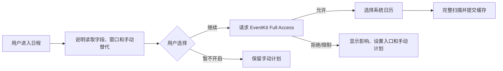

# 日历与出行系统设计

## 状态

草案，2026-08-09。关联 [`../prd/03-最小可行产品需求.md`](../prd/03-最小可行产品需求.md)、[`04-信息架构与用户流程.md`](04-信息架构与用户流程.md) 和 [`05-领域模型与数据设计.md`](05-领域模型与数据设计.md)。

## 目标与系统边界

本系统把系统日历中的时间和地点转换为用户确认的出行计划，安排本地提醒，调起外部导航，并在用户主动开始后记录实际行程。

明确边界：

- 只读取已进入 iOS 系统日历数据库且用户选择的日历。
- iOS 没有日历只读授权；请求 Full Access，但产品策略只读来源事件。
- 不修改系统事件，不读取微信、钉钉等 App 的私有日历。
- Apple 地图调起是单向交接，不读取其导航历史、偏航或到达状态。
- 实际轨迹仅由本 App 在用户主动开始后临时采集，用于恢复和生成摘要；摘要确认或行程丢弃后立即删除原始点。

## 日历授权与来源选择



- App 只在用户选择同步日程时请求权限。
- 授权成功后必须再让用户选择来源日历，默认不勾选明显的节假日/订阅日历是否自动纳入由产品评审决定。
- 权限状态、功能开关和是否同意上云分别建模；系统授权不代表同意同步到服务端。
- 权限撤回时停止读取和重扫；缓存如何清理按用户隐私设置执行，用户已创建的计划与 Journey 保留。

## 扫描窗口与变化处理

P0 默认窗口为过去 30 天至未来 90 天，用于今日回顾、近期计划和来源变化判断。窗口是产品默认，可在性能 POC 后调整。

一次扫描流程：

1. 创建 `CalendarScan`，记录窗口和 scan ID。
2. 从用户选中的日历查询事件。
3. 在内存/临时表规范化系列、实例、时区、全天和来源指纹。
4. 以外部标识、实例日期和稳定指纹匹配现有快照；非唯一匹配标记 ambiguous。
5. 在一个 SQLite 事务中写入全部成功结果和 `last_seen_scan_id`。
6. 只有查询与事务完整成功后，才把本应仍在本次窗口和已选来源中的缺失实例标为 `missing`，不直接判定来源删除。
7. 对 `missing` 实例执行定向查询或等待下一次完整扫描；只有 EventKit 明确取消/删除，或定向复核和连续完整扫描都确认不存在时，才标为 `source_deleted`。
8. 更新受影响的地点确认、计划和提醒状态。

`EKEventStoreChangedNotification` 只意味着需要重新扫描，不包含具体差异。权限错误、查询失败、进程被杀或部分写入时，不得批量判定来源删除。

来源生命周期必须区分；`active`、`missing`、`source_deleted`、`out_of_window`、`cancelled` 与 `ambiguous` 属于 occurrence，`unselected` 与 `unavailable` 属于 CalendarSource 的 access state，不能通过批量改写 occurrence 冒充：

| 状态 | 语义 | 产品行为 |
| --- | --- | --- |
| `active` | 来源实例在已选日历和扫描窗口内可见。 | 正常参与来源变化比较。 |
| `missing` | 完整扫描暂时未发现，但尚未确认删除。 | 保留计划和提醒，不向用户宣称删除；安排定向复核。 |
| `source_deleted` | 已通过明确取消/删除或复核确认来源不存在。 | 取消仍跟随来源的未来提醒，保留用户计划与历史。 |
| `out_of_window` | 实例因时间变化离开滚动窗口。 | 作为缓存生命周期处理，不表示来源删除。 |
| `unselected`（来源访问状态） | 用户不再选择对应日历。 | 停止跟踪来源，按隐私设置清理缓存。 |
| `unavailable`（来源访问状态） | 权限、账户或系统暂时不可用。 | 保留 occurrence 最近状态并提示恢复，不做删除推断。 |
| `cancelled` / `ambiguous` | EventKit 明确取消，或身份匹配不唯一。 | 分别进入取消处理或人工确认。 |

滚动窗口清理和权限撤回属于缓存/隐私操作，绝不能生成 `source_deleted`。已有 TripPlan 引用的实例即使正文被清理，也要保留最小本地 tombstone，使来源状态、版本和关联可解释。

### 重复事件、全天和时区

- 重复系列与 occurrence 分开；单次例外只影响具体 occurrence。
- 全天事件保存当地开始/结束日期和闭开区间，不用 UTC 瞬间替代日期语义。
- 全天事件默认不安排出发提醒；用户补充具体到达时间后创建独立计划，不修改原事件。
- 事件开始、结束和计划保留原时区；设备跨时区时提示用户按事件时区还是当前时区处理。
- 来源事件确认取消/删除后，取消尚未触发且 `follows_source = true` 的提醒，但不删除已确认计划、实际行程或交易。

## 事件字段来源与用户覆盖

| 字段 | 来源字段 | 用户覆盖 |
| --- | --- | --- |
| 标题 | EventKit 快照 | 可在 TripPlan 中使用独立显示名，不改系统事件。 |
| 时间 | EventKit start/end/timezone | 用户可为计划设置独立到达/出发时间。 |
| 地点文本 | EventKit location | 用户确认 LocationSnapshot 或手动输入。 |
| 忽略 | 无 | EventOverlay 保存。 |
| 缓冲与交通方式 | 无 | EventOverlay/TripPlan 保存。 |
| 提醒 | 系统事件自身提醒不读取为本产品承诺 | DepartureReminder 独立保存。 |

来源变化时显示旧来源、新来源和用户计划值。未被用户覆盖的字段可以提示一键采用；已覆盖字段不能静默替换。

为了可靠执行该规则，计划中每个可继承字段都保存 `source_occurrence_version`、`value_source`（`event`、`user` 或 `derived`）和可空 `user_overridden_at`。日历扫描生成不可变的来源 revision 或变化候选，界面比较 revision 后再采用；不直接覆盖 TripPlan。提醒另外保存 `follows_source`：仅该值为真且依赖字段未被用户覆盖时，来源变化才允许自动重算并重新调度。

P0 的 `EventTripLink` 与 `TransactionEventLink` 只存在于本机，因为 CalendarOccurrence、EventKit 标识和 HMAC 映射都不上传。账号同步只能上传用户确认后的 TripPlan 内容和 Journey/交易关系，不上传原始事件身份；未来若需要跨设备事件关联，必须另行批准最小 `EventReference` 替身及单独同意流程。

## 地点解析

地点字段通常是自由文本：

1. 保留原始来源文本的本地加密快照。
2. 通过 MapKit 地点搜索生成候选，并标注来源、WGS-84 坐标系和检索时间。
3. 单一高可信候选仍需要用户在首次创建计划时确认。
4. 多候选显示名称、行政区和距离等可解释信息。
5. 无结果或离线时允许手动输入地址、地图选点或稍后处理。
6. 用户确认后创建不可变 LocationSnapshot；未来来源文本变化不改写旧快照。

## 出行计划

### 创建来源

- 从 CalendarOccurrence 创建。
- 用户手动输入时间和地点。
- 从常用地点/重复模板创建（P1）。
- 从已完成 Journey 复制（P1）。

### 必填与可选

必填：目的地、目标到达时间、交通方式和计划时区。起点可用用户选择的常用地点、手动地点或出发时再使用当前位置；使用当前位置需要 When In Use 定位授权。

可选：关联事件、具体起点、路线、准备缓冲、提醒、显示名和备注。

### 出发时间

建议出发时间：

```text
目标到达时间 - 路线预计耗时 - 用户准备缓冲
```

系统展示三个组成部分和路线计算时间。用户可以直接覆盖计划出发时间；覆盖后路线变化只提示，不静默修改。

路线重算触发：

- 起点、终点、交通方式或目标到达时间变化。
- 关联事件的时间/地点变化且用户尚未覆盖。
- 用户主动刷新。
- App 在临近出发时回到前台且路线已过期。

系统后台执行不可靠，因此不能承诺在 App 长期未运行时持续根据路况刷新提醒。没有新路线时保留旧快照、显示过期，并允许手动设置出发时间。

## 路线规划

`RoutePlanningService` 输入规范化起终点、交通方式和时间，输出不可变 RouteEstimate：MapKit 提供的坐标系、距离、耗时、计算时间和有效期。

- 当前只实现 MapKit/MKDirections，按系统返回结果尽力提供路线，不把城市或交通方式覆盖率设为发布门槛。
- 当前不接入高德、百度、腾讯等国内路线供应商，不保留多供应商 adapter、坐标转换或供应商切换入口。
- 无路线时保留计划编辑和手动出发时间，不阻塞保存草稿。
- 路线距离和耗时只用于展示，不能自动生成交易。

## 出发提醒

本地通知是出发提醒主路径：

1. 用户确认计划与提醒后才请求通知权限。
2. 计算 `fire_at`，创建稳定 notification request ID 和 schedule version。
3. 先取消同计划旧版本，再提交新请求。
4. 保存系统调度结果和错误，不把“已安排”描述为“必然送达”。
5. 时间、路线、缓冲或计划状态变化时重新安排。
6. 计划取消、来源事件取消或提醒关闭时撤销请求。

通知内容默认只显示用户允许的最小信息；锁屏隐私模式可只显示“该准备出发了”。APNs 不作为准点提醒的唯一渠道。
当前提醒固定使用普通本地通知级别，不申请或设置 Time Sensitive、Critical Alerts，也不保留隐藏开关。

## 外部导航

`ExternalNavigationService` 只负责构造并打开 Apple 地图交接请求：

- Apple 地图是当前唯一导航入口，但不承诺城市、交通方式或路线覆盖率。
- 当前不检测或选择第三方地图 App，不配置第三方查询 scheme，也不嵌入导航 SDK。
- 调起失败时提供复制地址和返回计划。
- 只记录 NavigationHandoff 的请求与打开结果；成功不改变 Journey 状态。

用户选择“开始记录并导航”时，顺序必须是：先成功创建本地 Journey 与明显记录状态，再尝试调起地图。地图失败不会丢失 Journey，用户可继续记录或结束。

## 实际行程记录

### 开始

- 用户必须点击“开始记录”并看见用途、权限和停止入口。
- P0 请求 When In Use；使用 iOS 18 live updates 和可见后台活动会话，不默认请求 Always。
- 每台设备最多一个 active Journey；已有未结束记录时先恢复或结束。
- 初始 Journey 和记录同意版本先写入 SQLite，再启动位置更新。

### 记录

- `TripRecordingService` 由 App 级依赖容器拥有，不依赖 ViewModel 生命周期。
- 每个系统位置采样先分配单调序号，并连同精度和初始 `quality_flag` 在 SQLite 事务中可靠落盘；不能因为过滤逻辑、页面消失或网络状态丢弃原始证据。
- 落盘后异步校验时间、精度与异常跳点，更新质量标记并生成可重建的有效轨迹投影；原始点不经过 UI 状态保存。
- 采样根据交通方式、速度、精度和前后台状态自适应；具体阈值由真实行程 POC 决定。
- 低精度、权限暂时受限或系统暂停时保留已有段，`track_completeness` 标记 partial。
- UI 显示记录中、暂停、定位中断和最后可靠更新时间。

### 结束与恢复

- 用户手动结束是 P0 主路径；可选到达围栏只能提示确认，不能静默完成。
- 结束时先进入 `finalizing`，停止位置更新并落盘最后批次，再幂等计算摘要、`final_sequence`、`point_count` 和 `manifest_hash`。
- 摘要计算成功后进入 `reviewing`，展示摘要并等待用户确认；失败保持 `finalizing` 并重试，不能把已经停止定位的同一段静默恢复为 recording。
- 用户在收尾后选择继续采集时显式创建新的 TrackSegment；界面展示存在中断，不伪造一条连续轨迹。
- 用户确认摘要时，在同一 SQLite 事务中保存最终摘要、删除该 Journey 的全部 TrackPoint/TrackSegment，并把 `raw_track_state` 置为 `purged` 后才进入 `completed`；清理失败继续停留在 `reviewing`。
- App 异常退出后，下次启动检测 active、finalizing 或 reviewing Journey，分别提供继续、完成计算、确认摘要或丢弃。
- 没有轨迹也可保存起止时间和手动摘要，明确完整性为 none。

Journey 分别保存采集完整性 `capture_completeness` 与临时原始数据状态 `raw_track_state`。原始点不进入 mutation、OpenAPI、服务端 schema、导出或云备份；删除 Journey 或丢弃摘要时也必须先清理本地点，且不能留下可恢复的轨迹文件。

## 行程总结与消费

总结展示：计划与实际起止时间、耗时、距离、轨迹完整性、来源事件和路线来源。确认动作会删除原始点，因此界面必须在确认前明确说明之后只保留摘要，且不再提供轨迹回放。确认成功后可：

- 记录本次消费。
- 关联已有交易。
- 标记本次无消费。
- 修正摘要或删除 Journey。

新建消费可以预选交通、停车、过路、餐饮等分类和关系 role，但金额保持空白。正式交易创建后建立 TransactionJourneyLink；解除关系不删除两端。

## iOS 服务边界

| 协议 | 责任 |
| --- | --- |
| `CalendarService` | 权限、来源列表、窗口查询和变化通知。 |
| `CalendarImportService` | 扫描、规范化、匹配、完整提交和来源状态。 |
| `PlaceResolutionService` | 地点候选与用户确认所需元数据。 |
| `RoutePlanningService` | MapKit 路线快照和不可用降级。 |
| `ReminderService` | 本地通知权限、调度、取消和状态。 |
| `ExternalNavigationService` | Apple 地图交接请求和打开结果。 |
| `TripRecordingService` | Journey 生命周期、位置采集、批量落盘和恢复。 |
| `TripRepository` | 计划、路线、Journey、轨迹摘要和关系。 |

系统框架对象不进入 Domain 或 ViewModel。服务错误转换为稳定领域错误，例如 `calendarPermissionDenied`、`routeUnavailable`、`locationAccuracyReduced`、`notificationNotAuthorized`。

## 失败与降级

| 场景 | 降级 |
| --- | --- |
| 日历拒绝/撤回 | 手动计划；缓存状态清晰可见；不推断来源删除。 |
| 事件无地点 | 仅为“于是”补充目的地，不修改系统日历。 |
| 地点解析失败 | 手动文本、地图选点或稍后处理。 |
| 路线服务离线/失败 | 保存计划草稿，手动出发时间，复制地址。 |
| 通知关闭 | 页面内醒目展示未提醒；提供系统设置入口。 |
| Apple 地图调起失败 | 复制地址并返回计划。 |
| 定位低精度 | 继续记录并标记精度，或允许用户停止。 |
| 后台中断/进程终止 | 保存已有段，下次启动恢复 active Journey。 |
| 存储空间不足 | 停止新增轨迹、保留 Journey 状态并引导清理；不谎报完整。 |
| 跨时区 | 同时展示事件时区与设备时区，要求确认计划语义。 |

## 隐私要求

- 默认不采集日历正文、参会人和邮件地址。
- 标题、地点和地址是敏感数据；本地受 Data Protection，日志不记录正文。
- 原始 EventKit ID 在本地 HMAC 后保存，默认不上云。
- 精确位置和原始轨迹仅在活动行程恢复与摘要确认前临时保留在本地；摘要确认或行程丢弃后立即删除，不导出、不上传。
- 权限撤回不等于数据删除；设置中分别提供停止能力和删除已有数据。
- 推送和通知内容遵循锁屏最小披露模式。

## 真机验收重点

- 日历初次授权、拒绝、撤回、选择来源和完整重扫。
- 重复事件单次修改、事件移动日历、来源删除、全天和跨时区。
- MapKit 正常返回、无路线、路线过期、无网络和手动出发时间降级；不以多城市或多交通方式覆盖率作为发布门槛。
- 通知权限拒绝、锁屏、Focus、时区变化和重新调度。
- Apple 地图交接成功、打开失败、复制地址和返回 App。
- 行程在前台、后台、锁屏、低精度、权限撤回和系统杀进程后的恢复。
- 长行程耗电、数据库批写、存储不足、轨迹完整性，以及摘要确认后的原始点原子清理和异常恢复。
- 行程消费关联不会使用预计费用或删除正式账务。
