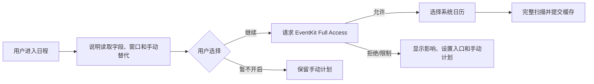

# 日历与出行系统设计

> **历史文档。** 日历与出行不属于当前 OOTD 产品范围；本文只用于解释旧代码、权限与数据，不再授权实现。

## 状态

P0 已批准并实施中，2026-08-10。日历授权、来源选择和窗口扫描，以及出行计划、MapKit 路线快照、普通本地提醒状态、Apple 地图单向交接和实际行程记录的本地垂直切片已实现并通过自动化验证。真机 EventKit、MapKit、通知、Apple 地图打开、Core Location 前后台恢复和相关界面证据仍待完成，不因模拟器或 fake adapter 通过而置为已验收。关联 [`../prd/03-最小可行产品需求.md`](../prd/03-最小可行产品需求.md)、[`04-信息架构与用户流程.md`](04-信息架构与用户流程.md) 和 [`05-领域模型与数据设计.md`](05-领域模型与数据设计.md)。

## 目标与系统边界

本系统把系统日历中的时间和地点转换为用户确认的出行计划，安排本地提醒，调起外部导航，并在用户主动开始后记录实际行程。

明确边界：

- 只读取已进入 iOS 系统日历数据库且用户选择的日历。
- iOS 没有日历只读授权；请求 Full Access，但产品策略只读来源事件。
- 不修改系统事件，不读取微信、钉钉等 App 的私有日历。
- Apple 地图调起是单向交接，不读取其导航历史、偏航或到达状态。
- 实际轨迹仅由本 App 在用户主动开始后临时采集，用于恢复和生成摘要；摘要确认或行程丢弃后立即删除原始点。

## 日历授权与来源选择



- App 只在用户选择同步日程时请求权限。
- 授权成功后必须再让用户选择来源日历；所有新发现来源一律默认不选中，节假日和订阅日历也不例外。
- 权限状态、功能开关和是否同意上云分别建模；系统授权不代表同意同步到服务端。
- 权限撤回时停止读取和重扫；缓存如何清理按用户隐私设置执行，用户已创建的计划与 Journey 保留。

## 扫描窗口与变化处理

P0 默认窗口为过去 30 天至未来 90 天，用于今日回顾、近期计划和来源变化判断。窗口是产品默认，可在性能 POC 后调整。

一次扫描流程：

1. 创建 `CalendarScan`，记录窗口和 scan ID。
2. 从用户选中的日历查询事件。
3. 在内存/临时表规范化系列、实例、时区、全天和来源指纹。
4. 以外部标识、实例日期和稳定指纹匹配现有快照；非唯一匹配标记 ambiguous。
5. 在一个 SQLite 事务中写入全部成功结果和 `last_seen_scan_id`。
6. 只有查询与事务完整成功后，才把本应仍在本次窗口和已选来源中的缺失实例标为 `missing`，不直接判定来源删除。
7. 对 `missing` 实例执行定向查询或等待下一次完整扫描；只有 EventKit 明确取消/删除，或定向复核和连续完整扫描都确认不存在时，才标为 `source_deleted`。
8. 更新受影响的地点确认、计划和提醒状态。

`EKEventStoreChangedNotification` 只意味着需要重新扫描，不包含具体差异。权限错误、查询失败、进程被杀或部分写入时，不得批量判定来源删除。

来源生命周期必须区分；`active`、`missing`、`source_deleted`、`out_of_window`、`cancelled` 与 `ambiguous` 属于 occurrence，`unselected` 与 `unavailable` 属于 CalendarSource 的 access state，不能通过批量改写 occurrence 冒充：

| 状态 | 语义 | 产品行为 |
| --- | --- | --- |
| `active` | 来源实例在已选日历和扫描窗口内可见。 | 正常参与来源变化比较。 |
| `missing` | 完整扫描暂时未发现，但尚未确认删除。 | 保留计划和提醒，不向用户宣称删除；安排定向复核。 |
| `source_deleted` | 已通过明确取消/删除或复核确认来源不存在。 | 取消仍跟随来源的未来提醒，保留用户计划与历史。 |
| `out_of_window` | 实例因时间变化离开滚动窗口。 | 作为缓存生命周期处理，不表示来源删除。 |
| `unselected`（来源访问状态） | 用户不再选择对应日历。 | 停止跟踪来源，按隐私设置清理缓存。 |
| `unavailable`（来源访问状态） | 权限、账户或系统暂时不可用。 | 保留 occurrence 最近状态并提示恢复，不做删除推断。 |
| `cancelled` / `ambiguous` | EventKit 明确取消，或身份匹配不唯一。 | 分别进入取消处理或人工确认。 |

滚动窗口清理和权限撤回属于缓存/隐私操作，绝不能生成 `source_deleted`。已有 TripPlan 引用的实例即使正文被清理，也要保留最小本地 tombstone，使来源状态、版本和关联可解释。

### 重复事件、全天和时区

- 重复系列与 occurrence 分开；单次例外只影响具体 occurrence。
- 全天事件保存当地开始/结束日期和闭开区间，不用 UTC 瞬间替代日期语义。
- 全天事件默认不安排出发提醒；用户补充具体到达时间后创建独立计划，不修改原事件。
- 事件开始、结束和计划保留原时区；设备跨时区时提示用户按事件时区还是当前时区处理。
- 来源事件确认取消/删除后，取消尚未触发且 `follows_source = true` 的提醒，但不删除已确认计划、实际行程或交易。

## 事件字段来源与用户覆盖

| 字段 | 来源字段 | 用户覆盖 |
| --- | --- | --- |
| 标题 | EventKit 快照 | 可在 TripPlan 中使用独立显示名，不改系统事件。 |
| 时间 | EventKit start/end/timezone | 用户可为计划设置独立到达/出发时间。 |
| 地点文本 | EventKit location | 用户确认 LocationSnapshot 或手动输入。 |
| 忽略 | 无 | EventOverlay 保存。 |
| 缓冲与交通方式 | 无 | EventOverlay/TripPlan 保存。 |
| 提醒 | 系统事件自身提醒不读取为本产品承诺 | DepartureReminder 独立保存。 |

来源变化时显示旧来源、新来源和用户计划值。未被用户覆盖的字段可以提示一键采用；已覆盖字段不能静默替换。

为了可靠执行该规则，计划中每个可继承字段都保存 `source_occurrence_version`、`value_source`（`event`、`user` 或 `derived`）和可空 `user_overridden_at`。日历扫描生成不可变的来源 revision 或变化候选，界面比较 revision 后再采用；不直接覆盖 TripPlan。提醒另外保存 `follows_source`：仅该值为真且依赖字段未被用户覆盖时，来源变化才允许自动重算并重新调度。

计划首次保存后，`TripPlan.source_occurrence_version` 与 `EventTripLink.source_occurrence_version` 表示“用户采用时看到的来源版本”，不得随日历重扫推进。后续扫描只更新 CalendarOccurrence、追加不可变 revision 并产生待处理提示；不得改写已确认计划的显示名、地点快照、目标到达时间、计划出发时间或提醒状态。P0 从事件创建的提醒固定 `follows_source = false`，来源变化只允许用户比较后显式采用；在该交互获独立验收前不自动重算或重新调度。

P0 的 `EventTripLink` 与 `TransactionEventLink` 只存在于本机，因为 CalendarOccurrence、EventKit 标识和 HMAC 映射都不上传。账号同步只能上传用户确认后的 TripPlan 内容和 Journey/交易关系，不上传原始事件身份；未来若需要跨设备事件关联，必须另行批准最小 `EventReference` 替身及单独同意流程。

### 来源变化处置与计划编辑

“来源已变化”必须是可处理状态，不能只显示没有入口的徽标。日程事件行提供“查看来源变化”，展示用户当前采用版本与最新来源版本之间的标题、开始/结束时间、时区和地点文本差异；原值、新值和已确认计划值分栏显示，长文本可完整读取。Today 的待处理项跳转到同一处置页，不创建第二套状态。

P0 对一个 occurrence 只允许从产品入口创建一个出行计划。Repository 在保存关系的同一事务中检查是否已有 EventTripLink；重复创建返回可恢复错误并引导打开既有计划。数据库仍保留现有复合唯一约束以兼容已生成数据，不通过破坏性 migration 静默删除历史重复关系；若检测到历史重复关系，来源采用操作闭合失败并要求用户逐个保留现状，不能批量覆盖多个计划。

处置动作只有两类：

- “保留当前计划”：把当前 occurrence 截至所见 `source_version` 的 pending revision 原子标记为 `ignored` 并记录 `resolved_at`；TripPlan、LocationSnapshot、Reminder 和 EventTripLink 采用版本全部不变。
- “采用到计划”：先进入计划编辑确认页，而不是直接改库。只对采用版本仍等于 revision 起点、计划版本未变化且状态为 `draft | planned` 的单一关联计划开放；用户逐项确认标题、目的地、到达/出发时间、路线和提醒后提交。完成事务才把相关 revision 标记为 `accepted`，并把 TripPlan 与 EventTripLink 的来源版本推进到所见版本。

为此追加新的有序本地 migration，不修改已经执行的 `v3_create_trip_planning`：

- `trip_plans.plan_version INTEGER NOT NULL DEFAULT 1`，每次编辑递增，用于阻止陈旧页面覆盖。
- `trip_plans.display_name_value_source` 与 `display_name_user_overridden_at`，补齐标题字段级来源。历史计划安全回填为 `user`，不根据字符串相等猜测来源；新建事件计划只有在用户从未编辑标题时才写 `event`。
- `calendar_occurrence_revisions.resolved_at` 可空；`pending` 时必须为空，`accepted | ignored` 时必须有值。若 SQLite `ALTER` 无法增加完整约束，migration 采用新表复制、完整性检查和原子换表，不丢失现有 revision。

采用事务按以下顺序执行：校验 owner、occurrence、连续 pending revision、EventTripLink、采用版本和 `expected_plan_version`；写入用户重新确认的地点快照；更新计划字段、字段来源、采用版本和 `plan_version`；将旧 RouteEstimate 从选择状态解除并删除，因为事件时间或地点变化会使快照失效；把提醒写成用户在确认页选择的期望状态；更新 EventTripLink 采用版本；最后把截至目标版本的 revision 标为 `accepted`。任一步失败全部回滚，来源 revision 保持 pending。

系统通知不属于 SQLite 事务。数据库先保存计划与 `not_requested | disabled` 期望状态，提交后再取消旧 request 并调度新 request，最后回写 `scheduled | authorization_denied | failed`；App 重启时按提醒表幂等协调。任何系统调度失败都不得回滚已确认计划，也不得把 revision 重新变回 pending，但必须向用户显示提醒未生效。

并发与多次变化按服务端式乐观规则处理：处置命令携带用户看到的 `occurrence_source_version`、`event_trip_link.source_occurrence_version` 与 `expected_plan_version`。若扫描在确认页期间再产生新版本，只允许处理用户已经看过的连续 revision，新版本继续 pending；若计划已被另一个页面编辑，整个采用事务拒绝并重新加载。`ignored` 后出现的新 revision仍可再次处理，不因为旧 revision 被忽略而自动采用。

### 当前日历缓存垂直切片

- `v2_create_calendar_cache` 只创建已经进入本切片的 `calendar_sources`、`calendar_scans`、`calendar_series`、`calendar_occurrences` 与 `calendar_occurrence_revisions`；TripPlan、路线、提醒、Journey 和关系表不提前创建。
- EventKit adapter 在框架边界内用 Keychain 保存的设备随机密钥对日历、系列和 occurrence 标识做长度分隔的 HMAC-SHA256；原始标识、notes、URL、参会人、邮件和附件不进入 Domain、SQLite 或日志。
- 首次授权后仅列出来源，新增来源默认 `unselected`。用户逐个选择后才查询事件；来源暂时不可见或权限撤回只设为 `unavailable`，保留用户原选择意图和 occurrence 最近状态。
- 产品展示窗口固定为过去 30 天至未来 90 天；一次完整扫描同时查询过去 60 天至未来 180 天的匹配窗口。匹配窗口内但展示窗口外的实例写为 `out_of_window`，用来避免把时间移动误判为删除。
- 扫描先从 EventKit 取得并规范化完整结果，再由一个 SQLite 事务提交 scan、series、occurrence、revision 和缺失状态。查询失败、取消、进程退出或数据库回滚不会推进任何 occurrence 状态。
- occurrence 先按 HMAC 身份匹配；来源字段变化时递增 `source_version` 并保存不可变 revision。只有当前展示窗口内、选中来源且连续成功完整扫描缺失的实例才从 `active` 进入 `missing`；本切片不在缺少明确证据时自动写 `source_deleted`，EventKit 明确取消则写 `cancelled`。
- 日程页面显示真实授权状态、来源选择、最后成功扫描、缓存事件和全天/时区信息；拒绝、限制或相机式系统能力不可用时不阻塞记账。`EKEventStoreChangedNotification` 只安排一次新的完整扫描，不能直接修改缓存。

## 地点解析

地点字段通常是自由文本：

1. 保留原始来源文本的本地加密快照。
2. 通过 MapKit 地点搜索生成候选，并标注来源、WGS-84 坐标系和检索时间。
3. 单一高可信候选仍需要用户在首次创建计划时确认。
4. 多候选显示名称、行政区和距离等可解释信息。
5. 无结果或离线时允许手动输入地址、地图选点或稍后处理。
6. 用户确认后创建不可变 LocationSnapshot；未来来源文本变化不改写旧快照。

## 出行计划

### 创建来源

- 从 CalendarOccurrence 创建。
- 用户手动输入时间和地点。
- 从常用地点/重复模板创建（P1）。
- 从已完成 Journey 复制（P1）。

### 必填与可选

必填：目的地、目标到达时间、交通方式和计划时区。起点可用用户选择的常用地点、手动地点或出发时再使用当前位置；使用当前位置需要 When In Use 定位授权。

可选：关联事件、具体起点、路线、准备缓冲、提醒、显示名和备注。

### 出发时间

建议出发时间：

```text
目标到达时间 - 路线预计耗时 - 用户准备缓冲
```

系统展示三个组成部分和路线计算时间。用户可以直接覆盖计划出发时间；覆盖后路线变化只提示，不静默修改。

路线重算触发：

- 起点、终点、交通方式或目标到达时间变化。
- 关联事件的时间/地点变化且用户尚未覆盖。
- 用户主动刷新。
- App 在临近出发时回到前台且路线已过期。

系统后台执行不可靠，因此不能承诺在 App 长期未运行时持续根据路况刷新提醒。没有新路线时保留旧快照、显示过期，并允许手动设置出发时间。

## 路线规划

`RoutePlanningService` 输入规范化起终点、交通方式和时间，输出不可变 RouteEstimate：MapKit 提供的坐标系、距离、耗时、计算时间和有效期。

- 当前只实现 MapKit/MKDirections，按系统返回结果尽力提供路线，不把城市或交通方式覆盖率设为发布门槛。
- P0 将新路线快照的前台新鲜期固定为 15 分钟；到期只标记过期并提示重算，不删除快照、不后台承诺持续刷新，也不阻止用户采用手动出发时间。
- 当前不接入高德、百度、腾讯等国内路线供应商，不保留多供应商 adapter、坐标转换或供应商切换入口。
- 无路线时保留计划编辑和手动出发时间，不阻塞保存草稿。
- 路线距离和耗时只用于展示，不能自动生成交易。

### 当前计划垂直切片

- `v3_create_trip_planning` 只随本切片创建 LocationSnapshot、TripPlan、RouteEstimate、DepartureReminder、NavigationHandoff 与本地 EventTripLink；不创建 Journey、轨迹或消费关系表。
- 计划草稿必须具有目的地和目标到达时间；起点可暂缺。使用 MapKit 计算路线时必须先由用户从地点候选中确认带 WGS-84 坐标的起终点；搜索失败时目的地可退化为用户确认的纯文字 manual 快照，此时 `latitude`、`longitude` 与 `coordinate_system` 必须同时为空，不能计算路线，但仍可保存手动出发时间并让 Apple 地图按地址搜索。已经安装过旧版 `v3_create_trip_planning`、仍把三列声明为 `NOT NULL` 的数据库必须由新增兼容 migration 修正，禁止编辑同名 `v3` 后假设更新安装会重跑。路线成功后按“到达时间 − 预计耗时 − 缓冲”生成建议出发时间，用户可再次覆盖。
- 保存为 `planned` 前必须存在用户可见并确认的出发时间；无路线时允许直接确认手动出发时间，并明确路线状态为不可用或未计算。
- 从日历事件创建时只保存本地 occurrence 关系和采用时的 source version；事件标题、地点和到达时间只作为表单初值，保存后不被重扫静默覆盖。
- 日程页只允许从 `active` 或 `missing` occurrence 发起创建，编辑器 seed 必须携带稳定的本地 occurrence ID 和用户开始创建时看到的 source version。普通事件未编辑的到达时间记为 `event`；用户改动后立即记为 `user` 并保存覆盖时间。事件地点文本永远只是搜索初值，只有用户选择候选或确认纯文字地址后才以 `user` LocationSnapshot 保存。
- 全天事件初始禁止保存和提醒；用户必须显式确认一个具体到达时间。该确认本身即是用户覆盖，即使确认后的值与屏幕初始显示值相同，`target_arrival_value_source` 也必须为 `user` 且写入 `target_arrival_user_overridden_at`；不修改 EventKit 事件。
- 从事件保存计划时，LocationSnapshot、TripPlan、DepartureReminder 期望状态和 EventTripLink 必须在同一 SQLite 事务中写入。occurrence 不存在、owner 不匹配、source version 非法或任一外键/约束失败时整次回滚，不得留下孤立地点、计划或提醒。保存不更新 CalendarOccurrence 的正文、状态或 source version。
- 提醒记录与计划在同一 SQLite 事务中保存期望状态；系统通知调度随后执行并回写 `scheduled`、`denied` 或 `failed`，不得在系统调用失败时显示为已安排。
- Apple 地图交接每次先持久化 `requested` handoff，再执行系统打开并回写 `succeeded` 或 `failed`；任何结果都不改变计划状态，也不创建 Journey。

## 出发提醒

本地通知是出发提醒主路径：

1. 用户确认计划与提醒后才请求通知权限。
2. 计算 `fire_at`，创建稳定 notification request ID 和 schedule version。
3. 先取消同计划旧版本，再提交新请求。
4. 保存系统调度结果和错误，不把“已安排”描述为“必然送达”。
5. 时间、路线、缓冲或计划状态变化时重新安排。
6. 计划取消、来源事件取消或提醒关闭时撤销请求。

通知内容默认只显示用户允许的最小信息；锁屏隐私模式可只显示“该准备出发了”。APNs 不作为准点提醒的唯一渠道。
当前提醒固定使用普通本地通知级别，不申请或设置 Time Sensitive、Critical Alerts，也不保留隐藏开关。

## 外部导航

`ExternalNavigationService` 只负责构造并打开 Apple 地图交接请求：

- Apple 地图是当前唯一导航入口，但不承诺城市、交通方式或路线覆盖率。
- 当前不检测或选择第三方地图 App，不配置第三方查询 scheme，也不嵌入导航 SDK。
- 调起失败时提供复制地址和返回计划。
- 只记录 NavigationHandoff 的请求与打开结果；成功不改变 Journey 状态。

地图打开失败态必须绑定发起操作的具体 TripPlan，而不是只显示一条无上下文错误：

- 列表展示“导航未打开”、本次目的地和显式“复制目的地”操作；不只用颜色表达失败。
- 复制内容优先使用用户已确认的非空地址，地址缺失时退化为地点名称；不写入坐标、时间、计划标识、账务或其他上下文。
- 剪贴板只能在用户点击复制后写入；地图失败本身不自动复制。写入成功后在原位显示“目的地已复制”，重复点击只覆盖同一文本。
- 复制通过可注入的系统边界执行，ViewModel 不直接访问全局剪贴板；自动化需断言失败前零写入、手动点击后精确一次写入和地址缺失的名称降级。

用户选择“开始记录并导航”时，顺序必须是：先成功创建本地 Journey 与明显记录状态，再尝试调起地图。地图失败不会丢失 Journey，记录页依然打开；用户关闭记录页返回计划后，仍可从与该计划绑定的失败态复制目的地。

## 实际行程记录

### 开始

- 用户必须点击“开始记录”并看见用途、权限和停止入口。
- P0 请求 When In Use；使用 iOS 18 live updates 和可见后台活动会话，不默认请求 Always。
- 每台设备最多一个 active Journey；已有未结束记录时先恢复或结束。
- 初始 Journey 和记录同意版本先写入 SQLite，再启动位置更新。

### 记录

- `JourneyRecordingService` 由 App 级依赖容器拥有，不依赖 ViewModel 生命周期。
- 每个系统位置采样先分配单调序号，并连同精度和初始 `quality_flag` 在 SQLite 事务中可靠落盘；不能因为过滤逻辑、页面消失或网络状态丢弃原始证据。
- 落盘后异步校验时间、精度与异常跳点，更新质量标记并生成可重建的有效轨迹投影；原始点不经过 UI 状态保存。
- 采样根据交通方式、速度、精度和前后台状态自适应；具体阈值由真实行程 POC 决定。
- 低精度、权限暂时受限或系统暂停时保留已有段，`track_completeness` 标记 partial。
- UI 显示记录中、暂停、定位中断和最后可靠更新时间。

### 结束与恢复

- 用户手动结束是 P0 主路径；可选到达围栏只能提示确认，不能静默完成。
- 结束时先进入 `finalizing`，停止位置更新并落盘最后批次，再幂等计算摘要、`final_sequence`、`point_count` 和 `manifest_hash`。
- 摘要计算成功后进入 `reviewing`，展示摘要并等待用户确认；失败保持 `finalizing` 并重试，不能把已经停止定位的同一段静默恢复为 recording。
- 用户在收尾后选择继续采集时显式创建新的 TrackSegment；界面展示存在中断，不伪造一条连续轨迹。
- 用户确认摘要时，在同一 SQLite 事务中保存最终摘要、删除该 Journey 的全部 TrackPoint/TrackSegment，并把 `raw_track_state` 置为 `purged` 后才进入 `completed`；清理失败继续停留在 `reviewing`。
- App 异常退出后，下次启动检测 active、finalizing 或 reviewing Journey，分别提供继续、完成计算、确认摘要或丢弃。
- 没有轨迹也可保存起止时间和手动摘要，明确完整性为 none。

Journey 分别保存采集完整性 `capture_completeness` 与临时原始数据状态 `raw_track_state`。原始点不进入 mutation、OpenAPI、服务端 schema、导出或云备份；删除 Journey 或丢弃摘要时也必须先清理本地点，且不能留下可恢复的轨迹文件。

### 当前 Journey 垂直切片契约

- 第四个本地 migration 固定命名为 `v4_create_journey_recording`，只创建 `journeys`、`track_segments` 和 `track_points`。消费关系、联想建议、云同步队列和服务端轨迹表都不在本切片预建。
- `recording`、`paused`、`finalizing` 和 `reviewing` 都视为未收口状态；SQLite 部分唯一索引保证同一 `owner_id + recording_device_id` 最多一个未收口 Journey。设备标识是 Keychain 保存的随机 UUID，不使用 IDFA、IDFV 或硬件标识。
- 用户点击“开始记录”后，领域用例先在一个 SQLite 事务中创建 Journey 和第一个 TrackSegment，再建立 `CLServiceSession` 的 When In Use 授权目标、`CLBackgroundActivitySession` 及 iOS 18 live location updates。App 必须保持这些对象的生命周期，不得由页面或 ViewModel 短暂持有。
- P0 只申请 When In Use，配置可见的后台定位能力和系统指示，不请求 Always。授权拒绝、精确位置关闭、服务不可用或系统暂停时，已创建 Journey 保留为 `paused`，显示稳定原因码，不转成 completed。
- 每个位置样本只先做最小格式验证：坐标必须有效，水平精度不得为负，时间不得早于本段已接受的最后样本。通过后立即以 `quality_flag = unreviewed` 按 Journey 单调 sequence 落盘；随后的精度、速度与跳点判断只更新 quality flag，不删除原始点。
- 手动暂停会结束当前 segment 并停止 live updates；继续时必须原子创建新 segment 后再开始系统更新。这一规则同样适用于从 `finalizing` 或 `reviewing` 明确恢复，不伪造连续轨迹。
- 收尾时先停止系统更新，再在数据库内冻结 `final_sequence`、`point_count` 和对有序点字段进行 SHA-256 得到的 `manifest_hash`。摘要距离只累加通过质量投影的相邻点；无有效点时仍可以时间摘要进入 `reviewing`，并把完整性设为 `none`。
- 用户确认摘要或丢弃时，清理 TrackPoint/TrackSegment 与状态转换必须在同一 SQLite 事务中完成。确认后只保留起止时间、距离、完整性和终止原因，不提供原始轨迹回放、导出或云备份。
- App 启动时读取唯一未收口 Journey：`recording` 不自动重启定位，而是先显示“继续或结束”；`paused` 显示中断原因；`finalizing` 只重试幂等摘要计算；`reviewing` 只恢复确认/丢弃界面。任何恢复都不自动推断已到达。
- 当前实现已包含 App 级记录服务、Keychain 随机设备 UUID、When In Use 显式会话、可见后台活动、开始/暂停/新片段恢复/结束/确认/丢弃界面，以及“先保存 Journey 再打开 Apple 地图”的组合协调器。自动化只证明领域、SQLite 原子性、系统 adapter 构造和交接顺序；真实授权、移动轨迹、锁屏、后台、系统终止和耗电仍以真机证据为准。

## 行程总结与消费

总结展示：计划与实际起止时间、耗时、距离、轨迹完整性、来源事件和路线来源。确认动作会删除原始点，因此界面必须在确认前明确说明之后只保留摘要，且不再提供轨迹回放。确认成功后可：

- 记录本次消费。
- 关联已有交易。
- 标记本次无消费。
- 修正摘要或删除 Journey。

新建消费可以预选交通、停车、过路、餐饮等分类和关系 role，但金额保持空白。正式交易创建后建立 TransactionJourneyLink；解除关系不删除两端。

消费复盘不是由空列表推导的展示状态。Journey 持久化 `pending | no_expense | has_expense`：初始及最后一条关系解除后为 `pending`；用户只有在 `reviewing | completed` 且不存在关系时才能明确选择“本次无消费”；任何正式关系创建成功后都在同一事务转为 `has_expense`。页面必须分别展示“尚待复盘”“已确认本次无消费”和已关联消费汇总，并允许用户在 `no_expense` 后继续记录或关联真实消费。不得以一条零金额交易、占位关系或仅存在于 ViewModel 的布尔值表示无消费。

该能力使用新增的 `v7_add_journey_expense_review_state` 前向 migration；既有 Journey 若已经存在正式关系则回填 `has_expense`，没有关系时保持 `pending`，不从空关系自动回填用户意图。关系创建、解除和无消费确认均由 Repository 在显式 SQLite 事务中更新关系与复盘状态，任一写入失败整体回滚。

## iOS 服务边界

| 协议 | 责任 |
| --- | --- |
| `CalendarService` | 权限、来源列表、窗口查询和变化通知。 |
| `CalendarImportService` | 扫描、规范化、匹配、完整提交和来源状态。 |
| `PlaceResolutionService` | 地点候选与用户确认所需元数据。 |
| `RoutePlanningService` | MapKit 路线快照和不可用降级。 |
| `ReminderService` | 本地通知权限、调度、取消和状态。 |
| `ExternalNavigationService` | Apple 地图交接请求和打开结果。 |
| `JourneyRecordingService` | Journey 生命周期、位置采集、落盘和恢复。 |
| `TripPlanRepository` | 计划、地点、路线、提醒和导航交接。 |
| `JourneyRepository` | Journey、轨迹片段、临时原始点和摘要收口。 |

系统框架对象不进入 Domain 或 ViewModel。服务错误转换为稳定领域错误，例如 `calendarPermissionDenied`、`routeUnavailable`、`locationAccuracyReduced`、`notificationNotAuthorized`。

## 失败与降级

| 场景 | 降级 |
| --- | --- |
| 日历拒绝/撤回 | 手动计划；缓存状态清晰可见；不推断来源删除。 |
| 事件无地点 | 仅为“于是”补充目的地，不修改系统日历。 |
| 地点解析失败 | 手动文本、地图选点或稍后处理。 |
| 路线服务离线/失败 | 保存计划草稿，手动出发时间，复制地址。 |
| 通知关闭 | 页面内醒目展示未提醒；提供系统设置入口。 |
| Apple 地图调起失败 | 复制地址并返回计划。 |
| 定位低精度 | 继续记录并标记精度，或允许用户停止。 |
| 后台中断/进程终止 | 保存已有段，下次启动恢复 active Journey。 |
| 存储空间不足 | 停止新增轨迹、保留 Journey 状态并引导清理；不谎报完整。 |
| 跨时区 | 同时展示事件时区与设备时区，要求确认计划语义。 |

## 隐私要求

- 默认不采集日历正文、参会人和邮件地址。
- 标题、地点和地址是敏感数据；本地受 Data Protection，日志不记录正文。
- 原始 EventKit ID 在本地 HMAC 后保存，默认不上云。
- 精确位置和原始轨迹仅在活动行程恢复与摘要确认前临时保留在本地；摘要确认或行程丢弃后立即删除，不导出、不上传。
- 权限撤回不等于数据删除；设置中分别提供停止能力和删除已有数据。
- 推送和通知内容遵循锁屏最小披露模式。

## 真机验收重点

- 日历初次授权、拒绝、撤回、选择来源和完整重扫。
- 重复事件单次修改、事件移动日历、来源删除、全天和跨时区。
- MapKit 正常返回、无路线、路线过期、无网络和手动出发时间降级；不以多城市或多交通方式覆盖率作为发布门槛。
- 通知权限拒绝、锁屏、Focus、时区变化和重新调度。
- Apple 地图交接成功、打开失败、复制地址和返回 App。
- 行程在前台、后台、锁屏、低精度、权限撤回和系统杀进程后的恢复。
- 长行程耗电、数据库批写、存储不足、轨迹完整性，以及摘要确认后的原始点原子清理和异常恢复。
- 行程消费关联不会使用预计费用或删除正式账务。
