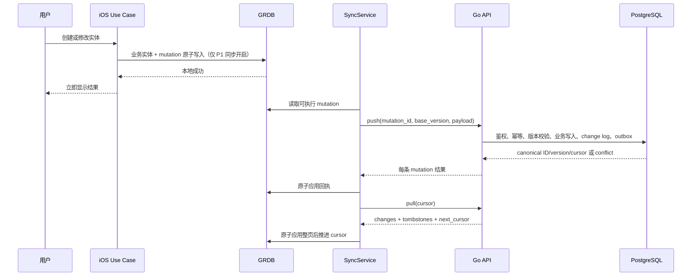

# 同步与接口设计

## 状态

草案，2026-08-09。账号、结构化数据云备份与多设备增量同步固定为 P1，P0 仅实现单设备本地模式；票据图片和原始轨迹不在 P1 同步范围。本文提前定义 P1 的可实施边界，不代表 `backend/openapi.yaml` 已批准加入这些接口；进入 P1 实施前仍需完成账号、隐私、云资源和接口评审。

关联 [`03-系统总体设计.md`](03-系统总体设计.md)、[`05-领域模型与数据设计.md`](05-领域模型与数据设计.md)、[`09-权限隐私与安全设计.md`](09-权限隐私与安全设计.md) 和 [`02-后端架构.md`](02-后端架构.md)。

## 目标

- 本地写入不依赖网络，账号关闭时核心功能完整可用。
- 多设备启用后，重试、重复请求和乱序网络不会产生重复交易或数据复活。
- 使用服务端版本与单调游标，不按客户端时钟做 Last Write Wins。
- 已确认账务、用户覆盖过的出行字段和正式关联不被静默覆盖。
- OpenAPI 为唯一接口契约，能生成 Swift client 并由 Go contract test 校验。
- 后端保持单 Go module、单进程和一个部署单元，不创建 `api/` 或独立 Worker。

## 运行模式

| 模式 | 行为 |
| --- | --- |
| 本地模式 | 所有核心数据只写 GRDB；不要求登录，不创建伪同步状态，不联系业务后端。 |
| 已登录、同步开启 | 本地写入同时创建 mutation；后台 push/pull；原始日历、OCR 图片和原始轨迹始终不进入同步范围。 |
| 已登录、同步暂停 | 继续本地写入并积累队列；明确显示暂停原因和本地数据安全状态。 |
| 退出账号 | 先说明设备本地副本与云端副本的处理选项；不能直接清空未上传数据。 |

账号能力未启用时不在 UI 展示不可操作的登录、冲突或云备份入口。

## 本地写入和同步流程

本地成功和云同步成功是两个状态。下述 mutation/push/pull 流程只在 P1 账号登录且同步开启时运行；P0 本地模式只原子写业务实体，不创建 mutation，也不联系业务后端。网络错误只改变 SyncSummary，不把已经保存的交易或行程显示成失败。

## Mutation 模型

每条 mutation 至少包含：

| 字段 | 说明 |
| --- | --- |
| `mutationId` | 全局唯一幂等标识。 |
| `deviceId` | 发起设备。 |
| `aggregateType` | 有限枚举，例如 account、ledgerRoot、tripPlan、journey、transactionJourneyLink。 |
| `aggregateId` | 聚合 ID；账务退款、冲销和更正固定使用 `canonicalRootId`。 |
| `operation` | `create`、`update`、`delete` 或该聚合批准的 typed command，例如 `refund`、`reverse`、`correct`。 |
| `baseVersion` | 客户端修改所基于的服务端版本；新建固定为 `0`。 |
| `dependsOnMutationIds` | 必须已成功 applied 的前置 mutation ID 列表，默认为空。 |
| `payload` | 对 aggregateType 完整约束的 typed payload。 |

OpenAPI 不允许使用无约束 `object`。`payload` 使用带 discriminator 的 `oneOf` 或等价明确 schema；在正式采用前必须用 Swift OpenAPI Generator 与 kin-openapi 对所有变体完成兼容 POC。

服务端不接收或信任客户端提供的 payload digest。它对认证用户、aggregate type/ID、operation、base version、依赖列表和规范化 typed payload 执行确定性编码，再计算带密钥的 digest，并在 receipt 中保存 digest 与 key version；不同 JSON 空白、键顺序或等价传输表示不能被误判成不同业务请求，低熵金额或状态也不能用裸 hash 暴露。

初始发布交易以 LedgerTransaction + Postings 作为一个 ledger root 提交，不能把分录拆成可独立重试的 mutation。`correct` 在一个 root command 中携带被替代交易、完全相反的冲销交易、替代交易及全部分录；`refund` 与 `reverse` 同样引用 root 和目标正式交易。服务端在同一事务中锁 root、校验 expected root version、写入所有记录并递增 root version。每个被冲销交易的 `reversalOfId` 必须唯一，多个 HTTP mutation 或事后状态修补不能代替该原子边界。

客户端只调度所有前置项已获得 applied receipt 的 mutation。服务端仍校验 `dependsOnMutationIds`：依赖尚无终态 receipt 时返回非终态 `dependency_not_applied`，不消费 mutation ID，待依赖满足后可以原样重试；依赖已终态 rejected/conflict 时返回并保存终态 `dependency_failed` receipt，由客户端创建新的解决 mutation，不能继续提交后续关系。

## 服务端处理

单条 mutation 的确定性处理在一个 PostgreSQL 事务中执行：

1. 从认证上下文获取 user ID，不信任请求中的 owner。
2. 规范化 typed 请求并计算服务端 digest，查找 `(user_id, mutation_id)` 对应的 `mutation_receipt`。
3. receipt digest 相同则重放首次保存的脱敏结果；不同则返回 `idempotency_key_reused`。
4. 校验依赖；未满足的非终态结果不写 receipt，也不执行领域写入。
5. 校验 aggregate 所有者、base version、状态机和领域不变量。`conflict`、不可恢复的 `rejected`、`dependency_failed` 与 `applied` 都是终态，必须写入最小 receipt 并提交；瞬时数据库/网络 `5xx` 不缓存为终态。
6. 对 applied 写业务表和新 version；账务 command 先锁 canonical root，并在同一事务完成冲销、替代或退款的全部分录。
7. applied 同时写 `change_log`、`mutation_receipt` 和需要异步处理的 `outbox_event`；conflict/rejected 只写不含敏感 payload 的 receipt 和必要冲突摘要。
8. 提交后返回首次保存的最小结果：状态、aggregate/root ID、version、可选 change cursor 或稳定错误码。完整 canonical entity 通过 pull 获取，receipt 不长期复制敏感业务 payload；事务失败不留下部分业务结果或伪成功 receipt。

一个 push 批次的原子单位是单条 mutation，而不是整个 HTTP 批次。服务端按请求顺序逐条返回 `applied | conflict | rejected | dependency_not_applied | dependency_failed`；混合结果的 HTTP 响应不能用单个 409 代替逐项状态。客户端只并发无依赖的不同聚合，同一聚合严格保序。

## Pull 与游标

- 服务端维护每用户一行 `sync_head`。产生 change 的事务必须先 `SELECT ... FOR UPDATE` 锁定该行，在锁内连续分配 cursor，并持锁直到业务数据、change log 和 receipt 一起提交，保证 cursor 顺序与提交可见顺序一致；失败或 conflict/rejected 不消耗 change cursor。
- `pull` 使用 cursor 和 limit，返回有序 change、tombstone、`nextCursor` 与 `hasMore`。
- `nextCursor` 是本页最后一条实际返回 change 的 cursor，不是请求开始时的 head 或当前最大值；没有变化时保持输入 cursor。
- 客户端在一个 SQLite 事务中应用整页；只有全部成功才推进 cursor。
- 客户端时间只用于展示与诊断，不参与同步顺序。
- tombstone 至少保留批准的最小期限并等待所有有效设备确认；达到最长离线期仍未确认的设备必须先标记为 `reset_required` 并推进 `min_valid_cursor/sync_epoch`，之后才允许清理，不能只因时间到期让旧设备继续增量同步。
- cursor 低于 `min_valid_cursor` 时返回 `reset_required`；客户端先冻结新 pull、保存未提交 mutation，再执行 snapshot/rebase，不直接清空本地库。

### Snapshot 与 reset

1. 首个 snapshot 请求在一致性事务中锁定 `sync_head`、记录固定 `snapshotCursor`，并物化当时 canonical 实体的 ID、version 与信封加密 payload；生成绑定 user、sync epoch、schema 版本、过期时间和该物化集合的不透明 `snapshotToken`。数据量较大时先返回 preparing 状态，完成后再开放分页，不能边扫描实时业务表边声称快照稳定。
2. 所有页面只读取该 token 的不可变物化集合，按 `(entityType, id)` 稳定排序，并返回明确 page cursor；客户端重试同一页得到等价集合。物化数据按最短必要期限清理，不复制附件或原始轨迹正文。
3. snapshot 期间发生的更新、创建或删除必须出现在 `snapshotCursor` 之后的 change feed；snapshot 完成后客户端从 `snapshotCursor` pull，因此允许实体在 snapshot 与 pull 中重复，但绝不能遗漏。
4. 客户端先写 staging tables，按 version 幂等合并，保留 dirty aggregate、pending mutation 和 ConflictStaging；全部页面校验成功后再原子切换 snapshot 状态。
5. token 过期、epoch 变化或页序错误时丢弃未完成 staging 并重新获取 token，不推进正式 cursor。

## 冲突策略

| 数据 | 策略 |
| --- | --- |
| 正式交易与分录 | dirty 本地 root 遇到更高远端版本时写入 ConflictStaging，不覆盖本地正式行；本机报表继续使用本地 effective 分支并显示未收敛。解决后以远端 canonical root version 为新 base 创建 correction/refund/reverse mutation，原 mutation 不修改或重放。 |
| 草稿 | base version 冲突时保留双方，可由用户选择或复制为新草稿。 |
| 账户/分类名称与排序 | P1 首版同步显示差异并选择；未来可对无重叠字段做可证明合并。 |
| 日历来源字段 | `CalendarSource/Series/Occurrence`、EventOverlay、EventTripLink、TransactionEventLink 在 P0 以及当前 P1 同步范围内都保持 local-only，不进入服务端冲突或 change feed；未来必须先批准最小 EventReference 才能扩大范围。 |
| TripPlan | 云端只同步用户确认后的计划正文，不包含原始 EventKit/HMAC 身份或本地 occurrence version；不同设备把它作为用户计划冲突处理，不能声称系统日历已跨设备同步。 |
| RouteEstimate/LocationSnapshot | 不可变；变化创建新记录。 |
| Journey | 按显式状态机；两设备不能共同继续同一个 active Journey。 |
| 用户确认关联 | 自动建议永远不能覆盖确认或拒绝。 |
| 删除与 stale 更新 | 返回冲突；恢复必须显式引用 tombstone version，避免数据复活。 |

解决冲突后创建新的 mutation，保留冲突审计摘要；不得修改或重放原 mutation 内容。

## 建议接口目录

以下为 OpenAPI 设计输入，路径在 PRD、领域模型和认证决策批准后才写入 `backend/openapi.yaml`。`servers.url` 已包含 `/v1`，paths 不重复 `/v1`。

### 基础与会话

| 方法与路径 | 用途 | 状态 |
| --- | --- | --- |
| `GET /health/live` | 进程存活。 | 固定需要。 |
| `GET /health/ready` | 数据库等必要依赖就绪。 | 固定需要。 |
| `POST /sessions/apple` | 校验 Sign in with Apple 凭据并创建会话。 | 账号启用后。 |
| `POST /sessions/refresh` | 轮换 refresh token。 | 账号启用后。 |
| `DELETE /sessions/current` | 撤销当前会话。 | 账号启用后。 |
| `GET /me` | 当前账号与功能状态。 | 账号启用后。 |

### 设备与同步

| 方法与路径 | 用途 |
| --- | --- |
| `PUT /devices/{deviceId}` | 注册/更新设备、App 版本和可选 APNs token。 |
| `DELETE /devices/{deviceId}` | 撤销设备和推送令牌。 |
| `POST /sync/push` | 批量提交 typed mutation，逐条返回 applied/conflict/rejected。 |
| `GET /sync/pull` | 按 cursor 拉取 change 和 tombstone。 |
| `GET /sync/snapshot` | cursor reset 或新设备使用 snapshot token/cursor 的稳定分页快照。 |
| `GET /sync/conflicts` | 获取尚未解决的服务端冲突摘要；若冲突完全客户端管理可不实现。 |

### 账号删除

| 方法与路径 | 用途 |
| --- | --- |
| `POST /account-deletion-requests` | 创建账号删除任务并停止非必要新写入。 |
| `GET /account-deletion-requests/{requestId}` | 查询删除状态。 |
| `DELETE /account-deletion-requests/{requestId}` | 在允许撤销期内取消；是否支持由产品决定。 |

删除请求进入撤销期后，普通 access/refresh token 和推送会话均撤销；查询或取消仅允许使用受限的 deletion-management session，或要求用户重新执行 Sign in with Apple。进入 `deleting` 后撤销该受限会话，并让同进程任务清理主数据、receipt、change log、冲突暂存、建议和死信。

路线规划只在 iOS 端通过 MapKit 完成，当前不提供服务端路线接口、第三方供应商代理或空占位契约。

## API 契约约定

- JSON 字段使用 lowerCamelCase；operationId 使用稳定英文动作名称。
- ID 是不透明字符串；客户端不得解析 UUID 位或依赖生成顺序。
- instant 使用 RFC 3339 UTC；需要日历语义的对象同时携带 IANA timezone 和 local date。
- 金额使用 `amountMinor` 整数和 `currencyCode`，不接受浮点金额。
- 坐标 schema 必须包含 `latitude`、`longitude`、`coordinateSystem`、可选 accuracy 和 `source`；当前只允许 `manual | mapkit`，坐标系固定为 WGS-84。
- 创建、同步、导入和回调使用 `Idempotency-Key` 或 mutation ID。
- 写请求携带 base version，新建使用 `0`；单资源冲突返回 HTTP 409 和稳定错误码，批量 push 在逐项结果中表达冲突。
- 列表和 change feed 使用游标；排序字段与 tie-breaker 写入契约。
- 错误统一包含 `code`、用户安全 `message`、`requestId` 和可选字段错误，不含堆栈。
- 429/503 可包含 `Retry-After`；只有幂等或明确可重试请求允许自动重试。
- 敏感正文不进入 URL/query；服务端不把 access token 放入日志。
- change、snapshot、conflict staging 和 receipt 同样遵守强制信封加密与最小明文元数据规则；不能因为它们属于同步基础设施而复制敏感明文。

## 认证与会话（账号启用后）

- P1 账号首选 Sign in with Apple，不自建密码体系。
- iOS access/refresh token 只存 Keychain；access token 短期，refresh token 轮换并支持设备撤销。
- 服务端只保存 refresh token 的不可逆验证值和必要会话元数据。
- 并发刷新由 Client Middleware 单飞处理，防止刷新风暴。
- 每个 Handler 从认证中间件获得 user ID；Repository 查询必须带 owner 条件。
- 设备 APNs token 与会话分离，可独立更新和撤销。

## iOS SyncService

职责：

- 观察网络和生命周期只是触发器，不把网络状态当可靠事实。
- 从队列选择依赖已满足的 mutation；同聚合保序、批量有上限。
- 使用退避、抖动和服务端 Retry-After；前后台执行服从系统时间预算。
- 原子应用 push 回执与 pull 页面。
- clean aggregate 可以按 version 幂等应用远端 canonical；dirty aggregate 收到更高远端版本时写入 ConflictStaging，绝不覆盖本地 effective 行。
- 将高风险冲突转换为待确认项；用户选择后创建新 mutation，不修改旧 mutation 或伪造成功 receipt。
- 以 snapshot token/page cursor 写 staging，完成全部页面后再切换 snapshot 状态并从 snapshot cursor 继续 pull。
- 暴露聚合 SyncSummary，而不是把网络细节散落到每个 ViewModel。

触发：登录完成、App 前台、用户下拉刷新、本地新 mutation、系统允许的后台刷新。后台刷新只是优化，不作为数据最终可同步的唯一保证。

## Go 后台任务

必要任务与 HTTP 运行在同一进程和根 context：

- Outbox/APNs 投递。
- 账号删除编排。
- mutation receipt/change log/tombstone 的策略性清理。

多副本时使用 PostgreSQL 行锁和 `FOR UPDATE SKIP LOCKED` 等显式 claim 机制避免重复拥有；每个处理器幂等、支持取消、有限重试和死信/人工诊断状态。不得创建独立 Worker 二进制。

## OpenAPI 与代码工作流

1. 先更新 `backend/openapi.yaml`。
2. Spectral 校验命名、示例、响应和安全方案。
3. oasdiff 与基线比较破坏性变更。
4. Swift OpenAPI Generator 生成 client/types 并编译。
5. Go 手写 request/response struct、Handler 和领域映射。
6. kin-openapi contract test 校验请求、响应、状态码和 schema。
7. Swagger UI 使用同一嵌入契约验收，不生成第二份文档。

对于 `oneOf`、nullable union、`const`、`$ref` sibling 和 discriminator，必须先通过 Swift 生成、Go 校验和 Swagger 展示三方 POC，再进入业务契约。

## 兼容与演进

- P1 账号与同步接口沿用统一 `/v1` 对外版本前缀；新增可选字段优先保持向后兼容。
- 服务端至少兼容当前发布版和产品定义的最低支持 App 版本，具体窗口在发布策略中确认。
- 删除字段、收紧枚举、改变可空性或语义都视为破坏性变更。
- 新 mutation 类型只有客户端与服务端都支持时启用；功能开关不绕过 schema 兼容。
- 生产 schema 变化遵循单 `backend/schema.sql` + Atlas dry-run/人工确认流程。

## 验收重点

- 同一 mutation 重试一次和多次的结果完全一致；相同 ID 不同内容被拒绝。
- applied、确定性 conflict/rejected 的 receipt 在进程重启后仍能重放首次脱敏结果；依赖未满足不消费 mutation ID。
- 同一 canonical ledger root 并发更正、退款和完整冲销只允许一个 expected version 成功；更正原子产生相反冲销和替代交易，完整冲销不能重复。
- dirty 本地正式交易拉取远端版本时进入 ConflictStaging，本地报表不双计也不被覆盖；解决后只发送新 mutation。
- 通过两个受控并发 PostgreSQL 事务验证 cursor 分配与提交顺序一致，不会出现较小 cursor 晚提交后被永久跳过。
- pull 分页在任意一页中断后不跳过变化，cursor 不提前推进。
- snapshot 分页重试、并发更新、token 过期和完成后的增量 pull 不遗漏实体，并保留本地 pending mutation。
- tombstone 与长期离线设备不会导致删除数据复活。
- logout、token 过期、并发刷新和设备撤销都有确定状态。
- OCR 图片与原始轨迹不会出现在 mutation、snapshot、change feed 或任一 OpenAPI schema 中。
- 手写 Go Handler 的请求/响应与 OpenAPI contract test 一致。
