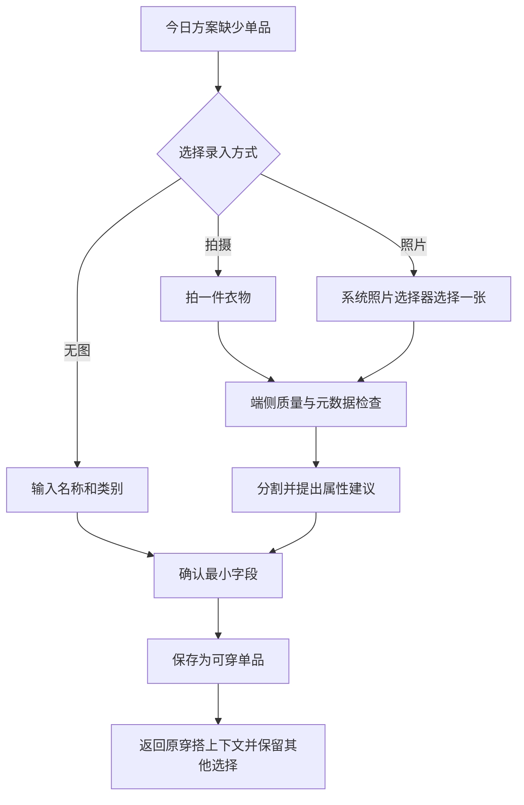
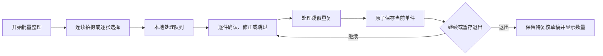

# 数字衣橱与衣物录入设计

## 文档状态与范围声明

状态：已批准，2026-08-30。

关联文档：

- [`../prd/10-OOTD产品需求.md`](../prd/10-OOTD产品需求.md) 是当前产品需求事实源。
- [`10-OOTD产品总体设计.md`](10-OOTD产品总体设计.md) 定义 OOTD-first 冷启动、三 Tab、90 秒决策路径和激活门槛。
- [`11-数字形象与照片采集设计.md`](11-数字形象与照片采集设计.md) 定义人物照片和数字形象，不与衣物图片混用生命周期。
- [`13-穿搭推荐设计.md`](13-穿搭推荐设计.md) 只消费用户确认的衣物属性与可用状态。
- [`14-AI虚拟试穿设计.md`](14-AI虚拟试穿设计.md) 定义衣物图片进入可选云端试穿前的额外同意和质量要求。
- [`15-动态预览设计.md`](15-动态预览设计.md) 不负责建立衣物事实。
- [`16-穿搭记录与反馈设计.md`](16-穿搭记录与反馈设计.md) 通过实际穿着回写穿着次数和状态建议。
- [`17-OOTD服务端与异步任务设计.md`](17-OOTD服务端与异步任务设计.md) 只在达到云能力启用门禁的任务中处理必要的短期媒体。
- [`18-OOTD权限隐私与安全设计.md`](18-OOTD权限隐私与安全设计.md) 统一照片、派生资产、保留和删除边界。

本文是 OOTD 数字衣橱与衣物录入的已批准设计。实现按 `docs/plan/` 分阶段落地，GRDB/Atlas migration、OpenAPI 与依赖变更必须随真实功能一起评审；衣物图片离机处理仍受供应商、合规、删除与 feature flag 门禁。

## 目标与非目标

### 目标

1. 允许用户从当日一套真实衣物开始渐进建库，不要求首次整理完整衣柜。
2. 让每件衣物拥有稳定身份、用户确认的结构化属性和可解释的当前可用状态。
3. 通过端侧质量检查、去元数据、分割和属性建议降低录入成本，同时保留人工修正。
4. 让基础浏览、手工新增、状态维护和推荐候选在离线时可用。
5. 将衣物照片与人物照片、试穿结果、穿搭历史分开存储和删除。
6. 让待洗、借出、打包和归档等现实状态可靠影响推荐，避免推荐“拥有但现在拿不到”的衣物。

### 非目标

- 不从用户完整照片库、相册分类、社交媒体、购物平台或通知中自动抓取衣物。
- 不根据账单商户、金额或商品标题静默创建衣物；未来账务关联必须由用户逐件确认。
- 不从照片推断真实尺码、人体尺寸、面料成分、保暖等级或洗护要求并当作事实。
- 不建立共享衣橱、家庭衣橱、租赁、二手交易、库存估值或购物清单。
- 不提供搭配社区、品牌目录、商品搜索、导购和联盟链接。
- 不因衣橱未达到“完整度”阻止用户手工记录或保存今日穿搭。
- 不把批量建库、照片级虚拟试穿或云端识别放入 90 秒核心决策路径。

## 设计原则

### 真实状态优先于目录完整

推荐准确度更依赖“这件今天能不能穿”而不是衣柜照片数量。衣物状态应是一等信息，且比算法猜测拥有更高优先级。

### AI 只提出候选

类别、颜色、图案、正式度、季节、保暖和材质均可由端侧或获批模型提出建议，但只有用户确认后才成为 `WardrobeItem` 属性。低置信度字段必须显式标记为未知，不能用默认值掩盖。

### 图片不是衣物本体

衣物可以无图存在；删除衣物照片不删除名称、类别、状态、穿搭历史或用户反馈。衣物 ID 不以图片哈希、文件名或 Photos 标识符作为业务主键。

### 渐进建库与批量整理并存

- OOTD-first 快速添加服务当日决定，字段最少、允许稍后补全。
- 衣橱 Tab 的批量整理服务主动建库，支持连续拍摄、逐项复核和中断恢复。
- 两条入口写入同一领域对象和确认规则，不复制两套衣橱。

## 信息结构

衣橱 Tab 建议包含：

1. **可穿**：默认列表，只显示当前可参与普通推荐的衣物。
2. **分类**：上装、下装、连体/连衣、外套、鞋、包和配饰；首个实施批次按计划明确支持类别，不能为未实现类别预建空入口。
3. **状态**：待洗、借出、已打包和归档。
4. **搜索与筛选**：名称、颜色、类别、季节、正式度和用户标签；未知属性不会被错误排除。
5. **新增**：拍摄、系统照片选择器、无图手工新增和批量整理。

“可穿”是默认工作视图，归档不与待洗混在同一筛选中。归档属于生命周期，其他状态属于现实可用性。

## 用户流程

### 三条录入路径

1. **快速连拍**：平铺或悬挂单件衣物，连续拍摄后只复核异常项，适合主动整理衣橱。
2. **从 OOTD 识别**：从用户主动选择的当日穿搭中拆出多件衣物草稿，适合冷启动和实际穿着记录。被身体、外套或其他衣物遮挡的区域必须标记为不完整，不生成虚构的平铺背面或隐藏细节。
3. **导入商品图或购物截图**：用户明确选择一张自己有权使用的图片并确认该衣物确实属于自己的衣橱；系统裁掉价格、订单、地址等无关区域，不把商品页文案、品牌或尺码自动当作事实。

三条路径最终进入相同的批量确认和去重规则。来源只描述证据路径，不决定推荐权重。

### OOTD-first 快速添加



最小字段：用户可理解的名称、类别、当前状态。若参与推荐，还需满足该类别所需的最小约束字段；未知保暖或正式度不会阻止保存，只会在推荐中降低确定性并显示提示。

快速添加返回原决策会话，不能清空场景摘要、已锁定单品或用户修改。

### 批量整理



批量流程每件独立提交，某张处理失败不会回滚已确认的其他衣物。退出时必须说明哪些已保存、哪些仍是本地待复核草稿、如何继续和如何全部丢弃。

### 状态维护

- 在单品详情、今日方案和穿搭完成反馈中都可标记待洗。
- “借出”可选记录预计归还日期和匿名备注，但不要求联系人权限或联系人身份。
- “已打包”可选关联用户明确选择的旅行上下文；在普通本地推荐中不可用，在相同旅行上下文中可用。
- 归档后不参与新推荐，但历史穿搭仍显示当时快照；恢复后重新进入其最后非归档可用状态或由用户选择状态。
- 状态改变后，已保存的未来方案显示“单品状态已变化”，不会静默替换方案。

### 删除照片但保留单品

用户可选择“移除照片”：删除 App 持有的规范化图、抠图、缩略图和与该照片直接派生的本地视觉特征，保留衣物名称、用户确认属性、状态和历史引用。依赖该图片的未开始试穿任务应取消；进行中云任务按 [`17-OOTD服务端与异步任务设计.md`](17-OOTD服务端与异步任务设计.md) 进入删除/清理状态。

## 拍摄与选择规范

### 拍摄引导

- 一次只拍一件主要衣物，平铺或悬挂，避免与其他衣服重叠。
- 保持全件进入画面，光线均匀，背景与衣物有足够区分。
- 首张默认正面；背面、细节和洗护标可作为可选补充，不作为首版激活门槛。
- 鞋和成对物品允许同一双出现在画面；不把左右鞋误建为两件。
- 避免真人入镜。若检测到明显人物，应提示重新拍摄或明确转入人物照片规则，不能自动把他人身体图存为衣物图。

### 端侧质量门禁

质量检查产生建议状态，不对无法精确判断的内容作绝对声明：

| 检查 | 通过 | 可修复 | 拒绝进入自动处理 |
| --- | --- | --- | --- |
| 清晰度/曝光 | 细节基本可见 | 提示调整亮度或重拍 | 图像无法辨认主要衣物。 |
| 完整性 | 主要轮廓完整 | 用户确认接受裁切 | 无法识别单件主体。 |
| 重叠 | 单件或一双鞋 | 用户手动选择主体 | 多件严重重叠且无法分离。 |
| 人物 | 无明显人物 | 仅手部等轻微遮挡，提示影响 | 包含清晰他人或非预期全身人物。 |
| 背景 | 可分割 | 允许手动修边/保留原背景 | 不阻止无图手工新增。 |

自动处理失败时仍可保存无图单品，不能要求用户反复上传才能完成今日决定。

### 图像处理

1. 通过系统照片选择器或 App 相机接收一次明确输入。
2. 在端侧移除 EXIF、GPS、原始文件名和不必要的拍摄元数据。
3. 纠正方向并生成尺寸受控的规范化工作图。
4. 尝试前景分割，保留可人工接受或重新处理的分割版本。
5. 生成 UI 缩略图；若获批本地相似度模型，再生成模型版本明确的特征。
6. 成功落盘并校验后释放导入原始字节；来自系统照片库的原图仍由系统照片 App 管理，OOTD 不持有永久 PhotoKit 身份。

每个衣物视觉资产都要独立标记用途质量：`catalog_ready` 表示足以浏览和参加推荐，`render_ready` 表示主体、可见区域、分辨率和遮挡达到试穿输入门槛，`unusable` 表示只能保留为待修复草稿。OOTD 拆出的遮挡衣物通常只能成为 `catalog_ready`；只有补拍或真实无歧义素材通过检查后才能升级，禁止通过生成补全把推测内容升级成衣物事实。

通过相机拍摄的图默认只进入 OOTD 本地存储，不自动保存到系统照片库；若未来提供“同时保存到照片”，必须由用户显式选择。

## 页面与状态

| 页面/组件 | 正常状态 | 异常或边界状态 |
| --- | --- | --- |
| 衣橱首页 | 可穿列表、分类、状态摘要 | 首次空、仅无图项目、处理草稿待复核、局部读取失败。 |
| 新增方式 | 相机、照片选择器、无图新增 | 相机不可用、照片选择取消、权限拒绝。 |
| 拍摄引导 | 实时框线或拍后检查 | 模糊、裁切、多人、多件重叠、光线不足。 |
| 属性确认 | 建议字段与置信度、用户修正 | 全部未知、类别不支持、处理模型不可用。 |
| 重复确认 | 两件并排、合并/仍保存/取消 | 旧项目无图、属性冲突、历史均被引用。 |
| 单品详情 | 图片、属性、状态、穿着摘要 | 图片丢失、状态变化、归档、历史引用存在。 |
| 批量复核 | 当前项、剩余数量、逐件保存 | 中断恢复、单项失败、低存储、用户丢弃草稿。 |

所有状态必须有文本和图形表达，不使用缩略图透明度或颜色单独表示待洗、归档等状态。

## 领域数据

以下均为已批准的逻辑领域对象，不等于物理 GRDB Record 或 PostgreSQL 表；后者只通过对应 migration 落地。

### WardrobeItem

```text
WardrobeItem
├─ id / ownerID
├─ displayName
├─ category / subtype
├─ lifecycle: active | archived
├─ availability: wearable | laundry | lentOut | packed
├─ confirmedAttributes
│  ├─ colors / pattern
│  ├─ seasonTags / warmthBand
│  ├─ formalityBand / styleTags
│  ├─ materialText? / coverageTags
│  └─ userConstraints
├─ primaryPhotoAssetID?
├─ createdSource: quickAdd | wardrobe | wearRecord | confirmedPurchase
├─ revision / createdAt / updatedAt
└─ archivedAt?
```

- `materialText` 是用户确认的描述，不等同于成分证明。
- 尺码可作为用户自由文本档案，但基础推荐和试穿不得据此承诺合身。
- `userConstraints` 可记录“不用于正式场合”“下雨不穿”等用户规则，不记录身体贬损描述。

### WardrobePhotoAsset

```text
WardrobePhotoAsset
├─ id / wardrobeItemID
├─ role: normalizedSource | cutout | thumbnail | detail
├─ source: quickCapture | ootdExtraction | productImage
├─ usability: catalog_ready | render_ready | unusable
├─ localRelativePath
├─ pixelSize / contentDigest
├─ derivedFromAssetID?
├─ processorVersion?
├─ protectionClass / createdAt
└─ deletionState
```

路径只能由受控本地资产仓库生成，领域层不接受任意外部路径。`contentDigest` 用于完整性和疑似重复，不作为跨用户全局身份，也不得离机共享。

### AttributeSuggestion

```text
AttributeSuggestion
├─ itemDraftID / field
├─ proposedValue / confidenceBand
├─ modelOrRuleVersion
├─ state: proposed | accepted | corrected | dismissed
└─ reviewedAt?
```

建议与已确认字段分开；重新运行模型不能覆盖用户修正。

### AvailabilityEvent

记录状态从何时、为何变化，用于解释推荐冲突和未来恢复。首个实施批次只需当前状态与最近变化；只有审计、同步或用户价值证据明确时才增加完整历史，并通过独立 migration 与验收落地，不能预建空表。

### DuplicateCandidate

疑似重复仅记录当前复核会话所需的两个稳定 ID、原因和置信区间。默认不自动合并，因为相似的基础款可能确实有多件。

## 一致性与业务规则

1. 保存有效衣物时，名称、类别和当前状态必填；图片、材质、品牌和价格不必填。
2. 用户确认属性优先级高于模型建议；模型升级不得重写已确认字段。
3. 推荐创建候选时读取同一一致性快照中的衣物属性和状态，不能先选中后忽略状态变化。
4. `archived` 项不能进入新候选；`laundry` 和 `lentOut` 默认不可用；`packed` 只对匹配旅行上下文可用。
5. 衣物状态在用户保存方案后变化，方案保留但标记冲突，不能自动替换。
6. 历史穿搭引用稳定衣物 ID 和当时显示快照；后续改名、归档或移除照片不重写历史。
7. 删除衣物实体前必须说明对未来推荐、历史记录、正在进行的试穿任务和派生媒体的影响。
8. 疑似重复只提示；用户明确选择合并前，两件均保持独立。
9. `catalog_ready` 可以参加推荐但不能静默进入试穿；`render_ready` 必须来自真实可见像素和已通过的质量检查，模型补全不得提升该状态。

## 接口与本地存储边界

以下协议用于划分 SwiftUI/ViewModel 与领域、数据和系统边界；具体实现随相应功能阶段进入代码：

```swift
protocol WardrobeRepository {
    func saveDraft(_ draft: WardrobeItemDraft) async throws
    func confirmItem(_ command: ConfirmWardrobeItemCommand) async throws -> WardrobeItem
    func updateAvailability(_ command: UpdateAvailabilityCommand) async throws
    func query(_ filter: WardrobeFilter) async throws -> [WardrobeItem]
    func removePhoto(_ command: RemoveWardrobePhotoCommand) async throws
}

protocol WardrobeImageProcessingService {
    func inspect(_ input: WardrobeImageInput) async throws -> WardrobeImageInspection
    func normalizeAndSegment(_ input: WardrobeImageInput) async throws -> ProcessedWardrobeImage
}
```

- View 和 ViewModel 不直接读写文件、Vision 结果、GRDB Record 或云供应商 DTO。
- 数据库只保存结构化元数据和受控相对资产引用；图片不以 BLOB 混入业务行。
- 规范化图、抠图和缩略图保存在 App 管理的受保护目录，使用随机稳定 ID，不使用用户原始文件名。
- 本地写入采用“临时受控文件 → 完整性校验 → 原子移动 → 元数据事务”的顺序；任一步失败都不能留下指向不存在文件的已确认衣物。
- 本地衣橱与基础推荐不上传衣物图片、特征或标签。只有用户主动触发、已通过门禁的云生成任务，才可按 17、18 号设计把必要净化资产写入私有对象存储并加入 OpenAPI 数据流。
- 若实施多设备结构化衣橱同步，照片缺失必须有无图 UI；不能用同步开关暗中上传原图。

## 权限、隐私与安全

- 进入衣橱不请求相机或相册权限；只有用户选择拍摄时请求相机，照片选择优先使用系统 picker 而非完整库授权。
- 在照片操作前说明：“衣物照片将保存在本机衣橱，直到你移除照片或删除衣物；不会因基础推荐自动上传。”具体文案需独立本地化与 Dynamic Type 验收。
- 人物检测用于防止意外保存身体图，不把检测结果持久化为人物画像。
- 规范化时去除 EXIF/GPS、设备信息和原始文件名；日志、诊断、通知和分析中不得出现图片路径、摘要、颜色组合或自由备注。
- 本地文件保护、后台快照遮罩、导出白名单和安全删除遵循 [`18-OOTD权限隐私与安全设计.md`](18-OOTD权限隐私与安全设计.md)。
- 衣物照片用于 AI 试穿时是新的离机用途，必须逐次或按明确范围重新同意；衣橱录入同意不能替代云上传同意。
- 不索取联系人权限来记录借出对象；不自动识别或持久化衣物标签上的姓名、地址、订单号等无关文字。
- 用户素材不得用于训练、广告、全局相似衣橱或跨用户推荐。

## 失败与降级

| 失败 | 处理 | 不允许 |
| --- | --- | --- |
| 相机拒绝/不可用 | 系统 picker 或无图新增 | 循环弹权限框。 |
| 照片选择取消 | 回到原决策，保留上下文 | 创建空白已确认衣物。 |
| 图像模糊或裁切 | 给出一条可操作建议，允许重拍或无图保存 | 用“失败”而不说明问题。 |
| 分割失败 | 保留规范化图或改用无图卡片 | 伪造完整抠图。 |
| 属性模型不可用 | 仅要求名称、类别、状态 | 写入未知来源默认属性。 |
| 疑似重复 | 并排比较，用户决定 | 自动删除或自动合并。 |
| 低存储 | 当前单件不确认，清理受控临时文件 | 留下数据库引用或扩大删除范围。 |
| 批量处理中断 | 已确认项保留，待复核项可继续或全部丢弃 | 重复创建已确认单品。 |
| 图片文件损坏/丢失 | 显示无图占位，允许重拍 | 删除衣物和历史。 |
| 离线 | 全部基础录入和状态维护可用 | 将网络作为保存门槛。 |
| 云试穿占用照片 | 显示任务并执行取消/删除协调 | 移除 UI 后让云副本无期限存在。 |

## 关键决策与备选方案

### 决策一：渐进建库为默认，批量整理为主动入口

原因：先完成真实 OOTD 能更早提供价值；批量录入仍适合有明确整理意愿的用户。

备选：首次强制拍满 20 件。该方案增加冷启动成本，不采用；只有定向用户研究证明完成率和长期价值明显更高时重评。

### 决策二：最小字段可保存，AI 属性需确认

原因：衣物图片无法可靠证明材料、保暖或正式度；允许未知比错误事实更安全。

备选：后台自动建库并隐藏置信度。该方案会污染推荐且难以纠错，不采用。

### 决策三：本地规范化图与派生图分开

原因：可以移除背景、替换处理版本或只删除照片，同时保持衣物事实稳定。

备选：只保存原图或只保存抠图。只存原图增加显示和隐私负担；只存抠图在处理失真后无法本地修正。是否在极端存储约束下只保留一种版本需通过真实空间测量重评。

### 决策四：归档与现实可用性分离

原因：待洗和借出是暂时不可用，归档表示不再参与日常管理；混为一个布尔值会破坏恢复和历史解释。

备选：单一“隐藏”状态。语义不足，不采用。

### 决策五：重复只提示，不自动合并

原因：用户可能拥有两件高度相似的同款，自动合并会让穿着次数和可用状态失真。

备选：基于图片摘要强去重。只有导入来源存在稳定外部 ID 且产品规则获批时重评。

## 可执行测试与验收

以下是设计级验收；正式发布还须满足 `docs/acceptance/` 中的系统验收并留存证据。

### 场景一：OOTD-first 快速添加

- 前置条件：空衣橱，用户正在一条手工场景决策中。
- 操作：分别用相机、系统 picker 和无图方式添加上装、下装与鞋。
- 期望：每次返回保留原场景和已选单品；三种方式写入同一对象语义；照片不是必填。

### 场景二：属性建议不覆盖用户

- 前置条件：模型建议蓝色、休闲，用户改为蓝绿色、商务休闲。
- 操作：保存后模拟模型版本升级并重新处理。
- 期望：用户确认值保持不变；新建议单独显示，不静默覆盖。

### 场景三：现实状态过滤

- 前置条件：同类鞋分别为可穿、待洗、借出和已打包。
- 操作：在普通场景和匹配旅行场景中请求候选。
- 期望：普通场景只使用可穿鞋；旅行场景可使用匹配的已打包鞋；其他状态不出现且原因可解释。

### 场景四：疑似重复

- 前置条件：录入两件相同款式但状态不同的白 T 恤。
- 操作：触发重复提示并选择“仍保存为两件”。
- 期望：产生两个稳定 ID，状态和穿着历史互不覆盖。

### 场景五：照片删除

- 前置条件：单品有规范化图、抠图、缩略图、本地特征和历史穿搭引用。
- 操作：移除照片但保留衣物。
- 期望：全部直接派生媒体和特征被清理；结构化单品、状态和历史保留；推荐可使用无图卡片。

### 场景六：低存储和中断

- 前置条件：批量处理五张合成图，在第三张原子提交前注入磁盘不足。
- 操作：退出并重启。
- 期望：前两件已确认；第三件没有悬空路径；后两件按明确草稿策略恢复或丢弃；重试不重复前两件。

### 场景七：隐私

- 操作：选择含 GPS/EXIF 的合成图片，完成录入后检查受控目录、数据库、日志、导出和网络。
- 期望：App 保存的工作图无原始元数据和文件名；基础录入无网络请求；图片不进入日志和默认导出。

### 场景八：权限和离线

- 操作：拒绝相机、不给完整照片库权限、关闭网络，使用无图新增并维护待洗/恢复可穿。
- 期望：核心路径可完成；权限拒绝不隐藏衣橱；状态更新即时影响本地候选。

### 场景九：可访问性

- 操作：最大辅助字号、VoiceOver 和深色模式下完成新增、属性确认、状态修改和疑似重复比较。
- 期望：图片均有类别/颜色/名称文本替代；状态不只靠颜色；操作顺序、命中区和错误建议可理解。

### 场景十：基线与云门禁检查

- 操作：检查 migration、OpenAPI、PostgreSQL schema、依赖、生产入口和 feature flag。
- 期望：衣橱结构只覆盖当前实施阶段，不包含购物抓取或空入口；基础录入不产生网络请求，云端图片上传只能由通过供应商、合规和删除门禁的主动生成流程触发。
